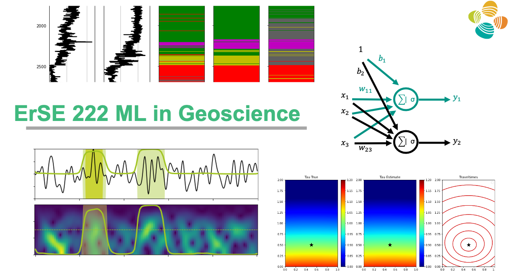

Teaching material for ErSE 222 Machine Learning in Geoscience course to be held at KAUST during the Spring semester.

## Material

The repository is organized as follows:

- **Docs**: notes written using [MKDocs](https://www.mkdocs.org) and rendered [here](https://dig-kaust.github.io/MLgeoscience/)
  and [here](http://mrava87.curve.space)
- **Labs**:  Python codes and Jupyter Notebooks used in the practical sessions. See inside for details.
