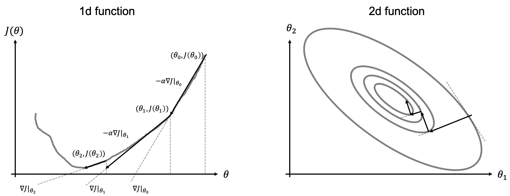
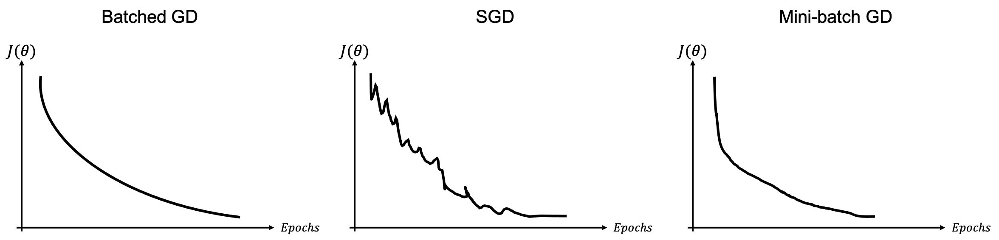

# Gradient-based optimization
After reviewing some of the basic concepts of linear algebra and probability that we will be using during this course, 
we are now in a position to start our journey in the field of *learning algorithms*. 

Any learning algorithm, no matter its level of complexity, is composed of 4 key elements:

**Dataset**: a collection of many examples (sometimes referred to as samples of data points) that represents the experience
we wish our machine learning algorithm to learn from. More specifically, the dataset is defined as:
$$
\mathbf{x} = [x_1, x_2, ..., x_{N_f}]^T \quad \mathbf{X} = [\mathbf{x}^{(1)}, \mathbf{x}^{(2)}, ..., \mathbf{x}^{(N_s)}] 
$$
and
$$
\mathbf{y} = [y_1, y_2, ..., y_{N_t}]^T \quad \mathbf{Y} = [\mathbf{y}^{(1)}, \mathbf{y}^{(2)}, ..., \mathbf{y}^{(N_s)}] 
$$
where $N_f$ and $N_t$ are the number of features and targets for each sample in the dataset, respectively, and 
$N_s$ is the number of samples.

**Model**: a mathematical relation between the input (or features) and output (or target) 
of our dataset. It is generally parametrized as function $f$ of a number of free parameters $\theta$ which we want the 
learning algorithm to estimate given a task and a measure of performance, and we write it as 
$$
\mathbf{y} = f_\theta(\mathbf{x})
$$

**Loss (and cost) function**: quantitative measure of the performance of the learning algorithm, which we wish to minimize 
(or maximize) in order to make accurate predictions on the unseen data. It is written as
$$
J_\theta = \frac{1}{N_s} \sum_{j=1}^{N_s} \mathscr{L} (\mathbf{y}^{(j)}, f_\theta(\mathbf{x}^{(j)}))
$$

where $\mathscr{L}$ is the loss function for each input-output pair and $J$ is the overall cost function.

**Optimization algorithm**: mathematical method that aims to drive down (up) the cost function by modifying
its free-parameters $\theta$:
$$
\hat{\theta} = \underset{\theta} {\mathrm{argmin}} \; J_\theta
$$

Optimization algorithms are generally divided into two main families: gradient-based 
(or local) and gradient-free (or global). Gradient-based optimization is by far the most popular way to train NNs and 
will be discussed in more details below.

## Gradient-descent algorithms
The simplest of gradient-based methods is the so-called **Gradient-descent** algorithms (e.g., steepest descent algorithm). As the name implies, this algorithm uses local gradient information of the functional to minimize/maximize to move towards its global 
mimimum/maximum as depicted in the figure below.

More formally, given a functional $J_\theta$ and its gradient 
$\nabla J = \frac{\delta J}{\delta \theta}$, the (minimization) algorithm can be written as:

Initialization: choose $\theta \in \mathbb{R}$

For $i=0,...N-1$;

1. Compute update direction $d_i = -\nabla J |_{\theta_i}$
2. Estimate step-lenght $\alpha_i$
3. Update $\theta_{i+1} = \theta_{i} + \alpha_i d_i$

Note that the maximization version of this algorithm simply swaps the sign in the update direction (first equation of the algorithm).
Moreover, the proposed algorithm can be easily extended to N-dimensional model vectors $\theta=[\theta_1, \theta_2, ..., \theta_N]$ by
defining the following gradient vector 
$\nabla J=[\delta J / \delta\theta_1, \delta J / \delta\theta_2, ..., \delta J/ \delta\theta_N]$.

### Step length selection
The choice of the step-length has tremendous impact on the performance of the algorithm and its ability to converge 
fast (i.e., in a small number of iterations) to the optimal solution.

The most used selection rules are:

- Constant: the step size is fixed to a constant value $\alpha_i=\hat{\alpha}$. This is the most common situation that we
  will encounter when training neural networks. In practice, some adaptive schemes based on the evolution of the train
  (or validation) norm are generally adopted, but we will still refer to this case as constant step size;
- Exact line search: at each iteration, $\alpha_i$ is chosen such that it minimizes $J(\theta_{i} + \alpha_i d_i)$. This
  is the most commonly used approach when dealing with linear systems of equations.
- Backtracking  "Armijo" line search: at each iteration, given a parameter $\mu \in (0,1)$, start with $\alpha_i=1$ 
  and reduce it by a factor of 2 until the following condition is satisfied: $J(\theta_i) - J(\theta_{i} + \alpha_i d_i) \ge  -\mu \alpha_i \nabla J^T d_i$
  
## Second-order optimization
Up until now we have discussed first-order optimization techniques that rely on the ability to evaluate the function $J$ and 
its gradient $\nabla J$. Second-order optimization method go one step beyond in that they use information from both the 
local slope and curvature of the function $J$. 

When a function has small curvature, the function and its tangent line are very similar: 
the gradient alone is therefore able to provide a good local approximation of the function (i.e., $J(\theta+\delta \theta)\approx J(\theta) + \nabla J \delta \theta$).
On the other hand, if the curvature of the function of large, the function and its tangent line start to differ very quickly away from the linearization point. The gradient alone is not able anymore to provide a good local approximation of the function 
(i.e., $J(\theta+\delta \theta)\approx J(\theta) + \nabla J \delta \theta + \nabla^2 J \delta \theta^2$).

Let's start again from the one-dimensional case and the well-known **Newton's method**. This method is generally employed to find the zeros of a function:
$\theta: J(\theta)=0$ and can be written as:

$$
\theta_{i+1} = \theta_i - \frac{J(\theta)|_{\theta_i}}{J'(\theta)|_{\theta_i}} 
$$

which can be easily derived from the Taylor expansion of $f(\theta)$ around $\theta_{i+1}$.

If we remember that finding the minimum (or maximum) of a function is equivalent to find the zeros of its first derivative 
($\theta: min_\theta f(\theta) \leftrightarrow \theta: f'(\theta)=0$), the Newton's method can be written as:

$$
\theta_{i+1} = \theta_i - \frac{J'(\theta)|_{\theta_i}}{J''(\theta)|_{\theta_i}} 
$$

In order to be able to discuss second-order optimization algorithms for the multi-dimensional case, 
let's first introduce the notion of *Jacobian*:

$$\mathbf{y} = J(\boldsymbol\theta) \rightarrow  \mathbf{J}  = \begin{bmatrix} 
                \frac{\partial J_1}{\partial \theta_1} & \frac{\partial J_1}{\partial \theta_2} & ... & \frac{\partial J_1}{\partial \theta_M} \\
                ...     & ...  & ...   & ... \\
                \frac{\partial J_N}{\partial \theta_1} & \frac{\partial J_N}{\partial \theta_2} & ... & \frac{\partial J_N}{\partial \theta_M} \\
  \end{bmatrix} \in \mathbb{R}^{[N \times M]}
$$

Through the notion of Jacobian, we can define the **Hessian** as the Jacobian of the gradient vector

$$\mathbf{H} = \nabla (\nabla J) = \begin{bmatrix} 
                \frac{\partial J^2}{\partial \theta_1^2} & \frac{\partial J^2}{\partial x_1 \partial \theta_2} & ... & \frac{\partial J^2}{\partial \theta_1\partial \theta_M} \\
                ...     & ...  & ...   & ... \\
                \frac{\partial J^2}{\partial \theta_M \partial \theta_1} & \frac{\partial J^2}{\partial \theta_M \partial \theta_2} & ... & \frac{\partial J^2}{\partial \theta_M^2} \\
  \end{bmatrix} \in \mathbb{R}^{[M \times M]}
$$

where we note that when $J$ is continuous, $\partial / \partial \theta_i \partial \theta_j = \partial / \partial \theta_j \partial \theta_i$, and $\mathbf{H}$
is symmetric.

The Newton method for the multi-dimensional case becomes:

$$
\boldsymbol\theta_{i+1} = \boldsymbol\theta_i - \mathbf{H}^{-1}\nabla J
$$

Approximated version of the Newton method have been developed over the years, mostly based on the idea that inverting $\mathbf{H}$ is sometimes a prohibitive task. Such methods, generally referred to as Quasi-Netwon methods attempt to approximate the Hessian (or its inverse) using the collections of gradient information from the previous iterations. [BFGS](https://en.wikipedia.org/wiki/Broyden–Fletcher–Goldfarb–Shanno_algorithm) or its limited memory version [L-BFGS](https://en.wikipedia.org/wiki/Limited-memory_BFGS) are examples of such a kind. Due to their computational cost
(as well as the lack of solid theories for their use in conjunction with approximate gradients), these methods are not yet commonly used by the machine learning community to optimize the parameters of NNs in deep learning.

## Stochastic-gradient descent (SGD)

To conclude, we look again at gradient-based iterative solvers and more specifically in the context of finite-sum functionals of the kind that we will encountering when training neural networks:

$$
J_\theta = \frac{1}{N_s} \sum_{i=1}^{N_s} \mathscr{L} (\mathbf{y}^{(i)}, f_\theta(\mathbf{x}^{(i)}))
$$

where the summation here is performed over training data.

### Batched gradient descent 
The solvers that we have considered so far are generally update the model parameters $\boldsymbol\theta$ using the full gradient (i.e., over the entire batch of samples):

$$
\boldsymbol\theta_{i+1} = \boldsymbol\theta_{i} - \alpha_i \nabla J = \boldsymbol\theta_{i} - \frac{\alpha_i}{N_s} \sum_{j=1}^{N_s} \nabla \mathscr{L}_j
$$

A limitation of such an approach is that, if we have a very large number of training samples, the computational cost of computing the full gradient is very high and when some of the samples are similar, their gradient contribution is somehow redundant.

### Stochastic gradient descent

In this case we take a completely opposite approach to computing the gradient. More specifically, a single training sample is considered at each iteration:

$$
\boldsymbol\theta_{i+1} = \boldsymbol\theta_{i} - \alpha_i \nabla \mathscr{L}_j
$$

The choice of the training sample $j$ at each iteration is generally completely random and this is repeated once all training data have been used at least once (generally referred to as *epoch*). In this case, the gradient may be noisy because the gradient of a single sample is a very rough approximation of the total cost function $J$: such a high variance of gradients requires lowering the step-size $\alpha$ leading to slow convergence.

### Mini-batched gradient descent

A more commonly used strategy lies in between the batched and stochastic gradient descent algorithms 
uses batches of training samples to compute the gradient at each iteration. More specifically given a batch of 
$N_b$ samples, the update formula can be written as:

$$
\boldsymbol\theta_{i+1} = \boldsymbol\theta_{i} - \frac{\alpha_i}{N_b} \sum_{j=1}^{N_b} \nabla \mathscr{L}_j
$$

and similarly to the stochastic gradient descent, the batches of data are chosen at random and this is repeated as soon as all 
data are used once in the training loop. Whilst the choice of the size of the batch depends on many factors 
(e.g., overall size of the dataset, variety of training samples), common batch sizes in training of NNs are from around 50 to 256 
(unless memory requirements kick in leading to even small batch sizes).

## Additional readings

- the following [blog post](https://ruder.io/optimizing-gradient-descent/) for a more
detailed overview of the optimization algorithms discussed here. Note that in one of our future [lectures](lectures/08_gradopt1.md) 
we will also look again at the optimization algorithms and more specifically discuss strategies that allow overcoming some of the 
limitations of standard SGD in [this lecture](lectures/10_gradopt1.md).