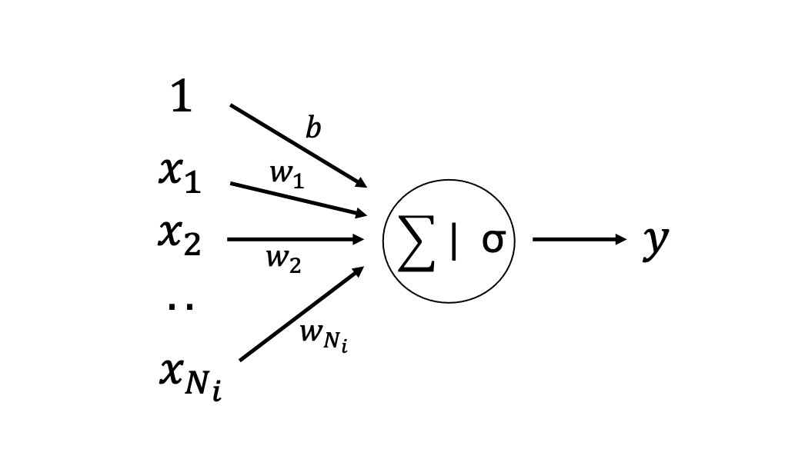
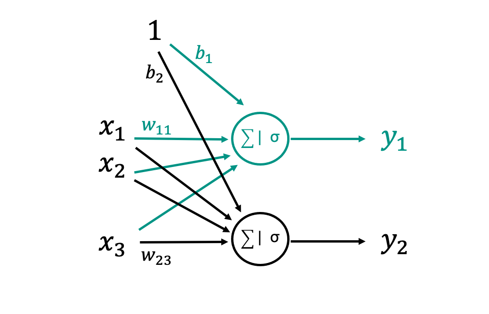
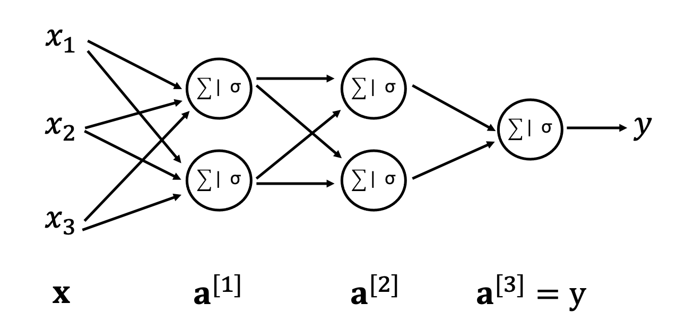
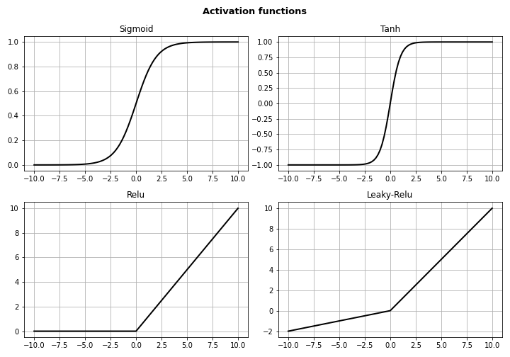
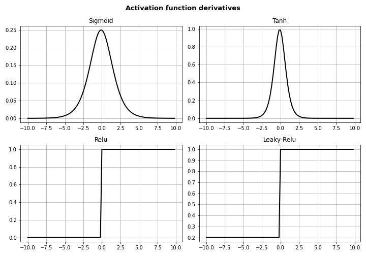

# Basics of Neural Networks 

In this lecture, we start our journey in the field of Deep Learning. In order to do so, we must first introduce
the most commonly used kind of Neural Networks, the so-called Multi-Layer Perceptron (MLP) (also commonly referred
to as fully connected (FC) layer).

A MLP is a class of *feedforward* artificial neural networks (ANNs), where the term feedforward refers to the 
fact the the flow of information moves from left to right. On the other hand, a change in the direction 
of the flow is introduced as part of the forward pass gives rise to a different family of NNs, so-called Recurrent 
Neural Networks (they will be subject of future lectures):

## Perceptron

To begin with, we focus on the core building block of a MLP, so-called Perceptron or Unit. 
This is nothing really new to us, as it is exactly the same structure that we used to create the logistic regression model, 
a linear weighting of the element of the input vector followed by a nonlinear activation function. We prefer however
to schematic represent it in a slightly different way as this will make it easier later on to drawn MLPs.

Mathematically, the action of a percepton can be written compactly as dot-product followed 
by an element-wise nonlinear activation:

$$
y = \sigma(\sum_i w_i x_i + b) = \sigma(\sum_i \textbf{w}^T \textbf{x} + b) 
$$

where $\textbf{w} \in \mathbb{R}^{N_i}$ is the vector of weights, $b$ is the bias, and $\sigma$ is a nonlinear 
activation function. Note that whilst we used a sigmoid function in the logistic regression model, this can be 
any differentiable function as later we will discuss in more details.

## Multi-layer Perceptron

The perceptron model shown above takes as input a vector  $\textbf{x} \in \mathbb{R}^{N_i}$ and 
returns a scalar $y$, we are now ready to make a step forward where we simply combine multiple perceptrons together 
to return a vector $\textbf{y} \in \mathbb{R}^{N_o}$

The MLP in the figure above presents $N_i=3$ inputs and $N_o=2$ outputs. By highlighting the original perceptron in green,
we can easily observed that a MLP is simply a composition of $N_o$ perceptrons, which again we can 
compactly write as a matrix-vector multiplication followed by an element-wise nonlinear activation:

$$
y_j = \sigma(\sum_i w_{ji} x_i + b), \quad \textbf{y} = \sigma(\textbf{W} \textbf{x} + \textbf{b}) 
$$

where $\textbf{W} \in \mathbb{R}^{N_o \times N_i}$ is the matrix of weights, $\textbf{b} \in \mathbb{R}^{N_o}$ 
is a vector of biases.

Finally, if we stack multiple MLPs together we obtained what is generally referred to as N-layer NN, where 
the count of the number of layers does not include the input layer. For example, a 3-layer NN has the following structure

where we omit for simplicity the bias terms in the schematic drawing. 
This figure gives us the opportunity to introduce some terminology commonly used in the DL community:

- *Input layer*: first layer taking the input vector $\textbf{x}$ as input and returning an intermediate representation
  $\textbf{z}^{[1]}$;
- *Hidden layers*: second to penultimate layers taking as input the previous representation $\textbf{z}^{[i-1]}$ and 
  returning a new representation $\textbf{z}^{[i]}$;
- *Ouput layer*: last layer producing the output of the network $\textbf{y}$;
- *Depth*: number of hidden layers (plus output layer);
- *Width*: number of units in each hidden layer.

Note that we will always use the following notation $\cdot^{(i)[j]}$ where round brackets are used to refer to a
specific training sample and square brackets are used to refer to a specific layer.

## Activation functions

We have just started to appreciate the simplicity of NNs. A Neural Network is nothing more than a stack of linear 
transformations and nonlinear element-wise activation functions. If such activation functions where omitted,
we could combine the various linear transformations together in a single matrix, as the product of N matrices. Assuming that sigma acts as an identity matrix $\sigma(\textbf{x})=\textbf{Ix}=\textbf{x}$,
(and omitting biases for simplicity) we get:

$$
\textbf{y} = \sigma(\textbf{W}^{[3]}\sigma(\textbf{W}^{[2]}\sigma(\textbf{W}^{[1]} \textbf{x}))) = 
\textbf{W}^{[3]}\textbf{W}^{[2]}\textbf{W}^{[1]}\textbf{x} = \textbf{W} \textbf{x}
$$
so no matter how deep the network is, we can always reconduct it to a linear model. 
Depending on the final activation and loss function, therefore we will have a linear regression or a logistic
regression model.

We consider here a very simple example to show the importance of nonlinear activations before delving into the details.
Let's assume that we wish the learn the XOR (eXclusive OR) boolean logic operator from the 
following four training samples:

$$
\textbf{x}^{(1)} = [0, 0] \rightarrow y^{(1)}=0
$$

$$
\textbf{x}^{(2)} = [0, 1] \rightarrow y^{(2)}=1
$$

$$
\textbf{x}^{(3)} = [1, 0] \rightarrow y^{(3)}=1
$$

$$
\textbf{x}^{(4)} = [1, 1] \rightarrow y^{(4)}=0
$$

Starting from the linear regression model, we can define a matrix 
$\textbf{X}_{train} = [\textbf{x}^{(1)}, \textbf{x}^{(2)}, \textbf{x}^{(3)}, \textbf{x}^{(4)}]$ and a vector
$\textbf{y}_{train} = [y^{(1)}, y^{(2)}, y^{(3)}, y^{(4)}]$. The linear model becomes:

$$
\textbf{y}_{train} = \textbf{X}_{train}^T  \boldsymbol \theta
$$

where the weights $\boldsymbol \theta$ are obtained as detailed in the previous section. It can be easily proven that
the solution is $\boldsymbol \theta=[0,0,0.5]$, where $\textbf{w}=[0,0]$ and $b=0.5$. This means that, no matter the input
the output of the linear model will always be equal to $0.5$; in other words, the model is unable to distinguish
between the true or false outcomes. If instead we introduce a nonlinearity between two weight matrices (i.e., a 2-layer NN),
the following combination of weights and biases (taken from the Goodfellow book) will lead to a correct prediction:

$$
\textbf{W}^{[1]} = \begin{bmatrix} 
                1 & 1 \\
                1 & 1\end{bmatrix},
\textbf{W}^{[2]} = \begin{bmatrix} 
                1  \\
                -2 \end{bmatrix}^T,
\textbf{b}^{[1]} = \begin{bmatrix} 
                0  \\
                -1 \end{bmatrix},
b^{[2]} = 0
$$

Note that in this case the $\sigma=ReLU$ activation function, which we will introduce in the next section, must be used. 
Of course, there may be many more combinations of weights and biases that lead to a satisfactory prediction. You can prove this to yourself by 
initializing the weights and biases randomly and optimizing them by means of a stochastic gradient-descent algorithm.

Having introduced nonlinearites every time after we apply the weight matrices to the vector 
flowing through the computational graph, the overall set of operations cannot be simply reconducted to a matrix-vector
multiplication and allows us to learn highly complex nonlinear mappings between input features and targets. The role of activation functions is however not always straightforward and easy to grasp. Whilst we can say that
they help in the learning process, not every function is suitable for this task and in fact, some functions may prevent
the network from learning at all.

In the following we look at the most commonly used activation functions and discuss their origin and why 
they became popular and useful in Deep Learning:

- **Sigmoid** and **Tanh**: historically these were the most popular activation functions as they are 
  differentiable across the entire domain. In the past, there was in fact a strong belief that
  gradient-descent cannot operate on functions that have singularities; although this is correct from 
  a theoretical point of view it was later proved to be wrong in practice. They are mathematically
  defined as:
  
  $$ \sigma_s(x) = \frac{1}{1-e^{-x}} $$
  
  and
  
  $$ \sigma_t(x) = 2 \sigma_s(2x) - 1 $$
  
  Whilst still used in various contexts, these activation functions saturate very quickly (i.e., large values are clipped to 1 
  and small values are clipped to -1 for tanh or 0 for sigmoid). This leads to the so-called *vanishing 
  gradient problem* that we will discuss in more details in following lectures; simply put, if we look at the 
  the gradient of both of these functions, it is non-zero only when x is near zero and becomes zero away 
  from it, meaning that if the output of a linear layer is large the gradient of the activation function
  will be zero and therefore the gradient will stop flowing through backpropagation. This is particularly
  problematic for deep network as the training of the early layers becomes very slow.
  
- **ReLU** (Rectified Linear Unit): this activation function became very popular in the start of the 21st 
  century and since then
  it is the most commonly used activation function for NN training. It is much closer to a linear activation
  than the previous two, but introduces a nonlinearity by putting negative inputs to zero. By doing so, the
  ReLU activation function is a piecewise linear function. This shows that
  non-differentiable functions can be used in gradient based optimization, mostly because numerically we will hardly
  (if not never) have an output of a NN layer that is exactly zero when fed as input to the activation. 
  Mathematically speaking, we can write it as:
  $$
  \sigma_r(x) = max ( 0,x ) = 
  \begin{cases}
      x & x\ge 0, \quad
      0 & x<0
    \end{cases}       
  $$
  whilst its derivative is:
  $$
  \sigma'_{relu}(x) = 
  \begin{cases}
      1 & x\ge 0, \quad
      0 & x<0
    \end{cases}    
  $$
  We can observe that this activation function never saturates, for every value in the positive axis the derivative
  is always 1. Such a property makes ReLU suitable for large networks as the risk of vanishing gradients is
  greatly reduced. A downside of ReLU is that the entire negative axis acts as an annihilator preventing information
  to flow. A strategy to prevent or reduce the occurrences of negative inputs is represented by the initialization
  of biases to a value slightly greater than zero (e.g., b=0.1).
  
- **Leaky ReLU** (Leaky Rectified Linear Unit): a modified version of the ReLU activation function
  aimed once again at avoiding zeroing of inputs in the negative axis. This function is identical to the ReLU
  in the positive axis, whilst another straight line with smaller slope is used in the negative axis:
  $$
  \sigma'_{l-relu}(x) = max ( 0,x ) + \alpha min ( 0,x ) = 
  \begin{cases}
      x & x\ge 0, \quad
      \alpha x & x<0
    \end{cases}     
  $$
  By doing so, also negative inputs can flow through the computational graph. A variant of L-ReLU, called
  P-ReLU, allows for the $\alpha$ parameter to be learned instead of being fixed.
  
- **Absolute ReLU** (Absolute Rectified Linear Unit): a modified version of the ReLU activation function
  that is symmetric with respect to the $x=0$ axis:
  $$
  \sigma'_{l-relu}(x) = |x| = 
  \begin{cases}
      x & x\ge 0, \quad
      -x & x<0
    \end{cases}     
  $$
  Whilst this is not a popular choice in the DL literature, it has been successfully used in object detection
  tasks where the features that we wish the NN to extract from the training process are polarity invariant.

- **Cosine, Sine, ...**: the use of periodic functions have recently started to appear in the literature
  especially in the context of scientific DL (e.g., Physics-informed neural networks).

- **Softmax**: this activation function is commonly used at the end of the last layer in the context of 
  multi-label classification. However as it takes an input vector of N numbers and converts it into an 
  output vector of probabilities (i.e., N numbers summing to 1), it may also be used as a sort of switch in 
  the internal layers.

The following two figures show the different activation functions discussed above and their gradients.

## Network architecture
Up until now we have discussed the key components of a Feedforward Neural Network, the Multi-layer Perceptron.
It was mentioned a few times that a NN can be composed of multiple MLPs connected with each other, giving rise
to a so-called Deep Neural Network (DNN). The depth and width of the network has been also defined, and
we have introduced the convention that a N-layer NN is a network with N-1 hidden layers. 

A crucial point in the design of a neural network architecture is represented by the choice of such parameters. 
Whilst no hard rules exist and the creation
of a NN architecture is to these days still closer to an art than a systematic science, in the following
we provide a number of guidelines that should be followed when approaching the problem of designing a 
network. For example, as previously discussed, connecting two or more layers without adding a nonlinear
activation function in between should be avoided as this part of the network simply behaves as a single 
linear layer.

An important theorem that provide insights into the design of neural networks is the so-called
**Universal Approximation theorem**. This theorem states that:

*"...regardless of the function that we are trying to learn, we know that a single MLP with infinite number
of units can represent this function. We are however not guaranteed that we can train such a network..."*

More specifically, learning can fail for two different reasons: i) the optimization algorithm used for training 
may not be able to find the value of the parameters that correspond to the desired function; ii) the training 
algorithm might choose the wrong function as a result of overfitting.

In practice, experience has shown that deeper networks with fewer units per layer are better both in
terms of *generalization* and *robustness to training*. This leads us with a trade-off between 
shallow networks with many units in each layer and deep networks with fewer units in each layer. 
An empirical trend has been observed between the depth of a network and its accuracy on test data:

To summarize, whilst theoretically 1-layer shallow networks can learn any function, it is advisable these
days to trade network width with network depth as training deep networks is nowadays feasible both from a 
theoretical and computational point of view. It is however always best to start small and grow the network in width and
depth as the problem requires. We will see in the following lectures that a large network requires a large
training data to avoid overfitting; therefore, when working with small to medium size training data it is
always best to avoid using very large networks in the first place.

## Additional readings

- the following [blog post](https://mlfromscratch.com/activation-functions-explained/) contains an extensive 
  treatment of activation functions used in NN training beyond the most popular ones that we covered in this 
  lecture.