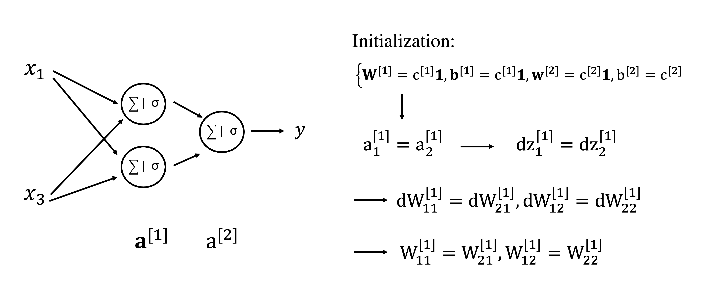

# More on Neural Networks

In this lecture, we will delve into some more advanced topics associated to the creation and training of deep 
neural networks.

## Backpropagation

First of all, once a neural network architecture has been defined for the problem at hand, we need a method
that can learn the best set of free parameters of such nonlinear function represented as $f_\theta$.

More specifically, we want to initialize the network with some random weights and biases (we will soon discuss how
such initialization can be performed) and use the training data at hand to improve our weights and biases in order
to minimize a certain loss function. Whilst this can be easily done by means of gradient based optimizers like those
presented in Lecture 3, a key ingredient that we need to provide to such algorithms is represented by the gradient
of the loss function with respect to each and every weight and bias parameters. 

We have already alluded at a technique that can do so whilst discussing a simple logistic regression model. This
is generally referred to by the ML community as *back-propagation* and more broadly by the mathematical community
as *Reverse Automatic Differentiation*. Let's start by taking the same schematic diagram used for the logistic regression
example and generalize it to a N-layer NN:

The main difference here, which we will need to discuss in details, is the fact that in the forward pass 
we feed the input into a stack of linear layers prior to computing the loss function. The backpropagation
does need to be able to keep track of the chain of operations (i.e., computational graph) and traverse it
back. However, as already done for the logistic regression model, all we need to do is to write the entire
chain of operations as a chain of atomic ones that we can then easily traverse back. Let's do this for
the network above and a single training sample $\textbf{x}$:

$$
\textbf{z}^{[1]} = \textbf{W}^{[1]}\textbf{x} + \textbf{b}^{[1]}, \quad
\textbf{a}^{[1]} = \sigma(\textbf{z}^{[1]}),
$$

$$
\textbf{z}^{[2]} = \textbf{W}^{[2]}\textbf{a}^{[1]} + \textbf{b}^{[2]}, \quad
\textbf{a}^{[2]} = \sigma(\textbf{z}^{[2]}),
$$

$$
z^{[3]} = \textbf{w}^{[3]T}\textbf{a}^{[2]} + b^{[3]}, \quad
a^{[3]} = \sigma(z^{[3]}),
$$

$$
l = \mathscr{L}(y,a^{[3]}).
$$

Given such a chain of operations, we are now able to find the derivatives of the loss function with
respect to any of the weights or biases. As an example we consider here $\partial l / \partial \textbf{W}^{[2]}$:

$$
\frac{\partial l}{\partial \textbf{W}^{[2]}} = \frac{\partial l}{\partial a^{[3]}} \frac{\partial a^{[3]}}{\partial z^{[3]}}
\frac{\partial z^{[3]}}{\partial \textbf{a}^{[2]}} \frac{\partial \textbf{a}^{[2]}}{\partial \textbf{z}^{[2]}} 
\frac{\partial \textbf{z}^{[2]}}{\partial \textbf{W}^{[2]}}
$$

Note that since this will be effectively evaluated from left to right, it is perhaps easier to rewrite the chain of derivatives as follows:

$$
\frac{\partial l}{\partial \textbf{W}^{[2]}} = \frac{\partial \textbf{z}^{[2]}}{\partial \textbf{W}^{[2]}} 
\frac{\partial \textbf{a}^{[2]}}{\partial \textbf{z}^{[2]}}  
\frac{\partial z^{[3]}}{\partial \textbf{a}^{[2]}} 
\frac{\partial a^{[3]}}{\partial z^{[3]}} \frac{\partial l}{\partial a^{[3]}}
$$

Assuming for simplicity that the binary cross-entropy and sigmoid functions are used here as the loss and activation functions, respectively,
we get:

$$
\frac{\partial a^{[3]}}{\partial z^{[3]}} \frac{\partial l}{\partial a^{[3]}}  = a^{[3]} - y
$$

(which has already been derived in the logistic regression lecture). The subsequent derivatives are:

$$
\frac{\partial z^{[3]}}{\partial \textbf{a}^{[2]}} = \textbf{w}^{[3]}_{N_{a^{[2]}} \times 1}
$$

$$
\frac{\partial \textbf{a}^{[2]}}{\partial \textbf{z}^{[2]}} = diag\{\textbf{a}^{[2]}(1-\textbf{a}^{[2]})\}_{N_{z^{[2]}} \times N_{a^{[2]}}}
$$

$$
\frac{\partial \textbf{z}^{[2]}}{\partial \textbf{W}^{[2]}} = 
\begin{bmatrix}
    \mathbf{a}^{[1]}  & \mathbf{0}       &  \ldots & \mathbf{0}  \\
    \mathbf{0}        & \mathbf{a}^{[1]} &  \ldots & \mathbf{0}  \\
    \vdots            & \vdots           &  \ddots & \vdots            \\
     \mathbf{0}       & \mathbf{0}       &  \ldots & \mathbf{a}^{[1]}
\end{bmatrix}_{N_{a^{[1]}}N_{z^{[2]}} \times N_{z^{[2]}}}
$$

where the last two expressions correspond to the transposed Jacobian. Putting all together:

$$
\frac{\partial l}{\partial \textbf{W}^{[2]}} = \begin{bmatrix}
    \mathbf{a}^{[1]}  & \mathbf{0}       &  \ldots & \mathbf{0}  \\
    \mathbf{0}        & \mathbf{a}^{[1]} &  \ldots & \mathbf{0}  \\
    \vdots            & \vdots           &  \ddots & \vdots            \\
     \mathbf{0}       & \mathbf{0}       &  \ldots & \mathbf{a}^{[1]}
\end{bmatrix} diag\{\textbf{a}^{[2]}(1-\textbf{a}^{[2]})\}
 \textbf{w}^{[3]} (a^{[3]} - y)
$$

which can be later reshaped into a matrix of size $N_{z^{[2]}} \times N_{a^{[1]}}$. This derivative
can also written in a more compact form as

$$
\frac{\partial l}{\partial \textbf{W}^{[2]}} = \textbf{a}^{[1]}[(\textbf{a}^{[2]}(1-\textbf{a}^{[2]})) \cdot \textbf{w}^{[3]}(a^{[3]} - y)]^T
$$

where $\cdot$ is used to refer to element-wise products. Similar results can be obtained for the bias vector
and for both weights and biases in the other layers as depicted in the figure below for a 2-layer NN:

To conclude, the backpropagation equations in the diagram above are now generalized for the case 
of $N_s$ training samples $\textbf{X} \in \mathbb{R}^{N \times N_s}$ and a generic activation function
$\sigma$ whose derivative is denoted as $\sigma'$. Here we still assume an output
of dimensionality one -- $\textbf{Y} \in \mathbb{R}^{1 \times N_s}$:

$$
\textbf{dZ}^{[2]}=\textbf{A}^{[2]}-\textbf{Y} \qquad (\textbf{A}^{[2]},\textbf{dZ}^{[2]} \in \mathbb{R}^{1 \times N_s})
$$

$$
\textbf{dW}^{[2]}= \frac{1}{N_s} \textbf{dZ}^{[2]}\textbf{A}^{[1]T} \qquad (\textbf{A}^{[1]} \in \mathbb{R}^{N^{[1]} \times N_s})
$$

$$
db^{[2]}= \frac{1}{N_s} \sum_i \textbf{dZ}_{:,i}^{[2]}
$$

$$
\textbf{dZ}^{[1]}=\textbf{W}^{[2]^T}\textbf{dZ}^{[2]} \cdot \sigma'(\textbf{Z}^{[1]})  \qquad (\textbf{dZ}^{[1]} \in \mathbb{R}^{N^{[1]} \times N_s})
$$

$$
\textbf{dW}^{[1]}= \frac{1}{N_s} \textbf{dZ}^{[1]}\textbf{X}^T
$$

$$
\textbf{db}^{[1]}= \frac{1}{N_s} \sum_i \textbf{dZ}_{:,i}^{[1]}
$$

## Initialization
Neural networks are highly nonlinear functions. The associated cost function used in the training
process in order to optimize the network weights and biases is therefore non-convex and contains
several local minima and saddle points.

A key component in non-convex optimization is represented by the starting guess of the parameters
to optimize, which in the context of deep learning is identified by initialization of weights and biases.
Whilst a proper initialization has been shown to be key to a successful training of deep train NNs, 
this is a very active area of research as initialization strategies are so far mostly based on heuristic 
arguments and experience.

### Zero initialization
First of all, let's highlight a bad choice of initialization that can compromise the training no matter the 
architecture of the network and other hyperparameters. A common choice in standard optimization in the absence
of any strong prior information is to initialize all the parameters to zero: if we decide to follow such a strategy
when training a NN, we will soon realize that training is stagnant due to the so called *symmetry problem*
(also referred to as *symmetric gradients*). Note that a similar situation arises also if we 
choose a constant values for weights and biases (e.g., $c^{[1]}$ for all the weights and biases in the first layer and 
$c^{[2]}$ for all the weights and biases in the second layer):

Let's take a look at this with an example:

Since the activations are constant vectors, back-propagation produces constant updates for the weights (and biases),
leading to weights and biases to never lose the initial symmetry.

### Random initialization
A more appropriate way to initialize the weights of a neural network is to sample their
values from random distributions, for example:
$$
w_{ij}^{[.]} \sim \mathcal{N}(0, 0.01)
$$
where the choice of the variance is based on the following trade-off: too small variance leads to the 
vanishing gradient problem (i.e., slow training), whilst too high variance leads to the 
exploding gradient problem (i.e., unstable training). On the other hand, for the biases we can use zero or a constant value. If you remember, we have already
mentioned this when discussing the ReLU activation function: a good strategy to limit the amount of
negative values as input to this activation function is to choose a small constant bias (e.g., $b=0.1$).

Whilst this approach provides a good starting point for stable training of neural networks, more advanced
initialization strategies have been proposed in the literature:

- **Uniform**: the weights are initialized with uniform distributions whose variance depend on the
  number of units in the layer:
  $$
  w_{ij}^{[k]} \sim \mathcal{U}(-1/\sqrt{N^{[k]}}, 1/\sqrt{N^{[k]}})
  $$
  or
  $$
  w_{ij}^{[k]} \sim \mathcal{U}(-\sqrt{6/(N^{[k-1]}+N^{[k]})}, \sqrt{6/(N^{[k-1]}+N^{[k]})})
  $$
  This strategy is commonly used with FC layers.
  

- **Xavier**: the weights are initialized with normal distributions whose variance depend on the
  number of units in the layer:
  $$
  w_{ij}^{[k]} \sim \mathcal{N}(0, 1/N^{[k]})
  $$
  This strategy ensures that the variance remains the same across the layers. Xavier initialization
  is very popular especially in layers using Tanh activations.
  
- **He**: the weights are initialized with normal distributions whose variance depend on the
  number of units in the layer:
  $$
  w_{ij}^{[k]} \sim \mathcal{N}(0, 2/N^{[k]})
  $$
  This strategy ensures that the variance remains the same across the layers. He initialization
  is very popular especially in layers using ReLU activations.
  

## Why Deep Learning took off in the last century

Before moving onto the last topic of this lecture, a unified statistical view of loss functions in deep learning, 
let's try to answer a question that many of you may ask: *what makes NNs so popular these days and why deep learning took off in the 
last decade?*

By now, we have made ourself familiar with the concept of neural networks, learned about its basic building block (the so-called perceptron) and
how by simply horizontally and vertically stacking multiple perceptrons we can create universal function approximators that can be trained to learn
very complex nonlinear relationships between inputs and targets (provided availability of a large enough amount of training data). The process
of creating and training NNs relies on the following four key ingredients:

- *linear algebra operations*: matrix-vector and matrix-matrix multiplications (at least within the context of FC networks);
- *activations*: nonlinear functions that enable the learning of complex nonlinear mappings;
- *loss functions*: functions that can be used to evaluate the goodness of the model in terms of predicting targets from inputs; 
- *learning algorithms*: optimization methods that can produce the best weights and biases using gradient information;

Eventually, most of the underlying theory of NNs was already fairly mature in 
70s and 80s; nevertheless, until the early 2000, research in the field of artificial neural networks was still considered a 
niche domain mostly theoretical and with little practical implications. So, what did lead to the renaissance of Deep Learning?

Two key factors in the popularity and success of Neural Networks growth are undoubtedly:

- *larger datasets*: with the growth of the internet and social media, a digital revolution has started since the beginning of the
  new century, where datasets of ever increasing size can be easily sourced. This applies both to images and text as well as audio 
  and video content.
- *larger networks*: with the emergence of new hardware technology such as GPUs, training large deep networks is nowadays possible,
  not only for large corporations like Google or Microsoft but also in Academia or for small- and medium-size enterprises that 
  want to leverage their data to make data-driven business decisions.

Alongside the data and hardware revolution, a number of important algorithmic discoveries have also led to faster, more robust 
training of NNs making this process easier and more accessible to domain scientists in a variety of scientific fields. Some of them
have been already discussed, but we wish here to put more emphasis on them:

- *MSE --> Cross-entropy*: whilst in the past the mean square error (MSE) loss was used for pretty much every task, nowadays classification
  or semantic segmentation tasks are more commonly solved by means of Cross-entropy loss functions. This shift in training strategy is mostly
  due to the fact that the ML community and the statistical community got closer to each other in the last two decades, which lead to 
  the development of strong statistical foundations in the theory of deep learning;
- *Sigmoid --> ReLU*: whilst continuous, differentiable activation functions used to be a must in the past mostly due to the belief that
  gradient descent algorithms (and back-propagation) needs these kind of functions to behave correctly, it is now clear that this constraint
  can be greatly related. Piece-wise linear activation functions like ReLU are nowadays not only used but pretty much the de-facto standard
  for hidden layers in deep neural networks. Jarrett et al. (2009) observed that *"using a rectifying nonlinearity is the single most 
  important factor in improving the performance of a recognition system"*.
  

## Maximum likelihood estimators

To conclude, we would like to revisit the loss functions already introduced in the context of linear and logistic 
regression models and introduce some other loss functions that are commonly employed to train neural networks.

However, whilst so far we have chosen different loss functions for each task (regression vs. classification) without really
providing a statistical motivation of such choices, in this section we will instead try to define a common framework based on the concept of
Maximum Likelihood Estimations (MLE).

Let's start by considering a set of samples drawn from the true (but unknown) distribution:

$$
\mathbf{X} = \{ \mathbf{x}^{(1)}, \mathbf{x}^{(2)}, ..., \mathbf{x}^{(N_s)} \} \sim p_{data}(\mathbf{X}) 
$$

Second, a parametric family of probability distribution is defined:

$$
p_{model}(\mathbf{X}; \theta) 
$$

This distribution maps any vector $\mathbf{x}$ to a real number and is generally referred to as the 
likelihood function. Its free parameters $\theta$ must be chosen
such that this probability distribution is as close as possible to the true one.

As an example, if we consider a multi-variate gaussian distribution with uncorrelated members, the
free parameters become $\theta = \{ \boldsymbol \mu, \sigma\}$ and the probability density function
becomes:

$$
p_{model}(\mathbf{x}; \{ \boldsymbol \mu, \sigma\}) = 
\frac{1}{\sqrt{2 \pi \sigma^2}} e^{-\frac{||\mathbf{x} - \boldsymbol \mu||_2^2}{2 \sigma^2}}
$$

We can now define the MLE as follows:

$$
\theta_{ML} = \underset{\theta} {\mathrm{argmax}} \; p_{model}(\mathbf{X}; \theta) 
$$

Assuming now statistical independence between the samples $\mathbf{x}^{(i)}$, the equation above can
be rewritten as:

$$
\begin{aligned}
\theta_{ML} &= \underset{\theta} {\mathrm{argmax}} \; \prod_{i=1}^{N_s} p_{model}(\mathbf{x}^{(i)}; \theta) \\
&= \underset{\theta} {\mathrm{argmax}} \; \sum_{i=1}^{N_s} log(p_{model}(\mathbf{x}^{(i)}; \theta)) \\
&\approx \underset{\theta} {\mathrm{argmax}} \; E_{\mathbf{x} \sim p_{data}} [ log(p_{model}(\mathbf{x}; \theta))] \\
&= \underset{\theta} {\mathrm{argmin}} \; - E_{\mathbf{x} \sim p_{data}} [ log(p_{model}(\mathbf{x}; \theta))]
\end{aligned}
$$

Simply put, maximizing the parametric probability density 
function is shown to be equivalent to *minimizing the negative log likelihood* of the same distribution.
An optimization problem must be therefore solved to find the most suitable free parameters. Going back
to the multi-variate gaussian example, let's assume we are interested to estimate the mean (whilst we keep the
variance fixed):

$$
\begin{aligned}
\boldsymbol \mu_{ML} &= \underset{\boldsymbol \mu} {\mathrm{argmin}} \; 
- \sum_{i=1}^{N_s} log \Big( \frac{1}{\sqrt{2 \pi \sigma^2}} e^{-\frac{||\mathbf{x}^{(i)} - \boldsymbol \mu||_2^2}{2 \sigma^2}} \Big) \\
&= \underset{\boldsymbol \mu} {\mathrm{argmin}} \; \sum_{i=1}^{N_s} \frac{||\mathbf{x}^{(i)} - \boldsymbol \mu||_2^2}{2 \sigma^2}
\end{aligned}
$$

Computing the gradient and imposing it to be zero gives us the point estimate of $\boldsymbol \mu_{ML}$:

$$ \frac{\partial -\sum_i log p}{\partial \boldsymbol \mu} = 0 \rightarrow \sum_{i=1}^{N_s} (\mathbf{x}^{(i)} - \boldsymbol \mu) = 0 
\rightarrow \boldsymbol \mu_{ML} = \frac{1}{N_s} \sum_{i=1}^{N_s} \mathbf{x}^{(i)}
$$

which is nothing more than the well-known *sample mean* of the distribution.

In order to apply the same framework to learning problems like those arising in DL, the ML estimation is now 
extended to the case of conditional probabilities where we are given a set of training pairs $(\mathbf{x}, y)^{(i)}$:

$$
\begin{aligned}
\theta_{ML} &= \underset{\theta} {\mathrm{argmax}} \; p_{model}(Y | \mathbf{X}; \theta) \\
&= ... \\
&= \underset{\theta} {\mathrm{argmin}} \; - E_{\mathbf{x},y \sim p_{data}} [ log(p_{model}(y|\mathbf{x}; \theta))]
\end{aligned}
$$

### Regression

#### Linear regression 
Let's first apply this framework to a simple linear regression problem. Here, under the assumption 
of gaussian noise, the likelihood can be written as a multi-variate gaussian distribution:

$$
y = \tilde{\mathbf{x}}^T \boldsymbol \theta + \mathbf{n}  \sim \mathcal{N}(\hat{y} = \tilde{\mathbf{x}}^T \boldsymbol \theta, \sigma)
$$

Plugging this distribution into the negative log likelihood expression, we obtain:

$$
\boldsymbol \theta_{ML} = \underset{\boldsymbol \theta} {\mathrm{argmin}} \; \sum_{i=1}^{N_s} 
\frac{||\hat{y}^{(i)} - y^{(i)}||_2^2}{2\sigma^2} = \frac{N_s}{2\sigma^2} MSE(\textbf{y}_{train}, \hat{\textbf{y}}_{train})\\
$$

This cost function can be seen to be a rescaled version of the MSE function previously introduced 
as the loss function for the linear regression model. Note however, that this model is not only more rigorous from
a statistical point of view but provides also a natural way to handle training samples with different confidence. By using
sample-dependant scaling factors ($\sigma^{(i)}$), different samples can be chosen to contribute more or less to the
training process.

#### Multi-layer perceptron regression
A very similar derivation can be performed for a neural network composed by one or more MLPs. Eventually we simply need
to swap the previously linearly predicted output $\hat{y}=\tilde{\mathbf{x}}^T \boldsymbol \theta$ with a new
output produced by the chosen nonlinear functional $\hat{y}=f_\theta(\mathbf{x})$. 

In conclusion, we must remember that the MSE loss function, commonly used for regression 
tasks in ML and DL, is a MLE in disguise.

### Classification

#### Binary classification

In statistical learning, a Bernoulli distribution is commonly used for the task of binary (i.e., 2 label) 
classification:

$$
P(y)= \phi y + (1-\phi)(1-y)
$$

where $y$ is the outcome and $\phi$ is its probability that we wish to learn by means of a model 
(i.e., logistic regression or MLP). Moreover, as we wish to learn a probability this value must be bound between
0 and 1; this can be easily achieved by feeding the output of the model into a sigmoid function $\sigma$:

$$
\hat{y} = \sigma (f_\theta(\mathbf{x}))
$$

Put together:

$$
\begin{aligned}
\boldsymbol \theta_{ML} &= \underset{\boldsymbol \theta} {\mathrm{argmin}} \; -\sum_{i=1}^{N_s} log(p_{model}(y^{(i)}|\mathbf{x}^{(i)}; \theta) \\
&= -\sum_{i=1}^{N_s} y^{(i)} log \hat{y}^{(i)} + (1-y^{(i)}) log (1-\hat{y}^{(i)})
\end{aligned}
$$

which is the same loss function that we have introduced and discussed in details in the context of logistic
regression. 

Once again, we note how we have here simply defined a MLE for a classification task and obtained
the well-know binary cross-entropy loss function.

#### Multi-label classification

An extension of binary classification, multi-label classification aims at producing an estimate of the most likely class
within a set of $N_c$ classes. 

The combination of a Bernoulli distribution and sigmoid activation used for the binary classifier 
is here replaced by a Multinoulli distribution and softmax activation, where the latter is defined as follows:

$$
\hat{\mathbf{y}} = \sigma(\mathbf{x}) =\frac{e^\mathbf{x}}{\sum_{i=1}^{N_c} e^{x_i}}
$$

A property of such activation function is that it takes as input a vector of numbers (sometimes called *logits*)) and 
produces as output a vector of probabilities (i.e., $y_i>0$ and $\sum_{i=1}^{N_c} y_i=1$).

Put together:

$$
\begin{aligned}
\boldsymbol \theta_{ML} &= \underset{\boldsymbol \theta} {\mathrm{argmin}} \; -\sum_{i=1}^{N_s} log(p_{model}(y^{(i)}|\mathbf{x}^{(i)}; \theta)) \\
&= -\sum_{i=1}^{N_s} \sum_{j=1}^{N_c} y_j^{(i)} log \hat{y}_j^{(i)}
\end{aligned}
$$

where the true labels $\mathbf{y}^{(i)}$ are one-hot encoded vectors (i.e., $y_{j=j_{true}}^{(i)}=1$ and 
$y_{j \neq j_{true}}^{(i)}=0$).

To conclude, let's try to get more insights into why ML estimators work so succesfully. In order to do so, we start
by defining a measure of similarity between the two distributions of interest:

- empirical distribution of the data: $p_{data}(\mathbf{X})$
- parametric model distribution: $p_{model}(\mathbf{X}; \theta)$

This can be achieved by means of the previously introduced Kullback-Leibler divergence, which we can write as follows:

$$
D_{KL}(p_{data}||p_{model})  = E_{x \sim p_{data}} [log p_{data}(\mathbf{x}) - p_{model}(\mathbf{x})]  
$$

Since we are interested to estimate the free-parameters $\theta$ such that the model distribution matches that of the data,
an equivalent optimization problem can be written with the help of the KL divergence:

$$
\begin{aligned}
\theta_{KL} &= \underset{\theta} {\mathrm{argmin}} \; D_{KL}(p_{data}||p_{model}) \\
&= \underset{\theta} {\mathrm{argmin}} \; - E_{\mathbf{x} \sim p_{data}} [ log(p_{model}(\mathbf{x}; \theta))]
\end{aligned}
$$

where the data probability has been removed in the second term since it is independent of $\theta$. We can conclude
that $\theta_{KL}=\theta_{ML}$ and therefore minimizing the KL divergence between the model and data distributions
is the same as maximizing their cross-entropy (as done by the ML estimator).

## Additional readings

- If you are interested to learn more about network initialization, I recommend reading (and reproducing)
the following blog posts: [1](https://medium.com/@safrin1128/weight-initialization-in-neural-network-inspired-by-andrew-ng-e0066dc4a566)
and [2](https://www.deeplearning.ai/ai-notes/initialization/).

