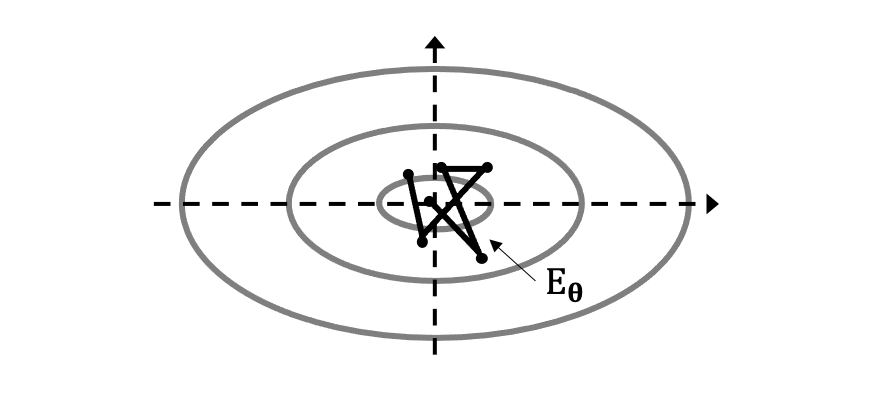
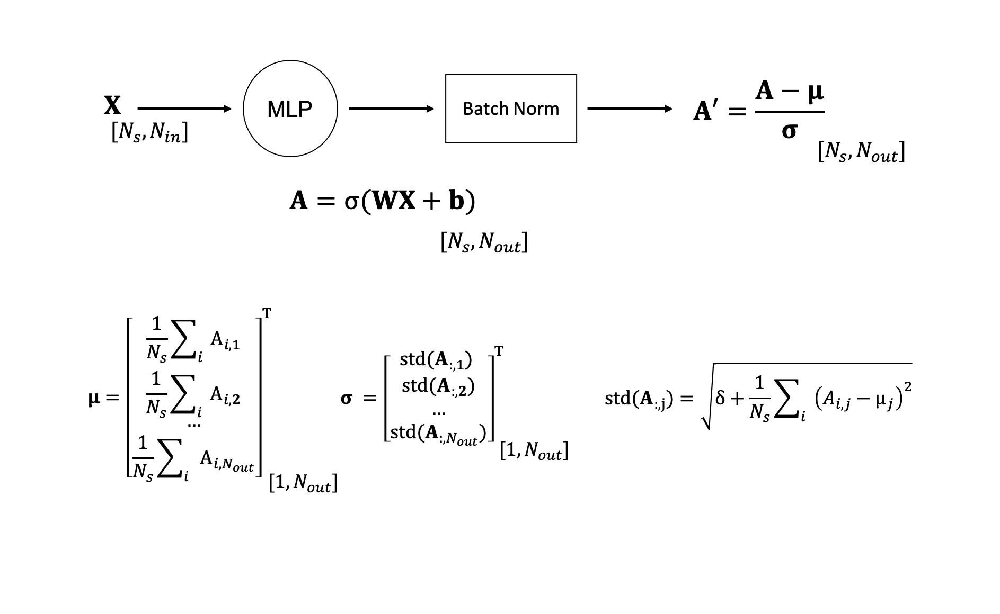

# More on gradient-based optimization

Whilst stochastic gradient descent is easy to understand, and simple to implement algorithm (as discussed in this
[lecture](lectures/03_gradopt.md)), it presents a number of shortcomings that prevent learning to be as fast and effective
as we would like it to be. In this lecture, we will discuss some of the limitations of SGD and look at alternative optimization
algorithms that have been developed in the last decade and are nowadays preferred to SGD in the process of training NNs.

## Limitations of SGD

### Ill-conditioning

The shape, and more specifically the curvature, of the functional that we wish to minimize affects
our ability to quickly and efficiently converge to one of its minima (ideally the global, likely one of the local). For nonlinear optimization problems, like those encountered in deep learning, this is mathematically represented by the *Hessian* matrix 
($\mathbf{H}=\frac{\partial^2 f}{\partial \boldsymbol \theta^2}$). An Hessian matrix with large conditioning number (i.e.,
ratio of the largest and smallest eigenvalues) tends to affect convergence speed of first-order (gradient-based) methods.

In classical optimization theory, second order methods such as the Gauss-Newton method are commonly employed to counteract
this problem. However, as already mentioned in one of our previous lectures, such methods are not yet suitable for deep learning
in that no mathematical foundations have been developed in conjunction with approximate gradients (i.e., mini-batch learning
strategy). 

Another factor that is worth knowing about is related to the norm of the gradient $\mathbf{g}^T\mathbf{g}$ through iterations.
In theory, this norm should shrink through iterations to guarantee convergence. Nevertheless, successful training may still be 
obtained even if the norm does not shrink as long as the learning rate is kept small. Let's write the second-order Taylor
expansion of the functional around the current parameter estimate $\boldsymbol \theta_0$:

$$
J(\boldsymbol \theta) \approx J(\boldsymbol \theta_0) + (\boldsymbol \theta - \boldsymbol \theta_0)^T \mathbf{g} + 
\frac{1}{2} (\boldsymbol \theta - \boldsymbol \theta_0)^T \mathbf{H} (\boldsymbol \theta - \boldsymbol \theta_0)
$$

and evaluate it at the next gradient step $\boldsymbol \theta = \boldsymbol \theta_0 - \alpha \mathbf{g}$:

$$
J(\boldsymbol \theta_0 - \alpha \mathbf{g}) \approx J(\boldsymbol \theta_0) - \mathbf{g}^T \mathbf{g} + 
\frac{1}{2} \alpha^2 \mathbf{g}^T \mathbf{H} \mathbf{g}
$$

We can interpret this expression as follows: a gradient step of $- \alpha \mathbf{g}$ adds the following contribution
to the cost function, $-\mathbf{g}^T \mathbf{g} + 
\frac{1}{2} \alpha^2 \mathbf{g}^T \mathbf{H} \mathbf{g}$. When this contribution is positive (i.e., 
$\frac{1}{2} \alpha^2 \mathbf{g}^T \mathbf{H} \mathbf{g} > \mathbf{g}^T \mathbf{g}$), the cost function grows instead of
being reduced. Under the assumption that $\mathbf{H}$ is known, we could easily choose a step-size $\alpha$ that prevents this from happening. However, when the Hessian cannot be estimated, a conservative selection of the step-size is the only remedy to prevent the cost function from growing. A downside of such an approach is that the smaller the learning rate the slower the training process.

### Local minima

Whilst the focus of the previous section has been in the neighbour of $\boldsymbol \theta_0$ where the functional 
$J_{\boldsymbol \theta}$ can be approximated by a convex function, the landscape of NN functionals is generally non-convex
and populated with a multitude of local minima. The problem of converging to the global minimum without getting stuck 
in one of the local minima is a well-known problem for any non-convex optimization. An example in geophysics is represented
by waveform inversion and a large body of work has been carried out by the geophysical research community to identify
objective functions that are more well-behaved (i.e., show a large basin of attraction around the global minimum).

Nevertheless, getting stuck into local minima is much less of a problem when training neural networks. 
This can be justified by the fact that multiple models may perform equally well on both the training and testing data. 
To be more precise this relates to the concept of *model identifiability*, where a model is defined identifiable if there exist a 
single set of parameters ($\boldsymbol \theta_{gm}$) that lead to optimal model performance. On the other hand, when multiple models $\{ \boldsymbol \theta_{gm}, 
\boldsymbol \theta_{lm,1}, ..., \boldsymbol \theta_{lm1,N}$ perform similarly those models are said to be non-identifiable. Moreover, even when a 
single model performs best, a distinction must be made between training and testing performance. As far as training performance is concerned,
this model must be that of the global minimum of the functional $\boldsymbol \theta_{gm}$. Nevertheless, the model that performs best on the testing
data may be the one obtained from any of the local minima $\boldsymbol \theta_{lm,i}$ as such a model be have better generalization capabilities
than the one from the global minimum. 

### Saddle points and other flat regions

Recent research in the field of deep learning has however revealed that multi-dimensional landscapes associated to the training of 
deep neural networks may actually have much fewer local minima than we tend to believe, and the main hinder to slow training is actually 
represented by saddle points (and flat regions in general). More specifically, empirically it can be shown that the ratio between saddle points and local 
minima is in the order of $e^n$ where $n$ is the number of dimensions of the model vector $\boldsymbol \theta$.

The main problem associated with saddle points is similar to that of local minima: the associated gradient is $J(\boldsymbol \theta) \rightarrow 0$; 
as a consequence, during training, when the trajectory of the model parameter vector
approaches a saddle point, the learning process may experience a slow down. 

### Cliffs

Another potentially dangerous feature of NN landscapes is represented by steep regions where $J(\boldsymbol \theta) \rightarrow \infty$.
This may in fact lead to unstable behaviours during training as large jumps will arise in the trajectory of the model parameter vector.

Heuristic approaches to mitigate this problem exist, one of them is the so-called *gradient clipping* strategy where:

$$
\nabla J(\theta_i) = min(\nabla J(\theta_i), th)
$$
where $th$ is a user-defined threshold. This approach allows element-wise gradient clipping for those directions with an extremely large gradient
whilst not forcing us to lower the overall learning rate.

### Exploding and vanishing gradients

Two problems that we commonly encounter whilst training Neural Networks are the so-called exploding and vanishing gradient phenomena. Whilst we already mentioned two scenarios where either of these situations can occur, i.e., cliffs and saddle points, the shape of the functional that we wish to optimize is not the only reason for gradients to grow uncontrolled or stagnate. It is in fact the NN architecture itself that sometimes may give rise to such phenomena.

To provide some intuition, let's consider a matrix of weights $\mathbf{W}$ and apply it N times recursively to a certain input
(where for simplicity we ignore the nonlinear activation functions):

$$
\mathbf{y}=\mathbf{W}^N\mathbf{x}
$$

If we assume $\mathbf{W}$ to be symmetric for simplicity and express it using
its eigendecomposition

$$
\mathbf{W}=\mathbf{V} \boldsymbol \Sigma \mathbf{V}^{-1}
$$

the resulting output vector $\mathbf{y}$ can be equivalently written as:

$$
\begin{aligned}
\mathbf{y} &= \mathbf{V} \boldsymbol \Sigma \mathbf{V}^{-1} \mathbf{V} \boldsymbol \Sigma \mathbf{V}^{-1} ... \mathbf{V} \boldsymbol \Sigma \mathbf{V}^{-1} \mathbf{x} \\
&= \mathbf{V} \boldsymbol \Sigma^N \mathbf{V}^{-1} \mathbf{x}
\end{aligned}
$$

where we have used here the property of eigendecomposition, $\mathbf{V}^{-1} \mathbf{V} = \mathbf{I}$. Note that since
the matrix of eigenvalues is raised to the power of N, when N is large we will experience the following phenomena:

- $\lambda_i > 1 \rightarrow$ exploding gradient; 
- $\lambda_i < 1 \rightarrow$ vanishing gradient; 

Note that the scenario discussed here does not manifest itself when training feed forward networks, whilst it is much more relevant in the context of recurrent neural networks as the same weights are repeatedly applied to the input
as it flows through the computational graph. We defer a more extensive discussion of this phenomenon to this [lecture](lectures/XX.md).

## Stategies to improve SGD

After looking at some of the problems that we should be aware of when training NNs (note that some of them can be
easily overcome as we will see in the following, whilst others are outstanding and do not have a simple solution), let's look back
at the SGD algorithm and consider a number of improvements that can lead to both faster and more stable training.

We remember from our previous [lecture](lectures/03_gradopt.md), that the optimization step of SGD is simply composed of two steps:

- compute the gradient of the cost function with respect to the free-parameters, obtained via back-propagation
- apply a scaled step, dictated by the learning rate $\alpha$.

### Cooling strategy

The most basic version of SGD uses a constant learning rate. However, a learning rate that may be optimal at the start of training and lead to fast convergence towards one of the minima of the cost function, may lead to unstable behaviour at later iterations.

A question arises: given a gradient telling us where to move in the NN functional landscape, can we do something smart with the 
learning rate to reach the minimum faster. A common approach usually referred to as *cooling strategy* or *learning rate scheduling*, where the learning rate is not kept fixed through epochs. Instead, the learning rate is slowly reduced as epochs progress allowing the trajectory of the free-parameters to not fluctuate too much as it progresses towards a valley. 

Many alternative approaches to LR scheduling exist. However, to be effective, they must respect the following conditions:

$$
\sum_i \alpha_i = \infty, \; \sum_i \alpha_i^2 < \infty'
$$

or, in words, the learning rate should reduce slowly as iterations progress. 

One common approach uses a linearly decaying LR for the first $\tau$ iterations, followed by a constant LR:

$$
\begin{aligned}
&\alpha_i = (1-\beta) \alpha_0 + \beta \alpha_\tau \qquad i<\tau\\
&\alpha_i = \alpha_\tau \qquad i\ge\tau
\end{aligned}
$$

where $\beta=i/\tau$. As a rule of thumb, $\tau \approx 100 N_{epochs}, \alpha_\tau = \alpha_0/100$, whilst the choice
of $\alpha_0$ is problem dependent and chosen by monitoring the first few iterations.

Alternative approaches can either apply a fixed decay (i.e., exponential) or choose to reduce the LR when the training (or validation) metric has not decreased for a number of epochs.

### Momentum

Another commonly used strategy aimed at improving the convergence of SGD is called *Momentum* and dates back to the 60s and the
seminal works of Polyak and Nesterov in the area of mathematical optimization. The idea of momentum is rather simple, yet very effective. It is based on the idea of using information not only from the current gradient but also from past gradients when making a step. More specifically, the step is based on an exponentially decaying moving average of the past gradients created during iterations.

The motivation behind using multiple gradients is to use the knowledge about the landscape shape accumulated through time in
the proximity of the current parameters to make a more informed decision on where to move. This can generally help dealing with 
poorly conditioned modelling matrices in linear optimization and poorly conditioned Hessian matrices in nonlinear optimization.
Intuitively, momentum can be understood as some sort of medium resistance or inertia when moving down a valley which slows down the trajectory and keeps it close to the axes of the ellipses of the functional (or its linearization around the current position). This physical interpretation is actually used when defining SGD with momentum as a vector $\mathbf{v}$ (where v stands for velocity) is introduced:

$$
\mathbf{v}_{i+1} = \gamma \mathbf{v}_i - \mathbf{g}_{i+1} = \gamma \mathbf{v}_i - \frac{\alpha}{N_b} \sum_{j=1}^{N_b} \nabla \mathscr{L}_j
$$

and the update becomes:

$$
\boldsymbol\theta_{i+1} = \boldsymbol\theta_{i} - \mathbf{v}_{i+1}
$$

where $\gamma \in [0, 1)$ is the momentum term. If we write explicitly the first three iterates of the velocity vector:

$$
\begin{aligned}
&\mathbf{v}_0 = - \alpha \mathbf{g}_0\\
&\mathbf{v}_1 = \gamma \mathbf{v}_0 - \alpha \mathbf{g}_1 =  - \gamma \alpha \mathbf{g}_0 - \alpha \mathbf{g}_1 \\
&\mathbf{v}_2 = \gamma \mathbf{v}_1 - \alpha \mathbf{g}_2 = 
- \gamma^2 \alpha \mathbf{g}_0 - \gamma \alpha \mathbf{g}_1 - \alpha \mathbf{g}_2
\end{aligned}
$$

we notice that the momentum tells us how quickly the contribution of the previous gradients should decay. With $\alpha=0$ we are back to the standard SGD algorithm, whilst with $\alpha \rightarrow 1$ we take into account the entire history of gradients. More commonly used values of momentum are $\alpha=0.5/0.9/0.99$ which can also be combined with a warming strategy (i.e., start from 0.5 and increase through iterations all the way to 0.99). This is a similar strategy (even though in opposite direction) to the one we previously discussed for the learning rate, even though it is known to impact the learning process to a lesser extent.

Based on what we wrote above for the first three iterates, we can easily conclude that:

- if $\mathbf{g}_i \approx \mathbf{g}_{i-1} \approx \mathbf{g}_{i-2}$ (where the sign $\approx$ is used here to
  indicate a vector with approximately the same direction), the gradients' sum constructively leading to higher momentum and therefore a faster trajectory
- if $\mathbf{g}_i \ne \mathbf{g}_{i-1} \ne \mathbf{g}_{i-2}$ (where the sign $\ne is used here to
  indicate a vector with different directions), the gradients' sum destructively leading to lower momentum and therefore a slower trajectory

Finally, an even smarter approach would require us not only to accumulate past gradients but also to look ahead of time
so that we could slow down the trajectory if the landscape is about to change curvature (i.e., slow up). This
requires a slight modification of the momentum term, referred to as *Nesterov momentum*:

$$
\mathbf{v}_{i+1} = \gamma \mathbf{v}_i - \frac{\alpha}{N_b} \sum_{j=1}^{N_b} \nabla \mathscr{L}_j(f_{\theta+\gamma \mathbf{v}_i}(\mathbf{x}_i), y_i)
$$

where the main change here is represented by the fact that the loss function ($\mathscr{L}$), and therefore, the gradient is
evaluated at location $\theta+\gamma \mathbf{v}_i$ rather than at the current one. Here, $\gamma \mathbf{v}_i$ represents
a correction factor to the standard method of momentum. In classical optimization (i.e., for batched gradient descent), this small change provides an improvement in the rate of convergence from $\mathcal{O}(1/i)$ to $\mathcal{O}(1/i^2)$. Note that this is however not always the case when using stochastic gradient descent.

### Adaptive learning rates

Up until now, we have introduced some modifications to the standard SGD algorithm that globally change the scaling of the
gradient (also referred to as learning rate). However, if we believe that directions of sensitivity of the functional should be axis aligned, different learning rates should be used for the different parameters we wish to optimize for. More specifically a small LR should be preferred for those directions associated with large eigenvalues of the local Hessian whilst a large LR should be used for the other directions that associated with small eigenvalues.

The *delta-bar-delta* algorithm of Jacobs (1988) represents an early heuristic approach to automatically adapting
learning rates of individual parameters. It is based on this simple rule:

- if $sign\{g_{i+1}^j\} = sign\{g_{i}^j\}$, increase LR
- if $sign\{g_{i+1}^j\} \ne sign\{g_{i}^j\}$, decrease LR

where $j$ refers here to the j-th component of the gradient vector.

However, in the last decade a large variety of optimizers have appeared in the literature mostly focusing on this 
particular aspect of training, i.e. parameter-dependent learning rate. We will go through some of the most popular ones
that have revolutionized the way we train NNs nowadays.

#### AdaGrad

This optimizer scales the gradient vector by the inverse of the square root of the sum of all historical squared 
values of the gradient.

$$
\begin{aligned}
&\mathbf{g}_{i+1} = \frac{1}{N_b} \sum_{j=1}^{N_b} \nabla \mathscr{L}_j\\
&\mathbf{r}_{i+1} = \mathbf{r}_i + \mathbf{g}_{i+1} \cdot \mathbf{g}_{i+1} \\
&\Delta \boldsymbol\theta_{i+1} = -\frac{\alpha}{\delta + \sqrt{\mathbf{r}_{i+1}}} \cdot \mathbf{g}_{i+1} \\
&\boldsymbol\theta_{i+1} = \boldsymbol\theta_{i} - \Delta \boldsymbol\theta_{i+1}
\end{aligned}
$$
  
where the vector $\mathbf{r}$ contains a running sum of the element-wise square gradients 
(with $\mathbf{r}_0=0$), $\cdot$ and $\sqrt{\;}$ represent the element-wise multiplication of two vectors and
square root, respectively. Finally, $\delta=10^{-6}$ is used as stabilizer to avoid division by zero.

If we look at the learning rate of AdaGrad, it is clear that this is parameter dependent and more importantly, it is 
a function of the norm of the past gradients. Therefore, parameters associated with large gradients will experience
a rapid decrease in their associated LR, whilst parameters with small gradients will have an increase of the LR
through iterations. 

The effect of such adaptive LR, is that the trajectory of the parameters will show greater
progress over gently sloped directions of the landscape. Nevertheless, it has been reported in the literature that a
main drawback of AdaGrad is that this effect is too strong, leading to a premature decrease of the LR in those
directions with large gradients and therefore an overall slow learning process.

#### RMSProp

A modified version of AdaGrad particularly suited for nonconvex optimization where the gradient accumulation 
(i.e., $\mathbf{r}$ vector) is exponentially weighted on a moving window. The idea behind is that for NN training it may take a large number of gradient steps to converge to a satisfactory solution, and therefore it is important for the LR not to decrease too fast in the first few hundred steps. In mathematical terms, a single change is needed to the AdaGrad equations, namely:

$$
\mathbf{r}_{i+1} = \rho \mathbf{r}_i + (1-\rho)\mathbf{g}_{i+1} \cdot \mathbf{g}_{i+1} \\
$$

where $\rho$ represents the decay rate in the accumulation of past gradients. RMSProp, which was proposed by
Geoffrey Hinton during a Coursera class, is shown to be one of the best-in-class optimizers for NN training and it
is widely adopted by the DL community.

#### ADAM 

ADAM stands for Adaptive Moments and it is a variant of RMSProp that further includes Momentum. Nowadays, ADAM 
is by far the most popular optimizer in the training of deep NNs. 

Two key changes have been introduced in the ADAM algorithm when compared to RMSProp:

- Momentum is applied via an estimate of the first-order momentum plus an exponential decay and used in spite of 
  pure gradients in the parameter update step;
- A bias correction is included to take into account initialization.

The algorithm can be written as follows:

$$
\begin{aligned}
&\mathbf{g}_{i+1} = \frac{1}{N_b} \sum_{j=1}^{N_b} \nabla \mathscr{L}_j\\
&\mathbf{m}_{i+1} = \rho_1 \mathbf{m}_i + (1-\rho_1)\mathbf{g}_{i+1} \leftarrow velocity \; term \\
&\mathbf{v}_{i+1} = \rho_2 \mathbf{v}_i + (1-\rho_2)\mathbf{g}_{i+1} \cdot \mathbf{g}_{i+1}  \leftarrow scaling \; term \\
&\hat{\mathbf{m}}_{i+1} = \frac{\mathbf{m}_{i+1}}{1-\rho_1^{i+1}} \leftarrow bias \; correction \\
&\hat{\mathbf{v}}_{i+1} = \frac{\mathbf{v}_{i+1}}{1-\rho_2^{i+1}} \leftarrow bias \; correction \\
&\Delta \boldsymbol\theta_{i+1} = -\frac{\alpha}{\delta + \sqrt{\hat{\mathbf{v}}_{i+1}}} \cdot \hat{\mathbf{m}}_{i+1}\\
&\boldsymbol\theta_{i+1} = \boldsymbol\theta_{i} - \Delta \boldsymbol\theta_{i+1}
\end{aligned}
$$

where, once again, a number of hyperparameters are introduced. These are the stabilizer, $\delta=10^{-6}$, and two 
decay rates ($\rho_1$ and $\rho_2$).

To conclude, we have first introduced simpler optimizers and subsequently built complexity in terms of both momentum and 
parameter-dependent learning, there is no universal winner. Although both momentum and adaptive LR do clearly seem
to be beneficial to the training on NNs, it is not always the case that ADAM provides the best results both in
terms of robustness and convergence speed. It is therefore important to be aware of the different optimizers that
are available in the DL arsenal and identify the best based on the task at end. In other words, the choice of the
optimizer can usually represent one of those hyperparameters that ML practitioners need to evaluate and select
when developing a new ML pipeline.

### Other tricks

In the following, we report a few other practical tricks that can be used when training NNs to further
improve the learning capabilities of our optimizer (no matter what optimizer has been selected).

#### Polyak Averaging
When training a NN, the most common approach is to select the last iterate ($\boldsymbol\theta_{N_{it}}$) where 
$N_{it}$ is the overall number of iterations and use it at inference stage. Nevertheless, given the highly nonconvex 
optimization problem that we are required to solver, it is logical to expect that perhaps the last estimate of
model parameters is not the best. Let's for example imagine that towards the end of the training process we are approaching a (local or global) minimum. However, our trajectory is bouncing all around the valley: 

A simple approach to mitigate this effect is to average over the last $N$ iterations:

$$
\boldsymbol\theta = \frac{1}{N} \sum_{i=0}^{N-1} \boldsymbol\theta_{N_{it}-i}
$$

This averaging acts as a denoising process that takes away some of the fluctuations and makes the optimization 
process less sensitive to the last step.

#### Batch Normalization
This is a very recent advancement in the field of DL, from the seminal work of Ioffe and Szegedy (2015). It has been shown
to be particularly beneficial to the training of very deep neural networks.

Let's first take a look at what happens during the training process if we do not include batch normalization. As 
previously discussed, given the gradient $\partial J / \partial \boldsymbol \theta$, at every step of the optimization
process all the parameters (weights and biases) in the different layers of a NN are simultaneously updated. This
goes against the "theoretical assumption" that the optimization process should update one parameter at the time (which
is however too expensive and therefore unfeasible). As a consequence of the fact that all free-parameters are updated
together is that second order updates are introduced or, in other words, the statistical distribution of various parameters
across the layers of the NN are modified. This is commonly referred to as *internal covariate shift*.

*Batch normalization* use a general way to reparametrize every NN, which reduces the need for coordination across many 
layers during an update (making the process of updating all parameters at the same time more stable). It is simply
implemented by modifying the output of a layer (or all the layers) at training time as follows:

where a re-normalization process is applied to every row of the output matrix $\mathbf{A}$ and it is directly based on the local statistics (mean and standard deviation) of the output of the layer. The overall forward and backward passes remain unchanged with the simple difference that the network is now operating on the re-normalized output $\mathbf{A}'$ instead of the original one $\mathbf{A}$.

The implications of such an additional step of re-normalization are that now the activations are distributed as $\mathcal{N}(0, 1)$ throughout the entire training process. By doing so, the optimization algorithm is discouraged to propose an update that simply acts constantly over the mean or the standard deviation of $\mathbf{A}$.

At testing time, the mean and standard deviation ($\boldsymbol \mu$ and $\boldsymbol \sigma$) are usually fixed and taken from a
running mean computed during training time.

In practice, however, batch normalization includes an extra step where instead of forcing the mean and standard deviation
of each layer to be fixed, these parameters are learned to make the units of the network more expressive. This is simply
accomplished by defining the output $\mathbf{A}''$ as:

$$
\mathbf{A}'' = \gamma \mathbf{A}' + \beta
$$

where $\gamma$ and $\beta$ are also learned alongside the weights and biases of the network. Finally, since the bias is now induced by $\beta$ a common recommendation when using batch normalization is to avoid adding a learnable bias to the layer of the network.

#### Supervised pre-training

So far, we have talked about optimizing the free-parameters of a neural network starting from a random initialization of such
parameters and using all the available data to get the best estimate of such parameters. We have also briefly mentioned that
transfer learning, a technique that uses a pre-trained network on a different set of data and possible different task and fine-tunes it on the task and data at hand, as a way to speed-up the training process as well as get around to the fact that sometimes we have access to a small amount of labelled data.

Another interesting technique that can be used to ease the learning capabilities of a NN is called *pre-training* or *greedy training*. Two alternative approaches are generally taken:

- $\boldsymbol \theta_0$ (selected at random) $\rightarrow$ Simple task: $\tilde{\boldsymbol \theta}$ $\rightarrow$ Hard task: $\tilde{\boldsymbol \theta'}$
- $\boldsymbol \theta^1_0$ (selected at random) $\rightarrow$ Simple network: $\tilde{\boldsymbol \theta^1}, \boldsymbol \theta^2_0$
  $\rightarrow$ Complex network: $\tilde{\boldsymbol \theta^1}, \tilde{\boldsymbol \theta^2}$

where in the latter case a common approach is to fix the hidden layers and discard the output layer after the first training process, add a number of extra layers to make the network deeper and continue training those layers alone. However, since N independent optimizations generally do not provide the overall optimal solution, a final fine-tuning step may be required.

## Additional readings

- A [great resource](https://github.com/jettify/pytorch-optimizer) containing references (and Pytorch implementations) of more than 20 optimizers. This may be a good starting point if interest to experiment with different optimizers in both classical optimization and training of NNs.
- Another great [resource](https://github.com/labmlai/annotated_deep_learning_paper_implementations) with step-by-step implementations of 
  some popular optimizers and networks.
