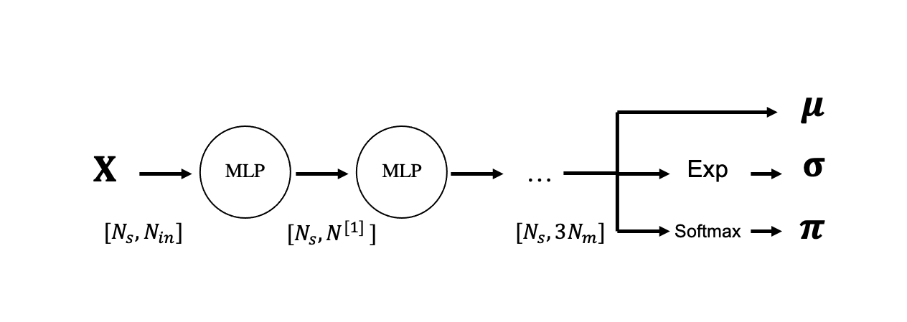
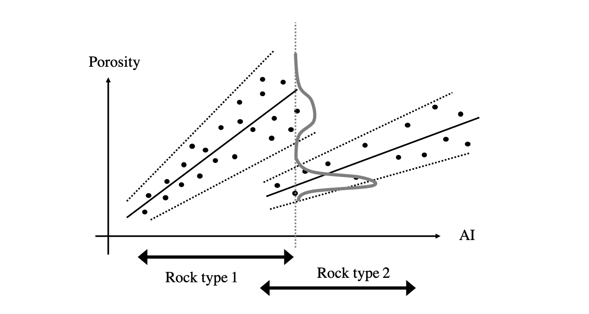

# Uncertainty Quantification in Neural Networks and Mixture Density Networks

Before delving into more advanced NN building blocks (e.g., convolutional, recurrent), let's revisit the training process
of feed forward NNs with a probabilistic standpoint. Anything that we present here can be later applied to any of the other NN 
architectures that will be discussed in this course.

We have already discussed that every loss function commonly used in the training of NNs, both for regression and classification,
can be justified using a statistical formulation mostly in the context of Maximum-likelihood estimators. Despite this intrinsic
link with probabilistic modelling, NN predictions are however most of the time punctual, meaning that we do not get an idea of
the uncertainty associated to our prediction. 

First of all, it is important to remark the fact that even in classification tasks when the output of a softmax layer has the form
of a probability (i.e., each term is bounded between 0 and 1, and their sum is equal to 1), this values should not be treated as an accurate description of the confidence level of our prediction.

Second, when assessing the confidence of a NN prediction (or another ML model), two different types of uncertainties 
are generally identified:

- *Epistemic uncertainty*, also called model uncertainty: this uncertainty arises from a lack of training data in certain regions of the input domain. As we can expect our training data not to cover the entire input space, our trained network is likely to produce arbitrary output values for a large portion of the input values that the network has never seen before. We therefore want to be able to quantify the lack of accuracy due to missing training data.
- *Aleatoric uncertainty*: this uncertainty is associated with the fact that the input data may contain some intrinsic randomness. This is either represented by the fact that the function we try to approximate is multimodal (i.e., multiple possible outputs exist for a single input) or the recorded data is polluted by noise. As a result, the training data will include samples with very close input values and a large spread of output values. We wish to be able to get such an insight out of the network predictions.
 

A number of more or less simple strategies can however be employed when training NNs with the goal of obtaining a quantitative measurement of how certain our estimate is:

- *Dropout*: this commonly used regularization strategy presented in one of our previous lectures can be also leveraged to produce an estimate of the uncertainty of our solution. This can be done by simply using dropout at the inference time and feeding the network multiple times with the same input. Multiple realizations of a prediction are computed, where different portions of the neurons of the network are deactivated for the different realizations. An empirical distribution or parameter estimates (e.g., mean and standard deviation) over the outputs can be finally estimated. 
  The reason behind the success of this strategy is that the network can easily learn to always predict the same (or very similar) output when it is well constrained by data no matter if some of the neurons are deactivated at random. On the other hand, when the network is more unsure because of lack of data or contrasting data, different versions of the network are likely to produce different predictions.

- *Ensembling*: another popular strategy, although quite expensive, is to train N neural networks with different initializations and use them to produce multiple predictions. Similar to dropout, when the training data is available and of good quality, the different networks will make similar predictions as they will likely converge to minima of similar quality. On the other hand, when the data is poor (or lacking), the weight initialization plays a much bigger role in the training and different network are likely to behave differently.
  
- *Distributional parameter estimation (DPE)*: a different route is to change the parametrization of the output itself. More specifically, considering here for simplicity the case of regression, the network is asked to produce two outputs. The first is tasked to predict the mean of the output distribution whilst the second predicts the standard deviation. Whilst in the more traditional training of NNs the standard deviation is kept fixed for all training samples, here the network will be able to understand which portion of the input data is noisier and which is cleaner (as well as detect where input data is missing). The negative log-likelihood is chosen to be the loss function of the network:

$$
\boldsymbol \theta = \underset{\boldsymbol \theta} {\mathrm{argmin}} \; \sum_{i=1}^{N_s} \frac{log \hat{\sigma}^{(i)2}}{2} +
\frac{||\hat{y}^{(i)} - y^{(i)}||_2^2}{2\hat{\sigma}^{(i)2}} \\
$$

  with the main difference that not only the mean (here denoted as $\hat{y}^{(i)}$) but also the standard deviation ($\hat{\sigma}^{(i)}$) are produced by the network and therefore function of the free-parameters that we wish to optimize. Intuitively, the numerator of the second term encourages the mean prediction to be close to the observed data, while the denominator makes sure the variance is penalized the predictions. The first term avoids the network making the variance grow to infinity (which would lead to minimizing the second term no matter the mean value prediction).

- *Mixture density networks*: a natural extension of the DPE method is is represented by networks that try to predict more complex probability distributions by parametrizing them as a mixture of gaussians. 
  

## Mixture density networks (MDNs)

Extending to the case above, the network output is now composed of $N_m$ means, $N_m$ standard deviations, 
and $N_m$ weights (where $N_m$ is the number of gaussians in the mixture):
  

and the probability of a single outcome $y$ given a single input $\mathbf{x}$ can be written as follows:

$$
p(y|\mathbf{x}) = \sum_{i=1}^{N_m} \pi_i p_i(y|\mu_i,\sigma_i) = 
  \sum_{i=1}^{N_m} \pi_i \frac{1}{\sqrt{2 \pi \sigma_i^2}} e^{-\frac{||y - \boldsymbol \mu_i||_2^2}{2 \sigma_i^2}}
$$

A few key points worth highlighting for this model:

- the last layer produces an output of size $3N_m$, where the last $N_m$ values must sum to 1 as they represent the weights
of the gaussian mixture. They are therefore passed through a softmax activation function.
  
- the variances should always be positive, this can be simply obtained by adding an exponential activation function at the end 
  of the network to the parameters that represent the variance. This turns unbounded values into values bounded between 0 and $+\infty$.

The loss function used for MDNs is once again the negative log-likelihood, which can be written for a single training sample
as follows:

$$
\begin{aligned}
- log(p(y|\mathbf{x})) &= - log(\sum_{i=1}^{N_m} \pi_i p_i(y|\mu_i,\sigma_i)) = \\
&= -log(\sum_{i=1}^{N_m} e^{(log \pi_i + log p_i)})
\end{aligned}
$$
  
where the second equation is introduced to avoid instability issues arising by applying the logarithm to the sum of exponential functions.
Here we observe that a $log(\sum e)$ has to be computed; this can be stably done by using the LogSumExp (LSE) function.

In prediction mode, a certain input $\mathbf{x}$ is feed through the network and a prediction of both the means, standard deviations and weights is produced. This uniquely define the probability function of the mixture of gaussian that we have decided to use to parametrize the output of the network.

To conclude, let's discuss a practical scenario where MDNs should be preferred to simple DPE networks. Imagine that we are tasked to predict the porosity values in the subsurface given knowledge of elastic parameters (e.g., acoustic and shear impedance). Depending on the rock type, the relation between porosity and acoustic impedance may change. More importantly, there may be a certain overlap in the acoustic impedance values of the different rock types. If this is the case, as shown in the figure below, the output is multi-modal; unless we are certain about the rock type (or jointly predict the rock type alongside the porosity value), we would like the network to inform us when we should be confident about our prediction and where two distinct values of porosity have been observed in the training data for the same (or similar) value of acoustic impedance. Of course, despite this is a simple, single-dimensional example, similar conclusions apply when training a NN with multi-dimensional inputs.

## Additional readings

- To learn more about uncertainties in deep learning, read this [webpage](https://www.inovex.de/de/blog/uncertainty-quantification-deep-learning/)
- If you are interest to learn more about MDN, this [blog post](https://towardsdatascience.com/mixture-density-networks-probabilistic-regression-for-uncertainty-estimation-5f7250207431)
  provides an in-depth introduction of both the underlying theory and implementation details.
