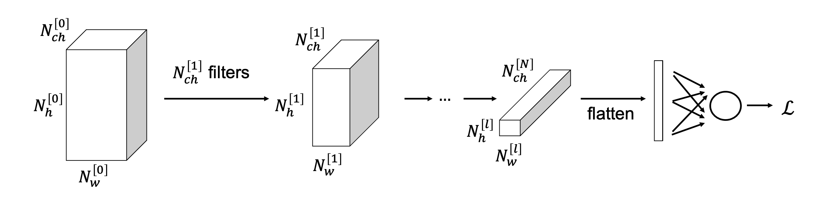
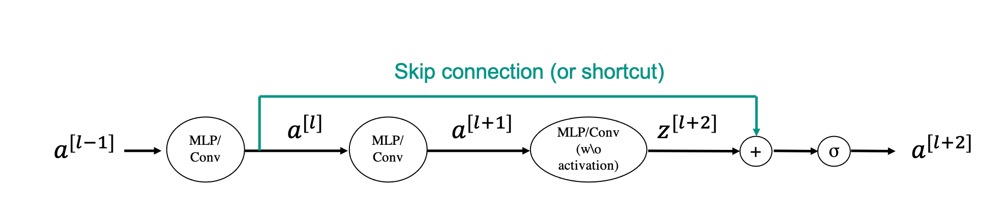

# Convolutional Neural Networks

Convolutional Neural Networks are one of the most powerful types of neural network, very popular and successfull in image processing (and more broadly computer vision). They are based on a simple mathematical operation that we, geoscientists, know very well and user in a variety of tasks: the *convolution* operator. This is motivated in most scenarios where local dependancies in the input data are known to be predominant. 

Imagine for example a geological model, or a core section. If we decide to apply Deep Learning to such data to either classify
rock types, estimate rock parameters, or even for generative modelling tasks, the first thing that we would like our NN to know is that nearby geological features are likely to be correlated, whilst the further apart we move the more the features become
independent from each other. By looking at the schematic diagrams below, a FCN would not take this prior information into account
as each input value is linearly combined to give rise to the output. On the other hand, a convolutional block which represents
the key component of a CNN will only use values of the input vector in a certain neighbour to obtain the output:

The example mentioned above is just one of many in geoscience where convolution-based networks have been lately shown to be very 
successfull. Other examples are:

- *Seismic interpretation* (faults, horizons, bodies)
- *Seismic processing* (denoising, interpolation, deblurring)
- *Satellite imaginery* (denoising, segmentation)
- *Microseismicity* (detection, source mechanism)
- *Laboratory studies* (CT, SEM, Microscopy for various processing and interpretation tasks)

In general, any data type that is represented regularly on a 1D, 2D, or ND gridded topology is fit for CNNs.

## Convolution

First of all, let's briefly recall what a convolution is. This represents in fact the core operation performed by a convolutional layer.

A convolution between two signals can be mathematically written as

$$
y(t) = \int x(\tau) h(t-\tau) d\tau \leftrightarrow y = x * h
$$

where $x(t)$ and $y(t)$ are the input and output, respectively, and $h(t)$ is the filter (also called *kernel* in the DL jargon).
This equation can be interpreted as follows: take the filter and flip it across the origin, then slide it along the time axis and multiply-and-sum it to the input signal.

In practice, when working with digital data in a computer, all signals are discrete and the continous formula above can be rewritten as follows:

$$
y_i = \sum_{j=-\infty}^{\infty} x_j h_{i-j}
$$

where, to be general, we have here extended the integral from $-\infty$ to $\infty$. In most applications, the filter $h$ is however compact (it has a small size of N samples, also called *kernel size*) and therefore we can limit the summation within the window of samples where the filter is non-zero.

A similar (but still different!) concept in signal processing is *correlation*

$$
y(t) = \int x(\tau) h(t+\tau) d\tau \leftrightarrow y_i = \sum_{j=-\infty}^{\infty} x_j h_{i+j}
$$

where the filter is simply slided across the $t$ axis (without being initially flipped). The main difference between convolution and correlation is therefore that one delays the input signal whilst the other anticipates it when the filter is non-symmetric to zero. As we will see later, it is important to immediately empathise also a slight difference in the jargon used in classical signal processing and deep learning: what usually we refer to as convolution in DL is what signal processing refers to as correlation. However, since in DL we do not choose the filter $h$, rather this is learned from data, if signal processing convolution was used instead of correlation, the learning algorithm would just learned the flipped version of the filter.

In both cases, when we convolve two signals of size $N_x$ with a filter of size $N_h$, the output signal has size:

$$
N_y = N_x + N_h - 1
$$

However, in the context of CNNs, we generally only want to consider the so-called *valid* part of the convolution, i.e., where the entire filter contributes to the computation. For this reason the output signal size becomes:

$$
N_y = N_x - N_h + 1
$$

In the next section, we will see how we can actually make the choice of $N_y$ more flexible with the help of additional tools like padding and striding.

Extending the concept of convolution to two- and multi-dimensional data is straighforward. This can be done by simply
sliding the filter in all dimensions and can be mathematically written (in the discrete form) as follows:

$$
y_{i,j} = \sum_m \sum_l x_{ij} h_{i+m,j+l}
$$

Finally, another interesting thing to notice is that convolution is a linear process. Therefore we can express it as a matrix-vector multiplication where the vector identifies the input data and the filter is re-organized into a Toeplitz matrix as show in the figure below

which means that the gradient of a convolutional operator that we need for backpropagation is just the adjoint of the matrix $\mathbf{H}^T$. This is a convolution with the flipped kernel (so truly a convolution!).

## Why Convolution?

A first intuitive motivation about locality of interactions, also referred to as *space interactions* 
(or *sparse connectivity* or *sparse weights*), has been already provided onto why convolution blocks may represent an appealing
alternative to fully connected blocks in the context of neural networks. However, this is not the only reason why convolution blocks are so powerful and widely used nowadays when training NNs for image processing tasks.

Let's start with an example. Imagine we are given a large image and a small 3x3 kernel. By sliding the kernel across the image we can still be able to detect useful local features (e.g., edges). Note that, the Machine Learning community has been aware of this for decades, and in fact many early approaches to image detection relied on hand-crafted filters that could highlight one feature of the input data over another. 
The modern DL approach simply takes this paradigm one step further where the filters are learned instead of being defined upfront. Experience has further shown that deep CNNs learn initially low level features (e.g., edges), then middle level features (e.g., shapes) and finally high level features (e.g., objects).

Compared to flattening the input data and applying a matrix that transforms it into the dimension of the output data (that is what a FCC would do as shown above), using convolutions with small filters can save both memory and computations. Given for example an image of size $N_{w,x} \times N_{h,x}$, a fully connected layer that produces an output of the same size requires a matrix with $(N_{w,x} N_{h,x})^2$ parameters and $(N_{w,x} N_{h,x})^2$ computations are required to obtain
the output. On the other hand, if we now consider a simple filter of size $N_{w,h} \times N_{h,h}$, the number of computations is reduced to $N_{w,x} N_{h,x} N_{w,h} N_{h,h}$.

The second main advantage of convolutional blocks is so-called *parameter sharing*. The same learned kernels are applied all over the input data, instead of having one filter operating on all (or part of) the input data to produce a single output component.

Finally, a third benefit is the *equivariance of convolution to translation*. This means that if we shift the input by $k$ samples, the output will also be shifted by the same number of samples; however, the shape of the output will not change.

## Padding and strides

We have previously seen how applying convolution to a signal with a kernel of a given size produces an output signal of different size, either with the total or valid output size is chosen. It may be however much easier when designing a convolutional neural network to have inputs and outputs of the same size, or more in general to be free to design the size of the output indipendent on that of the input and filter. Two simple approaches exist:

- *padding*: the input signal is padded with zeros on both sides (for 1D signals) or all sides (for ND signals) prior to convolution. This allows producing outputs that can have the same size or even larger size than the input. Let's first look at this with an example when the output size is computed using the equation above for the valid case. We can devise a padding such that the size of the output stays the same as that of the input. This is actually easy to do once we choose the size of the filter and more specifically $N_{x,pad} = N_x + 2*pad$ with $pad = (N_h-1)/2$ when $N_h$ is a odd number and $N_h/2$ when $N_h$ is a even number.
  
  Moreover, apart from the obvious benefit of not having to handle outputs that keep reducing in size, padding ensures that edge values in the inputs are also used the same number of times that central values in the convolution process.
  

- *strides*: a common approach when building convolutional neural network, as we will see when discussing popular CNN architecture, is however to gradually reduce the size of the signal (or image in 2D) whilst going deeper and deeper into the network. Two alternative ways to achieve this exist: the simplest is to couple convolutional layers that do not change the size of the input and downsampling (or pooling layers). Alternatively, one can choose to apply a special type of convolution called *strided convolution* that simply moves the filter around the input jumping (or striding) by more than a single sample at the time. Again, if we look at an example, we can observe how by doing so the size of the output is reduced by the striding factor. If we stride by a factor of two the output size will be half of the input size. As a result the output size can be written as $N_y = \lfloor (N_x - N_h) / stride + 1 \rfloor$.
  

Eventually striding and padding can be used together to get for example an output that is exactly half of the size of the input in all directions. An important formula to remember when designing convolutional layers is:

$$
N_y = \Bigl\lfloor \frac{N_x + 2pad - N_h}{stride} + 1 \Bigr\rfloor
$$

## Channels

We need to introduce one last key ingredient before we can define a convolutional layer. Let's imagine we have a 3D tensor and a 3D filter; the extension of 2D convolution to 3D (or any extra dimension) is as easy as sliding the filter along the third dimension as well as the first two. However, in deep learning we generally do something different when we are dealing with convolutional networks. We define a special dimension called *channel*.

Imagine having a 1D signal like a seismic trace but recording both the horizontal and vertical components of the particle displacement field. One way to arrange such data is as a 2D array where one of the dimensions is the size of the trace and the other is the number of components (or channels), here two. A similar scenario may arise for 2D signals if we record for example different spectral components or for pre-stack seismic data where we record data at different angles. Here once again we will have two "classical" dimensions, say latitude and longitude or geographical location and depth and one channel dimension. For the first example this will contain the different spectral components, for the second example it will be represented by the different angles (or offsets). This is the geoscientific equivalent to natural images that are commonly used in deep learning tasks where the channel contains different colors (e.g., RGB or CMYK). In order to make ourselves already familiar with the ordering used in computational frameworks like PyTorch, a batch of training samples is usually organized as follows:

$$
N_x = (N_s \times N_{ch,x} \times N_{w,x} \times N_{h,x})
$$

where $N_{ch,x}$ is the number of input channels, whilst $N_{w,x}$ and $N_{w,h}$ are the width and the height of the image, respectively.

By defining a special dimension, we can now decide to still work with filters that slide only across the width and height axes. Such kernels will have size $N_{ch,x} \times N_{w,h} \times N_{h,h}$. 
By doing so, for every step of convolution, the input and filter and multiplied and then all the values across all channels are summed together.

## Convolutional layer
A convolutional layer is simply a stack of $N_{ch,y}$ filters. The resulting output has therefore a shape equal to:

$$
N_y = (N_s \times N_{ch,y} \times N_{w,y} \times N_{h,y})
$$

where $N_{w,y}$ and $N_{w,y}$ can be computed upfront using the formulas derived above.

Note that a convolutional layer contains trainable parameters both in the form of the coefficients of the various filters and
a vector of biases $\mathbf{b}=[b_1, b_2,...,b_{N_{ch,y}}]$ where every bias is applied to a different output channel. The output can be therefore written in a compact mathematical
form as follows:
  
$$y = \sigma \Big( \begin{bmatrix} 
                h_1 * x + b_1 \\
                ...     \\
                h_{N_{ch,y}} * x + b_{N_{ch,y}} 
  \end{bmatrix} \Big)
$$

In summary, a convolutional layer has the following number of trainable parameters:

$$
N_{clay}=N_{w,h}N_{h,h}N_{ch,x}N_{ch,y} + N_{ch,y}
$$

For example, if $N_{ch,x}=3$, $N_{ch,y}=10$, and the filters have size $3 \times 3$, the overall number of parameters is $3\cdot3\cdot3\cdot10 + 10 =280$. 

Moreover, as convolutional layers can be stacked similarly to what we have done with MLP layers, the following nomenclature will be used in the following when
referring to a generic layer $l$:

$$
\begin{aligned}
x:&\quad N_{ch}^{[l-1]} \times N_w^{[l-1]} \times N_h^{[l-1]},\\
h:&\quad N_{ch}^{[l]} \times N_{ch}^{[l-1]} \times N_w^{[l-1]} \times N_h^{[l-1]},\\
b:&\quad N_{ch}^{[l]},\\
y:&\quad N_{ch}^{[l]} \times N_w^{[l]} \times N_h^{[l]}
\end{aligned}
$$
  
## Convolutional network
Similar to a fully connected network, a convolutional network can be easily created by putting together a certain number of convolutional layers.
Although we will see that different tasks call for different design choices, most convolutional neural networks share the following design features:

- the height and width ($N_h$ and $N_w$) tends to reduce the deeper we travel into the network;
- the number of channels ($N_{ch}$) does instead increase as function of network depth;
- after a certain number of convolutional layers, the output of size $N_{ch}^{[l]} \times N_w^{[l]} \times N_h^{[l]}$ is flattened and fed into one or more
  fully connected layers and then sent into a classifier (or regressor) loss function.

## Pooling
As we have previously mentioned in the previous section, convolutional neural networks require reducing the size of the height and width of an input image 
We have already discussed that by choosing the filter size, stride and padding, the output can be either kept of the same size of the input or reduced (or increased) in size.

At times, it may however be better to avoid changing the size of the output directly as part of the convolution process, rather perform this in a separate step. In this section we introduce the
so-called *pooling* process, which is designed specifically to reduce the size of an input N-dimensional array by an arbritrary factor $N_p$.

Let's start with an example. We are interested to take a matrix of size $N_{h,x} \times $N_{w,x}$ as input and produce an output of half the size (i.e., $N_{h,x}/2 \times $N_{w,x}/2$.
A possible way to achieve this without purely discarding some of the values of the matrix is to select the maximum value within a sliding window of size $2 \times 2$ (stride=2):

This approach is commonly referred to in the literature as *Max Pooling*. This approach can be easily extended to any other subsampling by simply extending the size of the window and stride
accordingly (i.e., using to the equations defined above used for the output sizes of a convolutional layer based on the filter size and stride). Moreover, even though less commonly used, *Mean Pooling* represent an alternative approach where the mean value inside each patch is taken 
instead of the maximum.

Finally, it is important to observe that Pooling is done for each channel indipendently and that it does not contain any learnable parameter.

## 1x1 convolutions
At this point we know how to take an input tensor with an arbitrary number of dimensions (two or more) and a given number of channels, feed it 
through a convolutional layer, and obtain an output sensor with the same (or slightly different size) and a new chosen number of channels.

It is common practice when building convolutional neural networks to start with a small number of channels and increase it gradually as we go deeper
into the network. However, when you start stacking many of these layers the number of channels will quickly grow to a point where
$N_{ch} \rightarrow \infty$. As a consequence of this fact, also the size of the filters start to grow indefinitely. But since having deeper networks
has been shown an effective way to learn very complex mappings, we need something to be able to reduce the size of these filters at any time
we are in need for it. A simple, yet very effective approach was proposed in 2013 by [Lin and coauthors](https://arxiv.org/abs/1312.4400)
where filters of size $1\times1$ are used to reduce the number of channels whilst keeping the number of learnable parameter to a minimum 
(any other filter with bigger depth or width will introduce more learnable parameters). The authors actually refer to this $1\times1$ 
convolutional layer as a specific implementation of cross-channel parametric pooling, as similar to pooling reduces the size of the input tensor over
one dimensions (channel in this case).

## Skip connections
As already extensively discussed in one of our previous lectures, one of the problem associated with making neural networks very deep is that of
so-called vanishing gradients. However, since deep neural networks are key to high performing models, the DL community has for long time tried to
come up with strategies that can speed up the training process (or at least avoid a slow down) in the presence of long stacks of convolutional blocks.

One successful idea that was proposed in 2015 by [He and coauthors](https://arxiv.org/abs/1512.03385v1) under the name of *Residual Block*, where
so-called *skip connection* is introduced in a NN to take the activation of a certain layer and feed it directly to another layer further down in the computational graph.
In the figure below, we consider an example where a skip connection of 2 layers is introduced to connect the activations of layer $l$ and
$l+2$ (just before applying a nonlinear activation). Here the *connection* is achieved by summing the two activations.

Mathematically we can write:

$$
\textbf{a}^{[l+2]}= \sigma(\textbf{a}^{[l]}+\textbf{z}^{[l+2]})
$$

and we can clearly see how the information contained in $\textbf{a}^{[l]}$ flows through the graph along both a longer path (i.e., main path)
and a shorter one (i.e., shortcut). Finally note that in the last 5 years or so many variations of the residual block have been introduced. For example,
one could have more or less than 2 convolutional layers (or MPLs) inside the main path. Moreover, since the size of $\textbf{a}^{[l]}$ and 
$\textbf{z}^{[l+2]}$ may be different, an additional layer with learnable parameter may be introduced as part of the shortcut to adjust for the size of 
$\textbf{a}^{[l]}$:

$$
\textbf{a}^{[l+2]}= \sigma(f_\theta(\textbf{a}^{[l]})+\textbf{z}^{[l+2]})
$$

where $f_\theta$ here could simply be a convolutional layer.