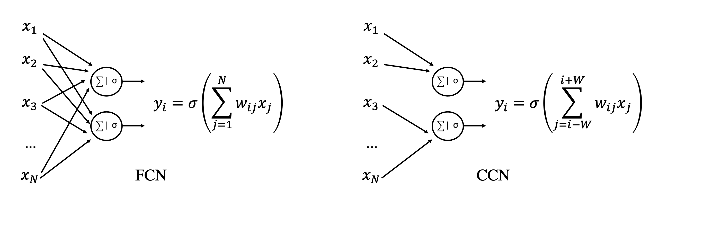
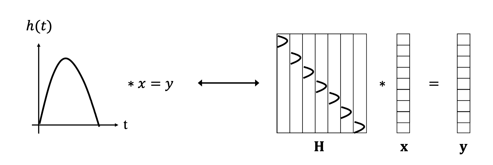
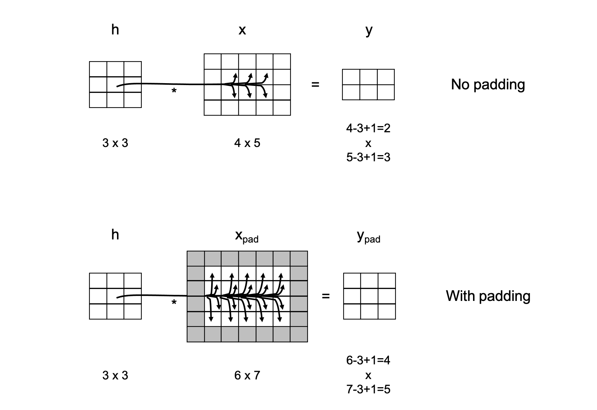

# Convolutional Neural Networks

Convolutional Neural Networks are one of the most powerful types of neural network, very popular and successfull in image processing (and more broadly 
computer vision). They are based on a simple mathematical operationrthat we, geoscientists, know very well and user in a
variety of tasks: the *convolution* operator. This is motivated in most scenarios where local dependancies in the input data
are known to be predominant. 

Imagine for example a geological model, or a core section. If we decide to apply Deep Learning to such data to either classify
rock types, estimate rock parameters, or even for generative modelling tasks, the first thing that we would like our NN to know is that nearby geological features are likely to be correlated, whilst the further apart we move the more the features become
indipendent from each other. By looking at the schematic diagrams below, a FCN would not take this prior information into account
as each input value is linearly combined to give rise to the output. On the other hand, a convolutional block which represents
the key component of a CNN will only use values of the input vector in a certain neighbour to obtain the output:

The example mentioned above is just one of many in geoscience where convolution-based networks have been lately shown to be very 
successfull. Other examples are:

- *Seismic interpretation* (faults, horizons, bodies)
- *Seismic processing* (denoising, interpolation, deblurring)
- *Satellite imaginery* (denoising, segmentation)
- *Microseismicity* (detection, source mechanism)
- *Laboratory studies* (CT, SEM, Microscopy for various processing and interpretation tasks)

In general, any data type that is represented regularly on a 1D, 2D, or ND gridded topology is fit for CNNs.

## Convolution

First of all, let's briefly recall what a convolution is. This represents in fact the core operation performed by a convolutional layer.

A convolution between two signals can be mathematically written as

$$
y(t) = \int x(\tau) h(t-\tau) d\tau \leftrightarrow y = x * h
$$

where $x(t)$ and $y(t)$ are the input and output, respectively, and $h(t)$ is the filter (also called *kernel* in the DL jargon).
This equation can be interpreted as follows: take the filter and flip it across the origin, then slide it along the time axis and multiply-and-sum it
to the input signal.

In practice, when working with digital data in a computer, all signals are discrete and the continous formula above can be rewritten
as follows:

$$
y_i = \sum_{j=-\infty}^{\infty} x_j h_{i-j}
$$

where, to be general, we have here extended the integral from $-\infty$ to $\infty$. In most applications, the filter $h$ is however
compact (it has a small size of N samples, also called *kernel size*) and therefore we can limit the summation within the window of samples
where the filter is non-zero.

A similar (but still different!) concept in signal processing is *correlation*

$$
y(t) = \int x(\tau) h(t+\tau) d\tau \leftrightarrow y_i = \sum_{j=-\infty}^{\infty} x_j h_{i+j}
$$

where the filter is simply slided across the $t$ axis (without being initially flipped). The main difference between convolution and correlation
is therefore that one delays the input signal whilst the other anticipates it when the filter is non-symmetric to zero. As we will see later, 
it is important to immediately empathise also a slight difference in the jargon used in classical signal processing
and deep learning: what usually we refer to as convolution in DL is what signal processing refers to as correlation. However, since in DL we do not choose
the filter $h$, rather this is learned from data, if signal processing convolution was used instead of correlation, the learning algorithm would
just learned the flipped version of the filter.

In both cases, when we convolve two signals of size $N_x$ with a filter of size $N_h$, the output signal has size:

$$
N_y = N_x + N_h - 1
$$

However, in the context of CNNs, we generally only want to consider the so-called *valid* part of the convolution, i.e., where the entire filter contributes
to the computation. For this reason the output signal size becomes:

$$
N_y = N_x - N_h + 1
$$

In the next section, we will see how we can actually make the choice of $N_y$ more flexible with the help of additional tools like padding and striding.

Extending the concept of convolution to two- and multi-dimensional data is straighforward. This can be done by simply
sliding the filter in all dimensions and can be mathematically written (in the discrete form) as follows:

$$
y_{i,j} = \sum_m \sum_l x_{ij} h_{i+m,j+l}
$$

Finally, another interesting thing to notice is that convolution is a linear process. Therefore we can express it as a matrix-vector
multiplication where the vector identifies the input data and the filter is re-organized into a Toeplitz matrix as show in the figure below

which means that the gradient of a convolutional operator that we need for backpropagation is just the adjoint of the matrix $\mathbf{H}^T$.
This is a convolution with the flipped kernel (so truly a convolution!).

## Why Convolution?

A first intuitive motivation about locality of interactions, also referred to as *space interactions* 
(or *sparse connectivity* or *sparse weights*), has been already provided onto why convolution blocks may represent an appealing
alternative to fully connected blocks in the context of neural networks. However, this is not the only reason why convolution blocks
are so powerful and widely used nowadays when training NNs for image processing tasks.

Let's start with an example. Imagine we are given a large image and a small 3x3 kernel. By sliding the kernel across the image we can still
be able to detect useful local features (e.g., edges). Note that the Machine Learning community has been aware of this for decades, and 
in fact many early approaches to image detection relied on hand-crafted filters that could highlight one feature of the input data over another. 
The modern DL approach simply takes this paradigm one step further where the filters are learned instead of being defined upfront. Experience has
further shown that deep CNNs learn initially low level features (e.g., edges), then middle level features (e.g., shapes) and finally
high level features (e.g., objects).

Compared to flattening the input data and applying a matrix that transforms it into the dimension of the output data (that is what a FCC would do as shown above),
using convolutions with small filters can save both memory and computations. Given for example an image of size $W_x \times H_x$, a fully connected
layer that produces an output of the same size requires a matrix with $(W_x H_x)^2$ parameters and $(W_xH_x)^2$ computations are required to obtain
the output. On the other hand, if we now consider a simple filter of size $W_h \times H_h$, the number of computations is reduced to $W_x H_x W_h H_h$.

The second main advantage of convolutional blocks is so-called *parameter sharing*. The same learned kernels are applied all over the input data, instead of having
one filter operating on all (or part of) the input data to produce a single output component.

Finally, a third benefit is the *equivariance of convolution to translation*. This means that if we shift the input by $k$ samples, the output
will also be shifted by the same number of samples; however, the shape of the output will not change.

## Padding and strides

We have previously seen how applying convolution to a signal with a kernel of a given size produces an output signal of different size, either with the total
or valid output size is chosen. It may be however much easier when designing a convolutional neural network to have inputs and outputs of the same size, or more in
general to be free to design the size of the output indipendent on that of the input and filter. Two simple approaches exist:

- *padding*: the input signal is padded with zeros on both sides (for 1D signals) or all sides (for ND signals) prior to convolution. This allows producing outputs that
  can have the same size or even larger size than the input. Let's first look at this with an example when the output size is computed using the equation above for the
  valid case. We can devise a padding such that the size of the output stays the same as that of the input. This is actually easy to do once we choose the size of
  the filter and more specifically $N_{x,pad} = N_x + 2*pad$ with $pad = (N_h-1)/2$ when $N_h$ is a odd number and $N_h/2$ when $N_h$ is a even number.
  
  Moreover, apart from the obvious benefit of not having to handle outputs that keep reducing in size, padding ensures that edge values in the inputs are also used
  the same number of times that central values in the convolution process.
  

- *strides*: a common approach when building convolutional neural network, as we will see when discussing popular CNN architecture, is however to gradually reduce the size of
  the signal (or image in 2D) whilst going deeper and deeper into the network. Two alternative ways to achieve this exist: the simplest is to couple convolutional layers that do
  not change the size of the input and downsampling (or pooling layers). Alternatively, one can choose to apply a special type of convolution called *strided convolution*
  that simply moves the filter around the input jumping (or striding) by more than a single sample at the time. Again, if we look at an example, we can observe
  how by doing so the size of the output is reduced by the striding factor. If we stride by a factor of two the output size will be half of the input size. As a result
  the output size can be written as $N_y = \lfloor (N_x - N_h) / stride + 1 \rfloor$.
  

Eventually striding and padding can be used together to get for example an output that is exactly half of the size of the input in all directions. An important formula
to remember when designing convolutional layers is:

$$
N_y = \Bigl\lfloor \frac{N_x + 2pad - N_h}{stride} + 1 \Bigr\rfloor
$$

## Channels

We need to introduce one last key ingredient before we can define a convolutional layer. Let's imagine we have a 3D tensor and a 3D filter; the extension of 2D
convolution to 3D (or any extra dimension) is as easy as sliding the filter along the third dimension as well as the first two. However, in deep learning we generally do something 
different when we are dealing with convolutional networks. We define a special dimension called *channel*.

Imagine having a 1D signal like a seismic trace but recording both the horizontal and vertical components of the particle displacement field. One way to arrange
such data is as a 2D array where one of the dimensions is the size of the trace and one is the number of components (or channels), here two. A similar scenario
may arise for 2D signals if we record for example different spectral components or for pre-stack seismic data where we record data at different angles. Here once again
we will have two `classical` dimensions, say latitude and longitude or geographical location and depth and one channel dimension. For the first example this will contain
the different spectral components, for the second example it will be represented by the different angles (or offsets). This is the geoscientific equivalent to natural images that
are commonly used in deep learning tasks where the channel contains different colors (e.g., RGB or CMYK). In order to make ourselves already familiar with the
ordering used in computational frameworks like PyTorch, a batch of training samples is usually organized as follows:

$$
N_x = (N_s \times N_{ch} \times N_w \times N_h)
$$

where $N_{ch}$ is the number of channels, whilst $N_w$ and $N_h$ are the width and the height of the image, respectively.

By defining a special dimension, we can now decide to still work with filters that slide only across the width and height axes. Such kernels will have size
$N_{ch} \times H_w \times H_h$. By doing so, for every step of convolution, the input and filter and multiplied and then all the values across all channels summed together.

