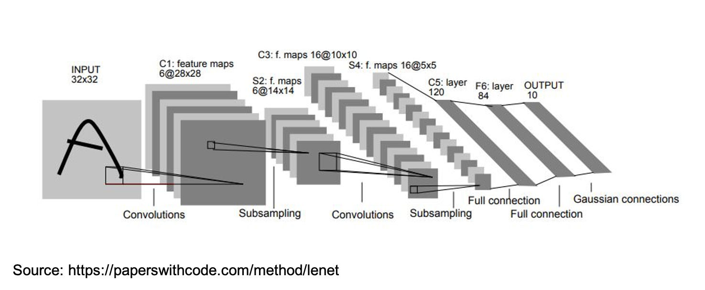
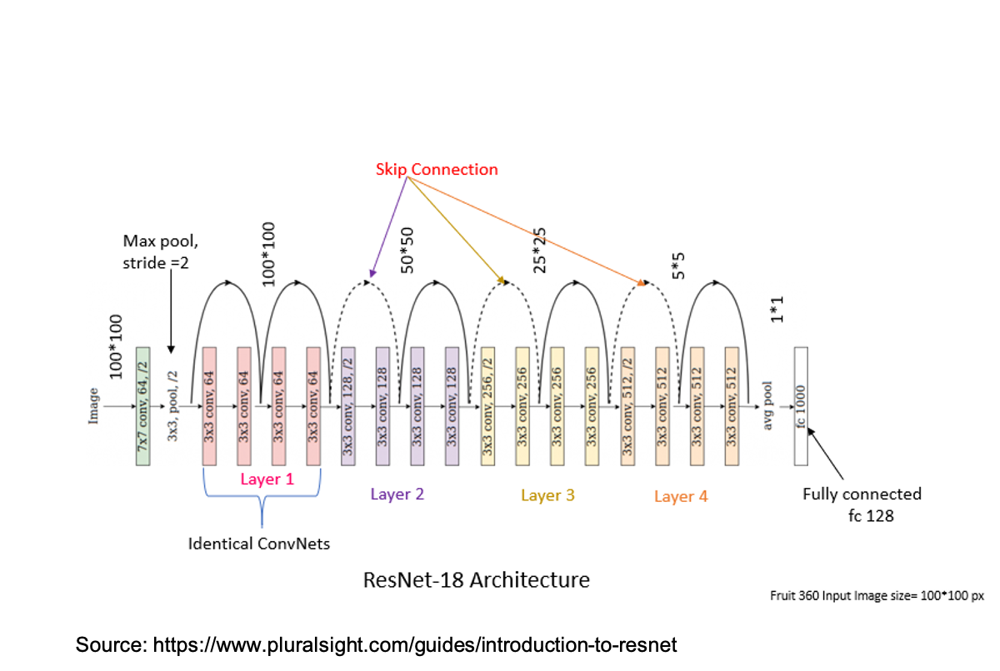
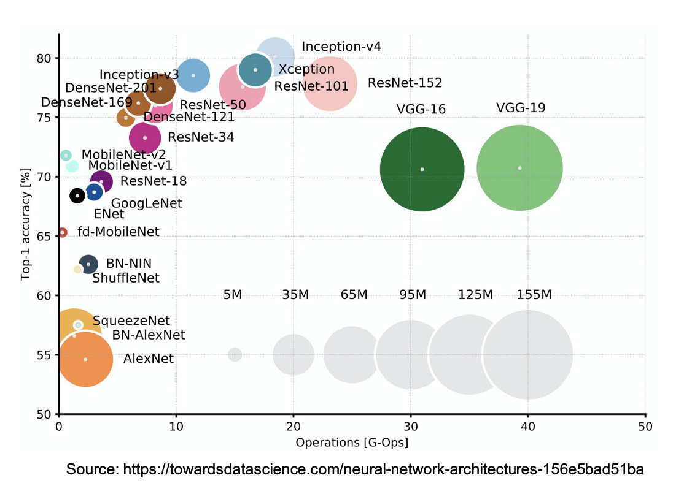

# Convolutional Neural Network Architectures
This lecture provides an overview of how deep learning, especially in the context of CNNs (and computer vision in general), has
evolved over the last decade. This is something that it is good to be familar with because:

- whilst most of these advances are given for granted and routinely used today, it is always insigthful to learn *how* ans *why* these
  developments were made;
- we can use architectures that worked well with no (or minimal) adaptation to our problem at hand (we will see that this is very commonly 
  done with high degree of success in geoscience);
- even better, sometimes we can decide to use pre-trained networks and fine-tune them with limited amount of label data. In this case knowning
  the network architecture in details allows us to make informed choices, such as remove some of the final layers and introduce new ones that 
  better adapt to the problem at hand (e.g., different number of classes).
  
## LeNet-5
One of the first successful CNNs was created and trained by the famous Yan Le Cun in 1989 with the objective of classifying hand-written digits. 
As we will see when comparing this to other popular networks, the size of LeNet-5 is very limited, mostly due to the hardware capabilities at that time (and the availability of a fairly small training
dataset). 

As shown in the figure below, this network is composed of:

- 2 convolutional layers with filter size equal to $5 \times $5$, stride equal to 1, and number of channels equal to 6 and 16, respectively;
- 2 average pooling layers that reduce the height and width of the feature maps by a factor of 2;
- 3 fully connected layers of size 120, 84, and 10 (the number of digits to classify);
- softmax activation in the final layer;

and the overall number of training parameters is $\approx 60k$. Finally, looking at the network architecture two things stand out that probably
today would have been implemented differently:

- average pool layers are not so popular today, max pool layers are more commonly used;
- activations were used also after pooling and all activations where sigmoid/tangent. Again, today ReLU or one of its variant is more commonly
  used and no activations are added after pooling layers.

## AlexNet
AlexNet represents a milestone in the field of DeepLearning. Developed by Alex Krizhevsky, Ilya Sutskever and Geoffrey Hinton, this network
was the first CNN that won the popular computer vision competition ImageNet. Not only that, but the network outperformed other submissions by
far, and brough Deep Learning to the attention of the larger Computer Vision community.

As shown in the figure below, this network is not very different from LeNet-5 in its individual components, it is however much deeper and contains
much more trainable parameters. More specifically, it is composed of:

- 5 convolutional layers with variable filter size (ranging from $11 \times 11$ in the first layer all the way to $3 \times 3$ in some of the deeper layers);
- 3 max pooling layers that reduce the height and width of the feature maps by a factor of 2;
- 3 fully connected layers of size 4096, 4096, and 1000 (the number of digits to classify);
- softmax activation in the final layer;

and the overall number of training parameters is $\approx 60M$, 3 order of magnitude more than that of LeNet-5. A number of interesting feature of this
network:

- the number of channels in the different layers: initially, this grows from 3 (i.e., RGB) to 384 and it is then reduced
to 256 all the way to the FC layer;
- ReLU is used as activation function for all hidden layers;
- Dropout is used to avoid overfitting;

## VGG-16

In 2015, the Visual Geometry Group at Oxford introduce a new CNN architecture called VGG. The key architectural change here is the fact that 
the network was much deeper than most state-of-the art networks at that time (16 layers); this was achieved by trading filter size (now $3 \times 3$) 
for depth. Moreover, whilst other networks like AlexNet were hand-crafted with very different filter sizes, strides and padding from layer to layer,
this network is really very simple to define:

- 16 $3 \times 3$ convolutional layers with stride equal to 1;
- 16 max pooling laywrs with filter size and stride equal to 2.

and the overall number of training parameters is $\approx 138M$, roughly twice more than those of AlexNet.

The key insight of VGG, which we will see is also used in later CNN architectures, is that stacks of convolutional layers with small filters
can emulate the receptive field of one layer with larger filter sizes. Note that further extensions of VGG-16 have been proposed, for example
VGG-19 where the network is composed of 19 layers.

## GoogleLeNet and Inception
In 2014, Christian Szegedy from Google was working on reducing the computational burden of deep neural networks. At that time, a new convolutional
block was introduced under the name of Inception Layer:

Instead of choosing the size of the bank of filters to be used upfront, the inception layer uses more than once filter size at the same time (a kind of multi-resolution approach).
More specifically the input is sent into 4 paths in parallel:

- $1 \times 1$ convolution block;
- $3 \times 3$ convolution block;
- $5 \times 5$ convolution block;
- Max pooling block.

Moreover, since sending an input with large width, height, and channel number into a $3 \times 3$ (or $5 \times 5$) convolutional layer would result in a very large 
number of trainable parameters and extreme computational cost, the input is first sent into a $1 \times 1$ that reduces the channel size and then the channel size is increased
again in the next layer. The $1 \times 1$ layers act as a *bottleneck layer* keeping the number of trainable parameters low.  Similarly, after the max pooling layer the number of channels is controlled via another $1 \times 1$ convolutional layer. The four
outputs are simply concatenated together to form the output of the Inception layer.

The GoogleLeNet network is a large networks where multiple of these Inception layers are stacked together. This network presents an additional set of new features:

- two *side branches* are added at different stages of the network, where intermediate representations from hidden layers are passed through a few more
  layers and sent to a classifier. These classifiers perform the same task of the main classifier placed at the end of the network and have been shown
  to act as a natural regularizer, ensuring that the hidden features are as expressive as possible to the point they can be used directly for the classification
  task at hand.

## ResNet
We can already observe a trend moving from LeNet-5 to VGG-19. From the 80' all the way to the early 2000', networks started to become depeer and deeper.
However, despite deeper network can generally achieve better performance, practitioners started to also experience painfully slow training. It was later discovered
that this was caused by the vanishing gradient problem.

Around the same time of VGG-16, He and coauthors proposed a new network block called the Residual Block. As already discussed in our last lecture,
this block introduces the innovative idea of shortcutting some of the activations forward in the computational graph and summing them to the activations
of the main path. This gave rise to the so-called ResNet that proved to be much easier (and faster) to train than other CNNs when stacking a large number of layers,
even up to 100 (or 1000) of layers!

The figure above shows ResNet-18, but it is important to remember that the idea of adding skip-connections every couple of layers has much wider 
implications than just for the ResNet architecture. One of the key benefits introduced by ResNet is the ability to increase the depth of a network without
incurring in the risk of overfitting the training data. So, whilst in theory deeper networks should always reduce the training error, this is not always the case
for plain networks. On the other hand, networks with Residual blocks are much more succesfull in that respect.

## UNet
Bla bla..

To conclude a summary of some of the most popular CNN architectures used for various computer vision task is shown in the figure below. Note
the size of the circles refer to the number of trainable parameters of the associated network.

## Additional readings

- the following [blog post](https://towardsdatascience.com/neural-network-architectures-156e5bad51ba) provides a good overview of some of
  the most popular architectures in computer vision, including those discussed in this lecture.
