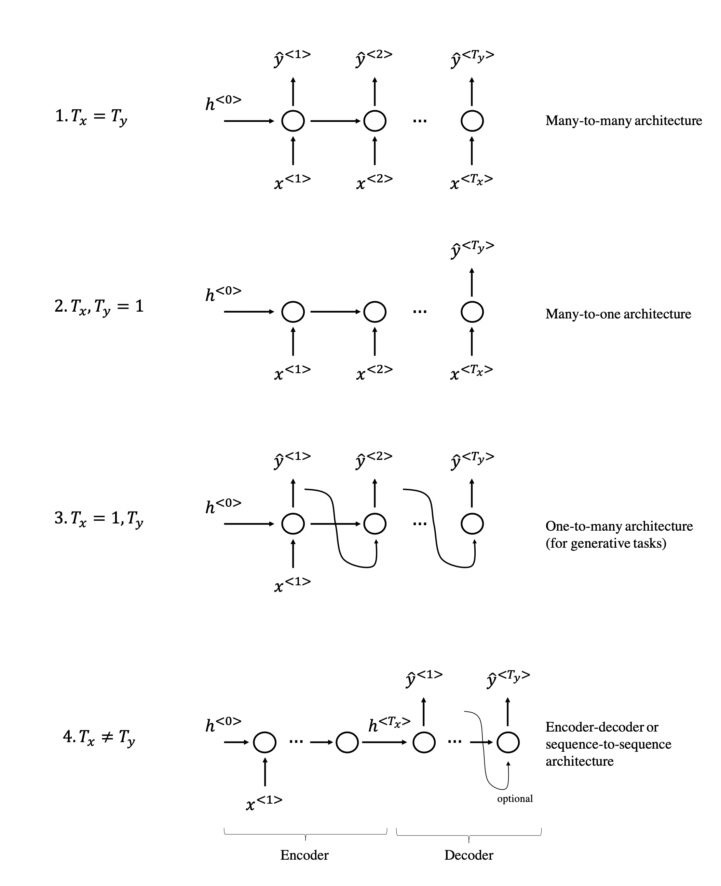
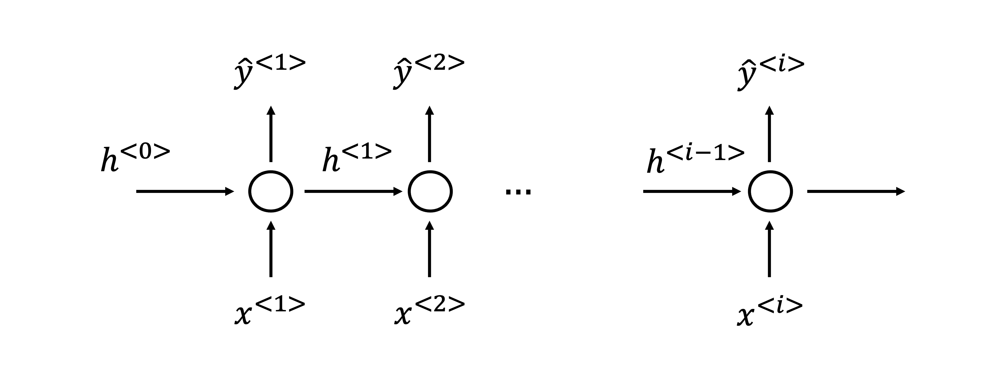
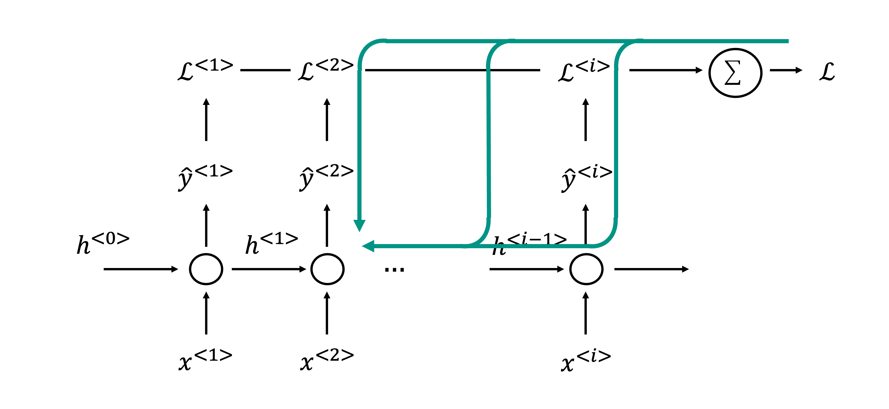
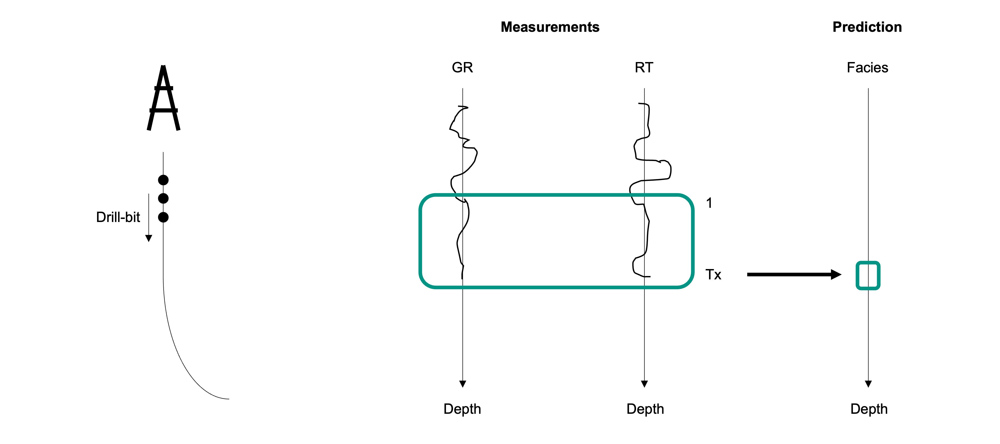
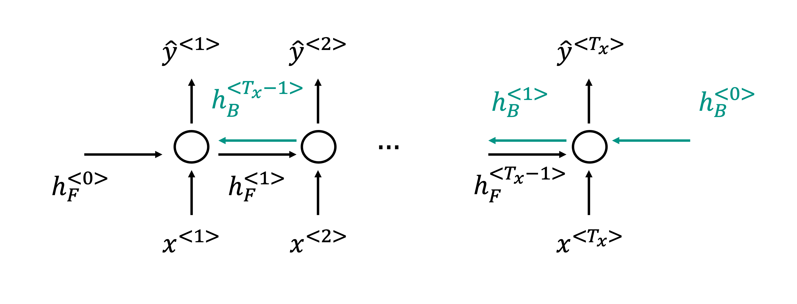
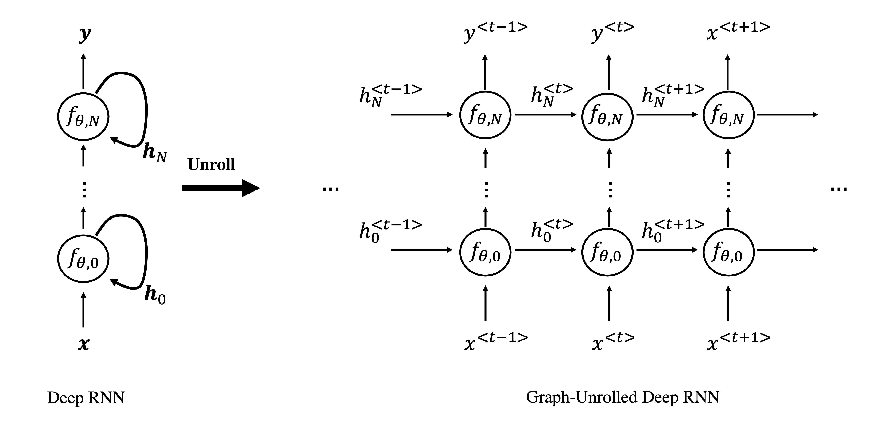
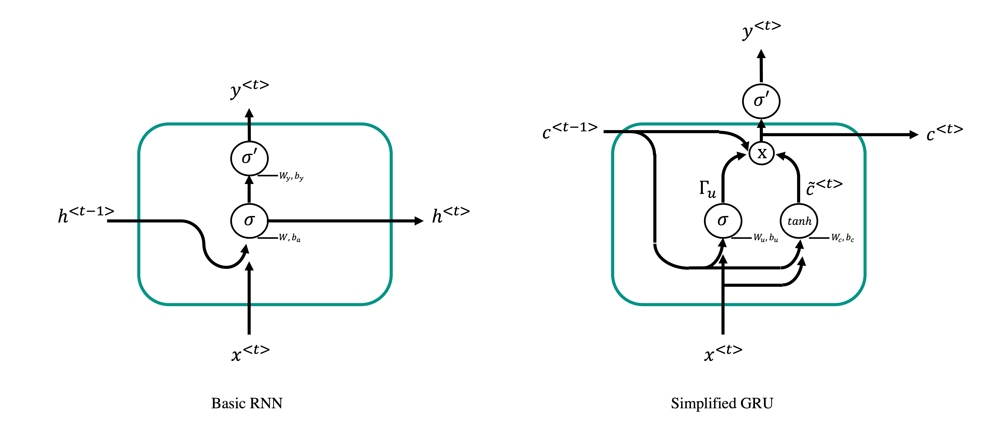
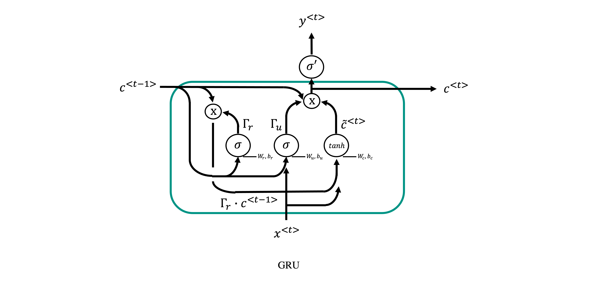

# Sequence modelling
In this lecture we will start investigating a family of Neural Network that are particularly suitable for learning tasks that involve sequences
as input data.

To understand what a sequence is in the context of Deep learning, let's consider a recording over time (e.g., an audio recording):

Compared to other dataset types (e.g., tabular or gridded data), the different samples of a sequence present an obvious degree of correlation
that tends to diminuish the further away to samples are from each other. Moreover, in the case of multi-feature sequences (e.g., multi-component
seismological recordings), the overall sequence contains a number of features at each time step that can be more or less correlated to each other.

Sequences appear in every aspect of life. For example, outside of geoscience, the two most commonly used data in sequence modelling are:

- text
- audio

More specifically, as we will see, the field of Natural Language Processing (NPL) has experienced a revolutionary growth in the last decade thanks
to sequence modelling and deep learning. In geoscience, many of the commonly used datasets can also be interpreted as sequences, for example:

- seismograms
- well logs
- production data

are all datatypes that present a certain degree of correlation along either the time or depth axis. 

Finally, similar to FFNs or CNNs, sequence modelling can be used for various applications:

- Single output classification: given an input sequence of a certain length $\mathbf{x}$, a model is trained to decide whether than sequence contains
  a feature of interest or not. For example, given a seismogram we may be interest to detect the presence of a seismic event, or we may want to find out
  if a well log is clean or corrupted by some recording error or what is the facies in the middle of the sequence;
- Multi output classification (i.e., semantic segmentation): given an input sequence of a certain length $\mathbf{x}$, a model is trained to classify each element
  of the input sequence into a predefined set of classes. Taking once again the example of facies labelling, here the task is extended to predicting labels
  at each depth level (and not only in the middle of the sequence);
- Regression: given an input sequence of a certain length $\mathbf{x}$, a model is trained to predict a continuous output, which could be
  a single value $y$ or a sequence of values $\mathbf{y}$ that has the same (or different length) of the input. For example, given a set of 
  well logs we may want to predict another one that was not acquired. Similarly, given a seismic trace recorded by the vertical component of a geophone
  we may be interested to predict the horizontal components. Both of these example fall under the area of *domain translation*;

## Motivation
Let's start by considering what we have learned so far and discuss how we could use those tools to handle sequential data. First of all,
we consider a sequence of $N_\tau$ samples and $N_f$ features:

$$
\mathbf{X} = \begin{bmatrix} 
                x_1^{<1>} & x_1^{<2>} & x_1^{N_\tau} \\
                ...     & ...     & ... \\
                x_{N_f}^{1} & x_1^{<2>} & x_{N_f}^{N_\tau}
  \end{bmatrix} =
  \begin{bmatrix} 
                \mathbf{x}^{<1>} & \mathbf{x}^{<2>} & \mathbf{x}^{<N_\tau>}
  \end{bmatrix}_{[N_f \times N_\tau]}
$$

we could easily deal with this as if it was a 2D-array (i.e., an image) and use CNNs. However, the locality argument used for the convolutional filters
that constitute a convolutional layer would not make much sense here, especially if we know that elements in the sequence away from each other may still have
a certain degree of correlation. Alternatively, the matrix $\mathbf{X}$ could be simply vectorized and used as input to a FFN. This approach does 
however present two main limitations:

- since the vector $vec(\mathbf{X})$ is likely to be very long, weight matrices will be very large leading to a very expensive training process;
- FFNs cannot easily handle inputs of variable lengths, so all sequences will need to have fixed length. We will see that being able to handle 
  variable-length sequences is very useful in some situations. 
  
Both problems can be overcome by taking advantage of *parameter sharing*. We have already introduced this concept in the context of CNNs,
where the same filters are used in different parts of the input. Similarly in sequence modelling, the idea of parameter sharing allows using the same
parameters at different stages of the sequence and therefore allows the network to easily handle sequences of variable length. By doing so,
a new type of neural network is created under the name of Recurrent Neural Network (RNN):

where $\mathbf{x}$ is the input vector (or matrix when multiple features are present), $\mathbf{y}$ is the output vector, and $\mathbf{h}$
is the so called hidden state vector.

As clearly shown in the unrolled version of the network into a standard computational graph, various inputs and hidden states are passed through
the same function $f_\theta$ with a given number of training parameters. This is very different from a feed-forward network where different functions 
is are used over consecutive layers. The choice of the function $f_\theta$ leads to the definition of different RNN architectures. 

Before we begin introducing a number of popular architectures for sequence modelling, let's introduce some useful notation. Inputs and outputs of a RNNs
will be always defined as follows:

$$
\mathbf{X} = \begin{bmatrix} 
                \mathbf{x}^{<1>} & \mathbf{x}^{<2>} & \mathbf{x}^{<T_x>}
  \end{bmatrix}_{[N_f \times T_x]}
$$

and

$$
\mathbf{Y} = \begin{bmatrix} 
                \mathbf{y}^{<1>} & \mathbf{y}^{<2>} & \mathbf{y}^{<T_y>}
  \end{bmatrix}_{[N_t \times T_y]}
$$

where $T_x$ and $T_y$ are the length of the input and output sequences. First, note that this notations differs from before in that a
single training sample is now represented as a matrix; therefore, the entire training data becomes a 3-D tensor of size $[N_s \times N_f \times T_x]$ 
(and $[N_s \times N_t \times T_y]$). Finally, note that in the most general case these parameters may be sample dependant (i.e., when we allow sequences of variable size): the following notation will be used in that case, $T_x^{(i)}$ and $T_y^{(i)}$
where $i$ refers to the i-th training sample. Moreover, given that we recurrently apply the same function $f_\theta$, we can very compactly write an
RNN as:

$$
\mathbf{h}^{<t>}, \mathbf{y}^{<t>}=f_\theta(\mathbf{h}^{<t-1>}, \mathbf{x}^{<t>}) \qquad t=1,2,T_x
$$

that we can unroll into:

$$
\mathbf{h}^{<t>}, \mathbf{y}^{<t>}=f_\theta(f_\theta(f_\theta(\mathbf{h}^{<0>}, \mathbf{x}^{<1>}), ...), \mathbf{x}^{<t-2>}), \mathbf{x}^{<t-1>}), \mathbf{x}^{<t>}) 
$$

As we have already briefly mentioned, RNNs allows some flexibility on the choice of $T_y$ (i.e., the length of the output sequence).
This leads to the creation of different network architectures that are suitable to different tasks:

Note that in the cases 3 and 4, the predicted output is fed back to the network as input to the next step at inference stage as shown in the figure above. 
At training stage, however, the true output is used as input.

In summary, what we wish to achieve here is to create a network that can learn but short and long term relationships in the data such that
both samples closes to each other as well as far away samples can help in the prediction of the current step. By using parameter sharing in a smart way,
we can avoid overparametrizing the network and therefore limit the risk of overfitting on short and long term trends in the data. In other words,
by assuming stationariety in the data, we let the network understand if step $t$ and $t+N_t$ are correlated to each other across the entire time sequence,
instead of giving the network with the freedom to find relationships between any two samples in the sequence.

## Basic RNN

### Architecture
It is now time to discuss in more details what is an effective function, $f_\theta$.

The most basic Recurrent Neural Network can be written as follows:

$$
\begin{aligned}
\mathbf{a}^{<t>} &= \mathbf{W}_h \mathbf{h}^{<t-1>} + \mathbf{W}_x \mathbf{x}^{<t>} + \mathbf{b}_a = \mathbf{W} [\mathbf{h}^{<t-1>}, \mathbf{x}^{<t>}]^T + \mathbf{b}_a  \\
\mathbf{h}^{<t>} &= \sigma(\mathbf{a}^{<t>} )  \\
\mathbf{o}^{<t>} &= \mathbf{W}_y \mathbf{h}^{<t>} + \mathbf{b}_y \\
\hat{\mathbf{y}}^{<t>} &= \sigma' (\mathbf{o}^{<t>}) 
\end{aligned}
$$

where:

- $\sigma$ and $\sigma'$ are the activation functions for the hidden and output paths (the choice of the activation
for the latter depends on the problem we wish to solve, e.g., softmax for binary classification)
- $\mathbf{h}^{<0>}$ is the initial hidden state vector which is usually initalialized as a zero vector.
- $\mathbf{W} = [\mathbf{W}_h, \mathbf{W}_x]_{[N_h \times N_h + N_x]}$ is the matrix of weights for the hidden path
- $\mathbf{W}_{y \; [N_y \times N_h]}$ is the matrix of weights for the output path

In conclusion, the learnable parameters for this kind of RNN block are: $\mathbf{W}_h, \mathbf{W}_x, \mathbf{W}_y, 
\mathbf{b}_a, \mathbf{b}_y$ whose overall size is $N_h(N_h+N_x) + N_y N_h + N_h + N_y$. To give some perspective, this 
is much smaller than the number of learnable parameters of an 'equivalent' Feed-Forward network where the entire input matrix $\mathbf{X}$
is flattened into a 1-d array of size $N_f T_x$ and the entire output matrix $\mathbf{Y}$
is flattened into a 1-d array of size $N_t T_y$. The equivalent weight matrix and bias vectors have size $N_x N_y T_x T_y$ and $N_yT_y$.
For example, given a problem of size $N_x=2$, $N_y=3$, $N_h=5$, and $T_x=T_y=4$, we obtain $N_{FFN}=108$ and $N_{RNN}=58$.

### Loss

Once the architecture is defined, the next step is to understand how the loss function should be defined for this kind of networks.
As shown in the figure below, this can be simply accomplished by considering a loss function per time step and summing them together:

$$
\mathscr{L} = \sum_{t=1}^{T_x} \mathscr{L}^{<t>}, \qquad \mathscr{L}^{<t>}= f(\hat{\mathbf{y}}^{<t>}, \mathbf{y}^{<t>})
$$

where $f$ can be the MSE, MAE, BCE, etc. This loss function can be easily interpreted in probabilistic terms as:

$$
f \rightarrow -log P (\mathbf{y}^{<t>} | \mathbf{x}^{<1>}, \mathbf{x}^{<2>}, ..., \mathbf{x}^{<t>})
$$

To conclude, we note that the process of evaluating the various terms of the loss function is sequential as a previous hidden state is 
required to evaluate the current output. This can be very expensive and does not allow for parallelization (beyond across training samples), similar
to the case of very deep feedforward neural networks.

### Backprop

Given the loss function defined above, the computation of its gradient easily follows the principles that we have already extensively
discussed in previous lectures; in simple terms, the backpropagation algorithm is applied on the unrolled computational graph in order
to obtain the gradients of the weights and biases of the network block. Backpropagation over an RNN block is usually referred to as
back-propagation through time (BPTT).

Looking at this in more details, we can observe how the overall gradient of each of the weights or biases can be written as

$$
\frac{\partial \mathscr{L}}{\partial \cdot} = \sum_{t=1}^{T_x} \frac{\partial \mathscr{L}^{<t>}}{\partial \cdot}
$$

or, in other words, the gradient accumulates over the unrolled graph. Note also that,

$$
\frac{\partial \mathscr{L}}{\partial \mathscr{L}^{<t>}} = 1, \qquad \frac{\partial \mathscr{L}}{\partial \cdot} = \sum_{t=1}^{T_x} \frac{\partial \mathscr{L}}{\partial \mathscr{L}^{<t>}} \frac{\partial \mathscr{L}^{<t>}}{\partial \cdot} = 
\sum_{t=1}^{T_x} \frac{\partial \mathscr{L}^{<t>}}{\partial \cdot}
$$

Let's now look more in details at the equations of backpropagation through time for a specific case of multi-label classification. 
More specifically we assume that the output of each step of the recurrent network ($\mathbf{o}^{<t>}$) is passed through a softmax
to get $\hat{\mathbf{y}}^{<t>}= \sigma' (\mathbf{o}^{<t>})$, and the loss in the negative log-likelihood of a Multinoulli distribution. 
Moreover, we will use tanh for the internal activation function $\sigma$. Starting from the gradients of the internal nodes:

$$
\left(\frac{\partial \mathscr{L}}{\partial \mathbf{o}^{<t>}}\right)_i = \hat{y}_i^{<t>} - \mathbf{1}_{i=y^{<t>}}
$$

$$
\frac{\partial \mathscr{L}}{\partial \mathbf{h}^{<T_x>}} = \frac{\partial \mathscr{L}^{<T_x>}}{\partial \mathbf{o}^{<T_x>}} 
\frac{\partial \mathbf{o}^{<T_x>}}{\partial \mathbf{h}^{<T_x>}} = \mathbf{W}_y^T (\hat{\mathbf{y}}^{<T_x>} - \mathbf{1}_{i=y^{<T_x>}})
$$

$$
\begin{aligned}
\frac{\partial \mathscr{L}}{\partial \mathbf{h}^{<t>}} &= \frac{\partial \mathscr{L}}{\partial \mathbf{o}^{<t>}} 
\frac{\partial \mathbf{o}^{<t>}}{\partial \mathbf{h}^{<t>}} + \frac{\partial \mathscr{L}}{\partial \mathbf{h}^{<t+1>}} 
\frac{\partial \mathbf{h}^{<t+1>}}{\partial \mathbf{h}^{<t>}} \\
&= \mathbf{W}_y^T (\hat{\mathbf{y}}^{<t>} - \mathbf{1}_{i=y^{<t>}}) + \mathbf{W}_h^T diag(1 - (\mathbf{h}^{<t+1>})^2) 
\frac{\partial \mathscr{L}}{\partial \mathbf{h}^{<t+1>}}
\end{aligned}
$$

where $\mathbf{1}_{i=y^{<t>}}$ is a vector of zeros with 1 at location of the true label, i.e. $i=y^{<t>}$, $diag(1 - (\mathbf{h}^{<t+1>})^2)$
is the Jacobian of the tanh activation function, and $\partial \mathscr{L} / \partial \mathbf{h}^{<t+1>}$ is computed recursively from $t+1=T_x$
as we know $\partial \mathscr{L} / \partial \mathbf{h}^{<T_x>}$. Moreover, it is worth noting how the gradient of the loss function
over any hidden state $\mathbf{h}^{<t>}$ is composed of two terms, one coming directly from the corresponding output 
$\mathbf{o}^{<t>}$ and one from the next hidden state $\mathbf{h}^{<t+1>}$.

It follows that the gradients of the parameters to update are:

$$
\frac{\partial \mathscr{L}}{\partial \mathbf{b}_y} = \sum_{t=1}^{T_x} \left( \frac{\partial \mathbf{o}^{<t>}}{\partial \mathbf{b}_y} \right)^T 
\frac{\partial \mathscr{L}}{\partial \mathbf{o}^{<t>}} =  \sum_{t=1}^{T_x} \frac{\partial \mathscr{L}}{\partial \mathbf{o}^{<t>}}
$$

$$
\frac{\partial \mathscr{L}}{\partial \mathbf{b}_a} = \sum_{t=1}^{T_x} \left( \frac{\partial \mathbf{h}^{<t>}}{\partial \mathbf{b}_a} \right)^T 
\frac{\partial \mathscr{L}}{\partial \mathbf{h}^{<t>}} = \sum_{t=1}^{T_x} diag(1 - (\mathbf{h}^{<t>})^2) \frac{\partial \mathscr{L}}{\partial \mathbf{h}^{<t>}}
$$

$$
\frac{\partial \mathscr{L}}{\partial \mathbf{W}_y} = \sum_{t=1}^{T_x} \frac{\partial \mathscr{L}}{\partial \mathbf{o}^{<t>}} 
\frac{\partial \mathbf{o}^{<t>}}{\partial \mathbf{W}_y} =
\sum_{t=1}^{T_x} \frac{\partial \mathscr{L}}{\partial \mathbf{o}^{<t>}} \mathbf{h}^{<t>T}
$$

$$
\frac{\partial \mathscr{L}}{\partial \mathbf{W}_h} = \sum_{t=1}^{T_x} \frac{\partial \mathscr{L}}{\partial \mathbf{h}^{<t>}} 
\frac{\partial \mathbf{h}^{<t>}}{\partial \mathbf{W}_h} = \sum_{t=1}^{T_x} diag(1 - (\mathbf{h}^{<t>})^2) \frac{\partial 
\mathscr{L}}{\partial \mathbf{h}^{<t>}} \mathbf{h}^{<t-1>T}
$$

$$
\frac{\partial \mathscr{L}}{\partial \mathbf{W}_x} = \sum_{t=1}^{T_x} \frac{\partial \mathscr{L}}{\partial \mathbf{h}^{<t>}} 
\frac{\partial \mathbf{h}^{<t>}}{\partial \mathbf{W}_x} = \sum_{t=1}^{T_x} diag(1 - (\mathbf{h}^{<t>})^2) \frac{\partial 
\mathscr{L}}{\partial \mathbf{h}^{<t>}} \mathbf{x}^{<t>T}
$$

### Inference

At test time, the evaluation of a RNN is straightforward. We usually simply need to pass through the forward pass and get 
the output $\hat{\mathbf{y}}^{<t>}$. However, this is not always true, especially in the following two cases:

- $T_x=1, T_y>1$ (generative network)
- $T_x, T_y$ (encoder-decoder network)

as in both cases we will be required to use the output at a given step ($\hat{\mathbf{y}}^{<t-1>}$) as part of the input to
produce the output of the next step ($\hat{\mathbf{y}}^{<t>}$). These two scenarios are dominant in so-called *Language Modelling*
for tasks where we want to generate sentences given some initial guess (e.g., first word) or perform language-to-language translation.
However, similar concepts could also be used to for example generate well logs or seismograms. Let's briefly take a look at some of
the required changes in the inference process of these 2 network types. 

First of all, in conventional cases our loss function can be written as:

$$
\begin{aligned}
\mathscr{L} &= \prod_{t=1}^{T_x} P (\mathbf{y}^{<t>} | \mathbf{x}^{<1>}, \mathbf{x}^{<2>}, ..., \mathbf{x}^{<t>}) \\
&= - \sum_{t=1}^{T_x} log P (\mathbf{y}^{<t>} | \mathbf{x}^{<1>}, \mathbf{x}^{<2>}, ..., \mathbf{x}^{<t>})
\end{aligned}
$$

where each output is here totally independent from the others. On the other hand, we are now faced with a joint distribution to
sample from:

$$
\begin{aligned}
\mathscr{L} &= P (\mathbf{y}^{<1>}, \mathbf{y}^{<2>},..., \mathbf{y}^{<t>})\\
&= - \prod_{t=1}^{T_x} log P (\mathbf{y}^{<t>} | \mathbf{y}^{<1>}, \mathbf{y}^{<2>},..., \mathbf{y}^{<t-1>})
\end{aligned}
$$

Evaluating such a probability is not a big deal during training as we can simply use the true labels as inputs (similarly to the 
more conventional network architectures where we use $\mathbf{x}^{<t>}$) instead. However, at inference stage we do not have access to the
exact previous outputs when evaluating the current one. In order to simplify the evaluation of such a probability, we are therefore required
to make an assumption: more specifically, we assume that the outputs can be modelled as a Markov Chain. In other words, we assume that the 
current output depends only on the previous one and not all of the other previous outputs. We can therefore write:

$$
\mathscr{L} \approx - \prod_{t=1}^{T_x} log P (\mathbf{y}^{<t>} | \hat{\mathbf{y}}^{<t-1>})
$$

which can be easily evaluated by placing the prediction at step $t-1$ as input to step $t$. 

However, when we are interested in using our trained RNN for generative tasks, this approach comes with a limitation. 
It is in fact deterministic, and therefore we can only create a single output sequence. A more sophisticated procedure can be
designed such that we can take advantage of our predictions in terms of their probabilities (and not the most probable outcome).
Given $P (\mathbf{y}^{<t-1>} | ...)$ (from, e.g., before a softmax later), what we can instead do is to sample one value of 
$\mathbf{y}^{<t-1>}$ and feed it to the next step of our recurrent network. If we now repeat the same procedure multiple times,
we will produce a bunch of different sequences. Finally, we could go even one step beyond and sample multiple values at step $t-1$, 
feed them concurrently to the next step (or the next N steps) and evaluate which one(s) has the highest joint probability, then go back 
to step $t-1$ and choose that value(s). This procedure, usually referred as *Beam Search*, is however beyond the scope of this lecture.

## Bidirectional RNN

Up until now, we have tried to construct NNs that can learn from short and long term patterns in the data in a *causal* fashion: in other
words, by feeding our time series from left to right to the network we allow it at every time step $t$ to learn dependencies from 
the past $(t-1,t-2,t-i)$. This is very useful for streaming data where we record the data sequentially from $t=0$ to $t=T_x$, and we do not
want to wait until the entire data has been collected before we can make some predictions. This is usually referred to as *online* processing. 
An example of such a scenario is represented by real-time drilling, when we drill a hole into the subsurface and record some measurements whilst doing so. We would like a machine to process
such recordings as they come in and provide us with useful insights on how to best continue drilling:

Of course, not every problem lends naturally to the above depicted scenario. In most cases we are able to record data over an entire time window
and only after that we are concerned with analyzing such data. This is usually referred to as *offline* processing. In this case it may be useful
to also look at correlations between samples at time $t$ and future samples $(t+1,t+2,t+i)$. Bidirectional RNNs represent a solution to this as they 
allow learning short and long term dependencies not only from the past but also from the future. Let's start with a schematic diagram:

where the network architecture presents a simple modification. Instead of having a single flow of information from left to right as it is the 
case for basic RNNs, we have now added a second flow of information from right to left. The hidden states of the first have been labelled with
the suffix F (for forward), and those of the second with the suffix B (for backward). The inputs remain unchanged, apart from the fact that they 
are now fed twice to the network, once for the forward flow and once for the backward flow, whilst the output is not the concatenation of the 
outputs of the two flows, i.e., $\hat{\mathbf{y}}^{<t>} = [\hat{\mathbf{y}}_F^{<t>T} \; \hat{\mathbf{y}}_B^{<t>T}]^T$.

## Deep RNNs

Similarly to any other network architecture that we have investigated so far, the concept of shallow and deep network also applies to RNNs. Shallow
RNNs are recurrent networks that have a single hidden layer connecting the inputs to the outputs. On the other than, deep RNNs are composed of more hidden
layers. This is simply achieved as follows:

- **First layer** input: $\mathbf{x}^{<t>}$, hidden and output: $\mathbf{h}_0^{<t>}$,
- **Second layer** input: $\mathbf{h}_0^{<t>}$, hidden and output: $\mathbf{h}_1^{<t>}$,
- **Last layer** input: $\mathbf{h}_{N-1}^{<t>}$, hidden:$\mathbf{h}_N^{<t>}$, output: $\hat{\mathbf{y}}^{<t>}$.

that we can visually represent as:

Mathematically, a deep RNN can be simply expressed as follows.

- For $i=0,1,N-1$ (with $\mathbf{h}_{-1}=\mathbf{x}$)

    $$
    \begin{aligned}
    \mathbf{a}_i^{<t>} &= \mathbf{W}_{h_i} \mathbf{h}_i^{<t-1>} + \mathbf{W}_{x_i} \mathbf{h}_{i-1}^{<t>} + \mathbf{b}_{a_i} \\
    \mathbf{h}_i^{<t>} &= \sigma(\mathbf{a}_i^{<t>} )  \\
    \end{aligned}
    $$

- For $i=N$

    $$
    \begin{aligned}
    \mathbf{a}_N^{<t>} &= \mathbf{W}_{h_N} \mathbf{h}_N^{<t-1>} + \mathbf{W}_{x_N} \mathbf{h}_{N-1}^{<t>} + \mathbf{b}_{a_N} \\
    \mathbf{h}_N^{<t>} &= \sigma(\mathbf{a}_N^{<t>} )  \\ 
    \mathbf{o}^{<t>} &= \mathbf{W}_y \mathbf{h}_N^{<t>} + \mathbf{b}_y \\
    \hat{\mathbf{y}}^{<t>} &= \sigma' (\mathbf{o}^{<t>})  \\
    \end{aligned}
    $$

## Long-term dependencies: implications for gradients

In this section, we will discuss a long-standing challenge arising when implementing backpropagation through a RNN. A number
of solution to circumvent this problem will be presented in following sections.

Let's start by considering the forward pass of a recurrent network. For the information to flow from left to right, a 
recurrent network repeatedly applies the matrix $\mathbf{W}_h$ to the hidden state vectors (interleaved by nonlinear
transformations): as already discussed in the [Optimization](08_gradopt1.md) lecture, this leads to raising the eigenvalues
of this matrix to the power of $T_x$. Eigenvalues smaller than one decay very fast to zero, whilst those bigger than one grow
exponentially fast to infinity. As a consequence, only the part of the initial vector $\mathbf{h}^{<0>}$ aligned with the largest
eigenvectors successfully propagates through the network whilst the other components become insignificant after a few steps. So,
no matter how we choose the initial weights of the network and hidden state, long term dependencies tend to become irrelevant when
compared to short terms ones in terms of their contribution to the gradient. In other words, the network will take a long time to
train and learn long-term dependencies. 

In order to avoid that, a number of strategies have been proposed in the literature. In the following, we will look at three of them:
the first tries to circumvent this problem as part of the learning process, whilst the latter two tackle the issue from the perspective 
of the network architecture design. By no means, these are the preferred choices nowadays when using RNNs.

### Gradient clipping

We have previously mentioned that one simple strategy to prevent exploding gradient is represented by so-called gradient clipping. As the name
suggests, this is applied only during the backward pass to gradients that overcome a given threshold. A forward-backward pass with gradient
clipping can be therefore written as:

- Forward pass: $\hat{\mathbf{y}}^{<t>} = f_\theta(\mathbf{x}^{<t>} , \mathbf{h}^{<0>}) \; \forall t=0,1,...T_x$
- Backward pass: $\partial \mathscr{L} / \partial \theta$
- Gradient clipping: if $|\partial \mathscr{L} / \partial \theta| > th$, then 
  $\partial \mathscr{L} / \partial \theta = sign(\partial \mathscr{L} / \partial \theta) \cdot th$

Unfortunately, a similar simply trick does not exist for the other problem, vanishing gradients. So, whislt adopting this strategy will avoid
instabilities in the training of basic RNNs, the training process will still be painfully slow.

### Gated recurrent networks or GRU unit

The most effective family of networks that can tackle both the exploding and vanishing gradient problem is called *Gated networks*. As the name
implies, a gate is introduced in each block of the network to help information flow and be used by later units without vanishing and exploding 
gradient issues. By doing so, the gate helps the network *remembering* some information from early steps, use it much later down the flow, and eventually
*forget* about it.

A GRU unit can be simply seen as a classical RNN unit with a number of small modifications. Let's start by drawing them side-by-side
(note that for the moment we are considering a simplified GRU block):

Apart from a slight change in name ($\mathbf{h}^{<t>}$ has been replaced by $\mathbf{c}^{<t>}$, which stands for *memory* cell), compared to the basic RNN
the GRU block contains a number of additional internal states. More specifically:

- $\tilde{\mathbf{c}}^{<t>}$: the candidate replacement for the memory cell. It is a candidate as in some cases it will not be used, rather the current 
  memory cell will be fast-tracked to allow learning long-term dependencies.
- $\Gamma_u$: update gate, which is responsible to choose whether to pass the candidate memory cell $\tilde{\mathbf{c}}^{<t>}$ or the previous memory
  cell $\mathbf{c}^{<t-1>}$ to the next layer.

The associated update equations for this simplified GRU block are:

$$
\begin{aligned}
&\boldsymbol \Gamma_{u}=\sigma\left(\mathbf{W}_{u}\left[\begin{array}{c}
\mathbf{c}^{<t-1>} \\
\mathbf{x}^{<t>}
\end{array}\right]+\mathbf{b}_{u}\right) \\
&\tilde{\mathbf{c}}^{<t>}=\tanh \left(\mathbf{W}_{c}\left[\begin{array}{c} 
\mathbf{c}^{<t-1>} \\
\mathbf{x}^{<t>}
\end{array}\right]+\mathbf{b}_{c}\right) \\
&\mathbf{c}^{<t>}=\boldsymbol \Gamma_{u} \cdot \tilde{\mathbf{c}}^{<t>}+\left(1-\boldsymbol \Gamma_{u}\right) \cdot  \mathbf{c}^{<t-1>}\\
&\hat{\mathbf{y}}^{<t>}=\sigma' (\mathbf{W}_y \mathbf{c}^{<t>} + \mathbf{b}_{y})
\end{aligned}
$$

In the last equation, the new memory cell is computed as the linear interpolation between the old memory cell and the candidate one. 
However, since a sigmoid is usually chosen for the update gate, $\boldsymbol \Gamma_{u}$ roughly acts as a binary gate (0-stop, 1-pass). 
This way, the gate can stop the flowing of new information for a number of steps allowing the old information to be moved further up the flow
without being multiplicated by the weight matrix and therefore creating long-term dependencies that do not suffer from the vanishing gradient
problem. 

To conclude, let's look at the real GRU and its equations, which introduces an additional gate called the relevance or reset gate $\boldsymbol \Gamma_{r}$:

$$
\begin{aligned}
&\boldsymbol \Gamma_{u}=\sigma\left(\mathbf{W}_{u}\left[\begin{array}{c}
\mathbf{c}^{<t-1>} \\
\mathbf{x}^{<t>}
\end{array}\right]+\mathbf{b}_{u}\right) \\
&\boldsymbol \Gamma_{r}=\sigma\left(\mathbf{W}_{r}\left[\begin{array}{c}
\mathbf{c}^{<t-1>} \\
\mathbf{x}^{<t>}
\end{array}\right]+\mathbf{b}_{r}\right) \\
&\tilde{\mathbf{c}}^{<t>}=\tanh \left(\mathbf{W}_{c}\left[\begin{array}{c}
\boldsymbol \Gamma_{r} \cdot \mathbf{c}^{<t-1>} \\
\mathbf{x}^{<t>}
\end{array}\right]+\mathbf{b}_{c}\right) \\
&\mathbf{c}^{<t>}=\boldsymbol \Gamma_{u} \cdot \tilde{\mathbf{c}}^{<t>}+\left(1-\boldsymbol \Gamma_{u}\right) \cdot \mathbf{c}^{<t-1>}\\
&\hat{\mathbf{y}}^{<t>}=\sigma' (\mathbf{W}_y \mathbf{c}^{<t>} + \mathbf{b}_{y})
\end{aligned}
$$

### Long-short term memory (LSTM) unit

Another popular, probably the most popular, RNN block that mitigates the vanishing gradient problem is called LSTM block. It uses similar concepts
to those introduced for the GRU block, but at the same time introduces a number of additional hidden states, namely:

- $\Gamma_f$: forget gate, which provides more flexibility when updating the memory cell with the old and candidate memory cells. 
  More specifically, whilst in the GRU block, the new memory cell was a linear combination of those two terms, now we have two independent weights (both of them learned) that 
  can allow passing more or less information from the two inputs instead of having to weight their total contribution to 1.
- $\Gamma_o$: output gate;

$$
\begin{aligned}
&\boldsymbol{\Gamma}_{u}=\sigma\left(\boldsymbol{W}_{u}\left[\begin{array}{c}
\boldsymbol{h}^{<t-1>} \\
\boldsymbol{x}^{<t>}
\end{array}\right]+\boldsymbol{b}_{u}\right) \\
&\boldsymbol{\Gamma}_{\boldsymbol{f}}=\sigma\left(\boldsymbol{W}_{f}\left[\begin{array}{c}
h^{<t-1>} \\
x^{<t>}
\end{array}\right]+\boldsymbol{b}_{f}\right) \\
&\boldsymbol{\Gamma}_{o}=\sigma\left(\boldsymbol{W}_{o}\left[\begin{array}{c}
\boldsymbol{h}^{<t-1>} \\
\boldsymbol{x}^{<t>}
\end{array}\right]+\boldsymbol{b}_{o}\right) \\
&\tilde{\boldsymbol{c}}^{<t>}=\tanh \left(\boldsymbol{W}_{c}\left[\begin{array}{c}
\boldsymbol{h}^{<t-1>} \\
\boldsymbol{x}^{<t>}
\end{array}\right]+\boldsymbol{b}_{c}\right) \\
&\boldsymbol{c}^{<t>}=\boldsymbol{\Gamma}_{u} \tilde{\boldsymbol{c}}^{<t>}+\boldsymbol{\Gamma}_{f} \boldsymbol{c}^{<t-1>} \\
&\boldsymbol{h}^{<t>}=\boldsymbol{\Gamma}_{o} \tanh \left(\boldsymbol{c}^{<t>}\right) \\
&\boldsymbol{y}^{<t>}=\sigma^{\prime}\left(\boldsymbol{W}_{y} \boldsymbol{h}^{<t>}+\boldsymbol{b}_{y}\right)
\end{aligned}
$$

## Present and future of sequence modelling

Finally, it is worth noting that the field of sequence modelling with deep neural networks has been taken by a storm a couple of years
ago with novel architectures that have led to great improvements in the field of Natural Language Processing. The first innovation, which
goes under the name of *Attention* layer has been initially introduced to mitigate one of the main limitations of the encoder-decoder RNN
architecture that we have extensively discussed in this lecture. More specifically, the attention layer can find global correlations between
the input(s) of the decoder layer and any of the hidden states of the encoder, avoiding the problem of having a bottleneck at the end of the 
encoder and a single hidden state that is required to encode the information of the various inputs of the encoder. 

The attention layer has later led to the design of a completely new type of neural network architecture, the so-called *Transformer* layer. In this
case, instead of processing the input sequentially as in RNNs, the transformer layer takes all the inputs at once and find both local and global correlations
by means of so-called self-attention blocks.

## Additional readings

- If you are interested to learn more about attention and transformer layers, I recommend watching this
  [lecture]() from the KAUST Summer School on Unstructured Data in Geoscience