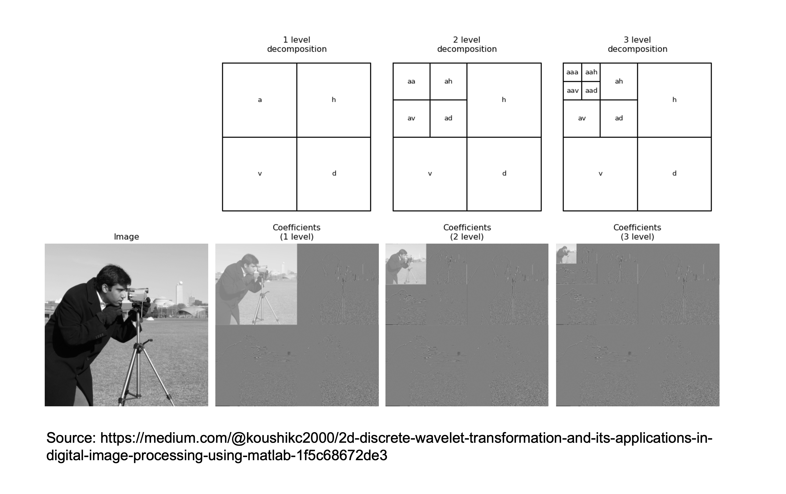

# Dimensionality reduction

Up until now we have mostly focused on one family of Machine Learning methods, so-called *Supervised learning*. Whilst this
is by far the most popular application in Deep Learning and the one that has reported greater success in the last decade,
another family of methods that is becoming more and more popular falls under the umbrella of so-called *Unsupervised learning*.

When labelled data are scarce, or it is difficult to have access to ground truth labels (e.g., in geoscience), unsupervised learning
can represent an appealing alternative to find patterns in data. Unsupervised learning comes in different flavours. 
For example let's imagine grouping a set of unlabelled data into a number of buckets and then analyze them 
one-by-one knowing that the samples within each bucket are more similar to each other than others in the dataset: this is a form of 
unsupervised learning called *clustering*. The flavour that we are going to discuss in 
more details in the following is however referred to as *Dimensionality reduction*. Simply stated dimensionality reduction 
can be described as:

Take $N_s$ training samples $\mathbf{x}^{(i)} \in \mathbb{R}^{N_f}$, ($i=1,2,...N_s$),

Find a smaller representation $\mathbf{c}^{(i)} \in \mathbb{R}^{N_l}$ ($N_l<<N_f$) whilst making the 
smallest possible reconstruction error.

If you previously studied how data are stored in a computer transmitted via cable (or air), you may recall that this 
is the very same objective of *data compression*. For this reason, nowadays we can build on a vast body of literature
when designing effective dimensionality reduction techniques. What it is however slowly becoming more and more evident is
the fact that by identifying representative low-dimensional (also called *latent*) spaces from a set of data samples living
in a much richer space, we can implicitly extract useful features to be later used in subsequent tasks of supervised learning.
This two-steps approach is becoming very popular these days especially in fields of science that lack vast amount of labelled data
as a way to take advantage as much as possible of unlabelled samples and then being able to fine-tune supervised models using
small amounts of labelled data.

Before we consider a number of different approaches to dimensionality reduction, let's write the problem in a common mathematical form. 
Given a number of training samples $\mathbf{x}^{(i)}, we wish to identify:

- encoder: $\mathbf{c}^{(i)} = e(\mathbf{x}^{(i)})$
- decoder: $\hat{\mathbf{x}}^{(i)} = d(\mathbf{c}^{(i)})$

such that:

$$
\hat{e},\hat{d} = \underset{e,d} {\mathrm{argmin}} \; \frac{1}{N_s}\sum_i \mathscr{L}(\mathbf{x}^{(i)}, d(e(\mathbf{x}^{(i)})))
$$

## Principal Component Analysis (PCA)

The simplest approach to dimensionality reduction uses linear operators for the encoder:

- encoder: $\mathbf{c}^{(i)} = \mathbf{E}\mathbf{x}^{(i)}$
- decoder: $\hat{\mathbf{x}}^{(i)} = \mathbf{D}\mathbf{c}^{(i)}$

where $\mathbf{E}_{[N_l \times N_f]}$ and $\mathbf{D}_{[N_f \times N_l]}$. PCA aims to find representative
features that are linear combinations of the columns of the encoder (i.e., $\mathbf{c}=\sum_{i=1}^{N_f} \mathbf{E}_{:,i} x_i$)
such that the projection of these new features onto the original space ($\mathbf{D}\mathbf{c}$) is as close as possible to the
original sample $\mathbf{x}$. In other words, we want to find the best linear subspace of the original space that minimizes the
reconstruction error defined here as the squared Euclidean norm ($\mathscr{L}=||.||^2_2$).

Defining a unique pair of matrices ($\mathbf{E},\mathbf{D}$) is however not possible without imposing further constraints. In the
PCA derivation we must assume that the columns of $\mathbf{D}$ are orthonormal:

$$
\mathbf{D}^T \mathbf{D} = \mathbf{I}_{N_l}
$$

By making such a strong assumption we can easily see that

$$
$\hat{\mathbf{x}}^{(i)} = \mathbf{D}\mathbf{E}\mathbf{x}^{(i)}=\mathbf{D}\mathbf{D}^T\mathbf{x}^{(i)} \quad (\mathbf{E}=\mathbf{D}^T)
$$

is the choice of encoder-decoder that minimizes the reconstruction error. Let's now prove to ourselves that this is the case for 
a single training sample:

$$
\hat{\mathbf{c}} = \underset{\mathbf{c}} {\mathrm{argmin}} \; ||\mathbf{x}-d(\mathbf{x})||_2^2
$$

where for the moment we do not specify the decoder and simply call it $d$. Let's first expand the loss function

$$
\begin{aligned}
||\mathbf{x}-d(\mathbf{x})||_2^2 &= (\mathbf{x}-g(\mathbf{x}))^T (\mathbf{x}-d(\mathbf{x})) \\
&= \mathbf{x}^T \mathbf{x} - \mathbf{x}^Td(\mathbf{x}) - g(\mathbf{x})^T \mathbf{x} + d(\mathbf{c})^T g(\mathbf{c})^T\\
&= \mathbf{x}^T \mathbf{x} - 2 \mathbf{x}^Td(\mathbf{x}) + d(\mathbf{c})^T g(\mathbf{c})^T\\
\end{aligned}
$$

where we can ignore the first term given it does not depend on $\mathbf{c}$. At this point let's consider the special
case of $d()=\mathbf{D}$, which gives:

$$
\begin{aligned}
||\mathbf{x}-d(\mathbf{x})||_2^2 &= \mathbf{c}^T \mathbf{D}^T \mathbf{D} \mathbf{c} - 2 \mathbf{x}^T \mathbf{D} \mathbf{c} \\
&= \mathbf{c}^T \mathbf{I}_{N_l} \mathbf{c} - 2 \mathbf{x}^T \mathbf{D} \mathbf{c}
\end{aligned}
$$

Finally we compute the derivative of the loss function over $\mathbf{c}$:

$$
\frac{\partial J}{\partial \mathbf{c}} = 0 \rightarrow 2 \mathbf{c}^T - 2 \mathbf{x}^T \mathbf{D} = 0 \rightarrow \mathbf{c} = \mathbf{D}^T \mathbf{x}
$$

where we have obtained that $\mathbf{E} = \mathbf{D}^T$.

At this point we know what is the optimal linear encoder-decoder pair with respect to the MSE loss. However, we do not have a specific form
for the matrix $\mathbf{D}$ itself. In order to identify the entries of the decoder matrix, we need to set up another optimization problem, this 
time directly for $\mathbf{D}$:

$$
\hat{\mathbf{D}} = \underset{\mathbf{D}} {\mathrm{argmin}} \; ||\mathbf{X}-\mathbf{D}\mathbf{D}^T \mathbf{X}||_F 
\quad s.t. \; \mathbf{D}^T \mathbf{D} = \mathbf{I}_{N_l}
$$

where $\mathbf{X}_{[N_f \times N_s]}$ is the training sample matrix. To simplify our derivation let's consider the case of
$N_l=1$; the result can then be easily generalized for any choice of $N_l=1$. Let's write

$$
\begin{aligned}
\hat{\mathbf{d}} &= \underset{\mathbf{d}} {\mathrm{argmin}} \; ||\mathbf{X}-\mathbf{d}\mathbf{d}^T \mathbf{X}||_F 
\quad s.t. \; \mathbf{d}^T \mathbf{d} = 1 \\
&= \underset{\mathbf{d}} {\mathrm{argmin}} \; ||\bar{\mathbf{X}}-\bar{\mathbf{X}}\mathbf{d}\mathbf{d}^T||_F 
\quad s.t. \; \mathbf{d}^T \mathbf{d} = 1 \quad (\bar{\mathbf{X}}=\mathbf{X}^T) \\
&= \underset{\mathbf{d}} {\mathrm{argmin}} \; Tr((\bar{\mathbf{X}}-\bar{\mathbf{X}}\mathbf{d}\mathbf{d}^T)^T(\bar{\mathbf{X}}-\bar{\mathbf{X}}\mathbf{d}\mathbf{d}^T))
\quad s.t. \; \mathbf{d}^T \mathbf{d} = 1\\
&= \underset{\mathbf{d}} {\mathrm{argmin}} \; Tr(\bar{\mathbf{X}}^T \bar{\mathbf{X}} - \bar{\mathbf{X}}^T \bar{\mathbf{X}}\mathbf{d}\mathbf{d}^T - 
\mathbf{d}\mathbf{d}^T \bar{\mathbf{X}}^T \bar{\mathbf{X}} + \mathbf{d}\mathbf{d}^T\bar{\mathbf{X}}^T \bar{\mathbf{X}}\mathbf{d}\mathbf{d}^T)
\quad s.t. \; \mathbf{d}^T \mathbf{d} = 1\\
&= \underset{\mathbf{d}} {\mathrm{argmin}} \; -2 Tr(\bar{\mathbf{X}}^T \bar{\mathbf{X}}\mathbf{d}\mathbf{d}^T) + Tr(\mathbf{d}\mathbf{d}^T\bar{\mathbf{X}}^T \bar{\mathbf{X}}\mathbf{d}\mathbf{d}^T) \quad s.t. \; \mathbf{d}^T \mathbf{d} = 1\\
&= \underset{\mathbf{d}} {\mathrm{argmin}} \; -2 Tr(\bar{\mathbf{X}}^T \bar{\mathbf{X}}\mathbf{d}\mathbf{d}^T) + Tr(\bar{\mathbf{X}}^T \bar{\mathbf{X}}\mathbf{d}\mathbf{d}^T \mathbf{d}\mathbf{d}^T) \quad s.t. \; \mathbf{d}^T \mathbf{d} = 1\\
&= \underset{\mathbf{d}} {\mathrm{argmin}} \; -Tr(\bar{\mathbf{X}}^T \bar{\mathbf{X}}\mathbf{d}\mathbf{d}^T) \quad s.t. \; \mathbf{d}^T \mathbf{d} = 1\\
&= \underset{\mathbf{d}} {\mathrm{argmax}} \; Tr(\bar{\mathbf{X}}^T \bar{\mathbf{X}}\mathbf{d}\mathbf{d}^T) = Tr(\mathbf{d}^T \bar{\mathbf{X}}^T \bar{\mathbf{X}}\mathbf{d})  \quad s.t. \; \mathbf{d}^T \mathbf{d} = 1\\
\end{aligned}
$$

where in 6 we use the fact that $\mathbf{d}^T \mathbf{d} = 1$. The solution of this maximization problem is represented by the 
eigenvector of $\bar{\mathbf{X}}^T \bar{\mathbf{X}}$ associated to the largest eigenvalue (or the $N_l$ largest eigenvalues for the 
general case).

We can therefore conclude that PCA is defined as:

- Take $N_s$ training samples $\mathbf{x}^{(i)} \in \mathbb{R}^{N_f}$, ($i=1,2,...N_s$),
- Compute the matrix $\bar{\mathbf{X}}_{[N_s \times N_f]}$
- Compute the SVD of $\bar{\mathbf{X}}$ (i.e., eigenvalues and eigenvectors of the sample covariance matrix $\bar{\mathbf{X}}^T \bar{\mathbf{X}}$)
- Form $\mathbf{D}$ composed by the eigenvector associated with the $N_l$ largest eigenvalues.
- Compute $\mathbf{c}=\mathbf{D}^T \mathbf{x}$ and $\hat{\mathbf{x}}=\mathbf{D} \mathbf{c}$.

More in general, it is also worth remembering that if the training data is not zero-mean, PCA can be slightly modified to take that into account:

$$
\mathbf{c}=\mathbf{D}^T (\mathbf{x}-\boldsymbol\mu$ and $\hat{\mathbf{x}}=\mathbf{D} \mathbf{c}+\boldsymbol\mu$.
$$

where $\boldsymbol\mu$ is the sample mean.

To conclude, let's try to provide some additional geometrical intuition of how PCA works in practice. Once again,
let's recall the covariance matrix that we form and create SVD on:

$$
\mathbf{C}_x=E_\mathbf{x} [(\mathbf{x}-\boldsymbol\mu) (\mathbf{x}-\boldsymbol\mu)^T]
$$

The eigenvalues $\lambda_i$ of $\mathbf{C}_x$ relate to the variance of the dataset $\mathbf{X}$ in the direction of the 
associated eigenvector $\mathbf{v}_i$ as follows (we use a 2d example for simplicity):

so we observe that the first direction of PCA (i.e. $\mathbf{v}_1$) is the one that best minimizes the 
reconstruction error (i.e., \sum_i d_{i,1}). In multiple dimensions, the eigenvectors are organized in order of reconstruction 
error of the projected data points from smallest to largest.

## Other linear dimensionality reduction techniques

Whilst PCA is very popular for its simplicity (both of understanding and implementation), other techniques for linead dimensionality
reduction exist. As some of them has been shown during the years to be very powerful and better suited to find representative latent
representations from data, we will briefly look at them here.

### Independent Component Analysis (ICA)

ICA aims to separate a signal into many underlying signals that are scaled and added together to reproduce the original one:

$$
\mathbf{x} = \sum_i c_i \mathbf{w}_i = \mathbf{Wc} 
$$

where in this case $\mathbf{c}$ has the same dimensionality of $\mathbf{x}$. This model is in fact commonly used for blind source separation
of mixed signals. Despite it is strictly speaking not a dimensionality reduction technique, we discuss it here due to its ability of finding
representative bases that combined together can explain a set of data.

Once again, the problem is in need for extra constraints for us to be able to find a solution. In this case the assumption made of
the $\mathbf{w}_i$ signals is as follows:

Signals $\mathbf{w}_i$ must be statistically independent from each other and non-gaussian

A solution to this problem can be obtained finding the pair ($\mathbf{W}, \mathbf{c}$) which maximises non-gaussianity (i.e., minimizes 
normalized sample kurtosis) or minimizes mutual information (MI). Whilst we don't discuss here in details how to achieve such solution,
it is worth pointing out that this requires solving a nonlinear inverse problem as $\mathbf{W}$ relates in a nonlinear manner to kurtosis or MI. 

### Sparse Coding (or Dictionary Learning)
Sparse coding is another heavily studied model for dimensionality reduction. The general idea has origin in a large body of 
work carried out in other areas of applied mathematics where hand-crafted transformations (e.g., wavelets) habe been identified
to nicely represent data of different kind (e.g., images, sounds, seismic recordings) in a very sparse fashion. Here *sparse*
refers to the fact that the transformed signal can be represented by a vector with many zeros and just few non-zero entries.

In this context, however, the transformation is represented a matrix $\mathbf{W}$, whose entries are once again learned directly
from the available training data. This is achieved by imposing a strong condition on the probability distribution associated with 
the latent vector $\mathbf{c}$:

$$
p(\mathbf{c}) \approx \text{Laplace, Cauchy, Factorized t-student}
$$

in other words, a fat tailed distribution, whose samples are therefore sparse. By making such an assumption, no closed form
solution exist like in the PCA case. Instead, the training process is set up with the following goals in mind:

1. Find sparsest latent representation during the encoding phase
2. Find a decoder that provides the smallest reconstruction error

which mathematically can be written as:

$$
\begin{aligned}
\hat{\mathbf{W}}, \hat{\mathbf{h}} &= \underset{\mathbf{W}, \mathbf{h}} {\mathrm{argmax}} p(\mathbf{h}|\mathbf{x}) 
&= \underset{\mathbf{W}, \mathbf{h}} {\mathrm{argmin}} \beta ||\mathbf{h}-\mathbf{W}\mathbf{h}||_2^2 +\lambda ||\mathbf{h}||_1
\end{aligned}
$$
where $\beta$, $\lambda$ are directly related to the parameters of the posterior distribution that we wish to maximize. This
functional can be minimized in an alternating fashion, first for $\mathbf{W}$, then for $\mathbf{x}$, and so on and so forth.

Finally, once the training process is over and $\hat{\mathbf{W}}$ is available, it is worth noting that sparse coding does require
solving a sparsity-promoting inverse problem for any new training sample $\mathbf{x}$ in order to find its best
representation $\hat{\mathbf{h}}$. Nevertheless, despite the higher cost compared to for example PCA, sparse coding has shown 
great promise in both data compression and representation learning, the latter when coupled with down-the-line supervised tasks.

## Autoencoders

Finally, we turn our attention onto nonlinear dimensionality reduction models. We should know by now that nonlinear mappings (like
those performed by NNs) may be much more powerful than their linear counterpart is used to our advantage.

The most popular nonlinear dimensionality techniques dates back to 1991 and the work of M. Kramer. Simply put, an autoencoder is 
the combination of an encoder function $e_\theta$, which converts the input data into a latent representation, 
and a decoder function $d_\theta$, which converts the new representation back into the original format. Here, both 
$e_\theta$ and $d_\theta$ and nonlinear and fully learned and stack one after the other as shown below

An autoencoder can therefore be simply defined as:

$$
\hat{\mathbf{x}} = d_\phi(e_\theta(\mathbf{x}))
$$

where similar to PCA, the training process is setup such the parameters of the two networks are optimized to minimize the 
following loss function:

$$
\hat{e}_\theta,\hat{d}_\phi = \underset{e_\theta,d_\phi} {\mathrm{argmin}} \; \frac{1}{N_s}\sum_i \mathscr{L}(\mathbf{x}^{(i)}, d_\phi(e_\theta(\mathbf{x}^{(i)}))))
$$

where the network architecture for both the encoder and decoder can be chosen accordingly to the type of data we are interested in.

Once again, our code (or latent vector $\mathbf{z}$) must be chosen to be of lower dimensionality compared to the input in order to be able to 
learn useful representations. On the other hand if we choose $N_l \ge N_f$, we will likely not learn something useful: very likely what
we are going to learn is to reproduce the identity mapping. In other words, whilst the loss function is set to reproduce the input itself,
what we are really interested is not the mere reconstruction, rather the creation of some meaningful transformation of the input vector
that first projects it into a latent space and then expands it back to the original space. If we are able to accomplish this task,
we will likely see that if we feed the trained network with a new sample $\mathbf{x}_{in}$ that lies inside the distribution of the training data,
the reconstruction will be of similar quality as to what we observed in training. On the other hand, when a out-of-distribution sample
$\mathbf{x}_{out}$ is fed to the network, its prediction will be much less accurate.

### Applications

Now that we know how an AutoEncoder works, the next obvious question is why do we care and what can we use if for. Let's recap here a
couple of applications that we have already mentioned here and there in the lecture:

- Data compression: the use of NNs (and AEs in this specific case) may soon lead to a completely new, nonlinear paradigm in data compression 
  where we could simply store the latent vectors and network architecture and weights and reconstruct the original vector on-demand similar
  to what conventionally done with linear compressors (e.g., JPEG2000).
- Learn robust features on large unlabelled data prior to supervised learning: assuming that we have access to a large dataset composed for the majority of
  unlabelled data and for a small portion of labelled data, we could imagine training and AE on the first part of the dataset and use the learned latent
  features as input to a subsequent task of supervised learning. More specifically, the inputs of the labelled data are fed to the trained encoder and the resulting
  features are used in conjunction with the labels in a supervised manner.
- Inverse problems in the latent space: this is similar to the previous case, with the main difference that we may have an inverse problem we wish to solve where
  the parameter to estimate lives in the manifold of the $\mathbf{x}$ samples. We can once again train and AE to learn a good representation for such
  the manifold of possible solutions and then solve the inverse problem for $\mathbf{z}$ instead of $\mathbf{x}$ directly.
- Perform vector math in the latent space: Imagine we want to compare two multi-dimensional vectors $\mathbf{x}$ (e.g., images). Classical
  distance measures may focus too much on small discrepancies and not really on the overall similarity between these samples, that is
  what we usually want to compare. Alternatively, we could convert both vectors into their latent representations and compare them in this reduced space.
  In this case, even simple distance measures like MSE may become more robust as they really compare high-level features of the inputs that
  are encapsulated in the latent vectors.

### Undercomplete vs. Overcomplete AEs

Up until now, we are talked about *undercomplete* representations (i.e., $N_l << N_f$). We have justified this with the fact that if we give
too many degrees of freedom to the network, we will likely allow it to learn the identity mapping (a form of overfitting for AEs). In short,
a good design for a AE should follow these two rules:

- choose a small enough code ($N_l$): not too small as it won't be able to reproduce the input accurately, not too large as it will make the AE overfit;
- choose a small enough network capacity for both the encoder and decoder: similarly, a too large network will easily overfit even if the size of bottleneck has been appropriately chosen. 

However, a different choice may be taken as we will see shortly. This is heavily inspired by traditional compression algorithms, where a
(linear) transformation that can produce a compact code (i.e., a code that can be stored in far fewer bits than the corresponding input) is
usually overcomplete. Let's take the Wavelet transform as an example:

Here the input image is initially decomposed into 3 high-pass and one-low pass filtered versions of it, and the low-pass one is further processed
recursively. The overall size of the input and output is however *identical*. What makes this transform a great compressor is that in the transformed domain,
natural images (and other N-dimensional signals) can be represented by very few non-zero coefficients. In other words, we say that the Wavelet transform provides
a *sparse* representation of a variety of N-dimensional signals in nature.

A similar approach can be taken for nonlinear transformations, like those applied by AEs. In this case, however, extra care must be taken to
avoid overfitting, which can be done by adding some constraints to the learning process. As already discussed many times, these constraints
can simply come in the form of regularization in the learning process:

$$
\mathscr{L}_r = \frac{1}{N_s}\sum_i \left( \mathscr{L}(\mathbf{x}^{(i)}, d_\phi(e_\theta(\mathbf{x}^{(i)}))) +\lambda R(\mathbf{x}^{(i)} ; \theta,\phi) \right)
$$

where $R(\mathbf{x}^{(i)} ;\theta,\phi)$ can take several forms:

- *L1 norm*: this encourages the network to produce sparse latent representations;
- *Derivative of the latent vector over the input*: this encourages robust latent vectors that a small sensitivity to small perturbations of the input;
- *Noise or missing parts in the inputs*: this is not really a regularization in formal sense, as nothing is added to the cost function, 
  rather the input is perturbed to make once again the latent representation robust to small variations in the input.

#### Sparse AutoEncoders
Enforcing a sparse latent vector can act as a strong regularization. This can be simply achieved by choosing:

$$
R(\mathbf{x}^{(i)} ;\theta,\phi) = ||e_\theta(\mathbf{x}^{(i)})||_1
$$

which allows the learning process to optimize for the pair of encoder-decoder that can reproduce the training samples, whilst also forcing the encoder
to produce sparse latent representation.

A step further can be taken by imposing that not only the activations of the latent code are sparse, rather all the activations in the network. Let's
take for simplicity a small network as depicted below:

and changing the regularizer to:

$$
R(\mathbf{x}^{(i)} ;\theta,\phi) = \sum_j ||a_e^{[j](i)}||_1 + \sum_j ||a_d^{[j](i)}||_1
$$

An autoencoder that is trained using this strategy is called *Sparse Autoencoder*.

Finally, a slightly different strategy has been proposed under the name of *K-sparse AutoEncoder*, where instead of having a soft-constraint
in the form of the regularization term above, the elements of the latent code are modified by a nonlinear 
transformation that brings all elements to zero apart from the K largest elements in absolute value. More formally, even though in practice no regularization term is
therefore explicitly added to the loss function, this approach solves the following constrained problem:

$$
\underset{\mathbf{e}_\theta, \mathbf{d}_\phi} {\mathrm{argmin}} \; \frac{1}{N_s}\sum_i \mathscr{L}(\mathbf{x}^{(i)}, d_\phi(e_\theta(\mathbf{x}^{(i)}))) 
\quad s.t. \quad ||\mathbf{z}||_0<K
$$

Note that, once again, this procedure can be extended such that all the activations in the network are forced to have only K non-zero values.

#### Contractive AutoEncoders

An alternative regularization term that can make AEs robust to small changes in the input vectors is:

$$
R(\mathbf{x} ;\theta,\phi) = ||\nabla_\mathbf{x} \mathbf{z}||_F
$$

where the derivative of the latent vector is taken over the input vector and forced to be small. Note that this derivative produces the 
Jacobian of the encoder as both the input and output are multi-dimensional (and therefore the use of the Frobenious norm). Whilst the authors
of this method claim additional robustness, the computational cost of computing a Jacobian makes this approach quite costly.

#### Denoising AutoEncoders

Finally, denoising AEs are another family of regularized autoencoders. In this case, however, the regularization is implemented directly on
the input vectors prior to feeding them to the network, by either replacing some values with zeros (or random values) or adding noise. Considering 
this last case, each step of the training process becomes:

- $\tilde{\mathbf{x}}^{(i)} = \mathbf{x}^{(i)} + \mathbf{n}^{(i)} \quad \forall i$;
- $\mathscr{L} = \frac{1}{N_s}\sum_i \mathscr{L}(\mathbf{x}^{(i)}, d_\phi(e_\theta(\tilde{\mathbf{x}}^{(i)})))$.

## Additional readings

- the following [resource](https://towardsdatascience.com/independent-component-analysis-ica-a3eba0ccec35) provides a detailed 
  explanation of the theory of ICA (and a simple Python implementation!)
- the following [blog post](https://lilianweng.github.io/posts/2018-08-12-vae/) provides an extensive list (and description) of
  different AutoEncoder networks (and Variational AutoEncoders, which we will discuss in the next lecture).