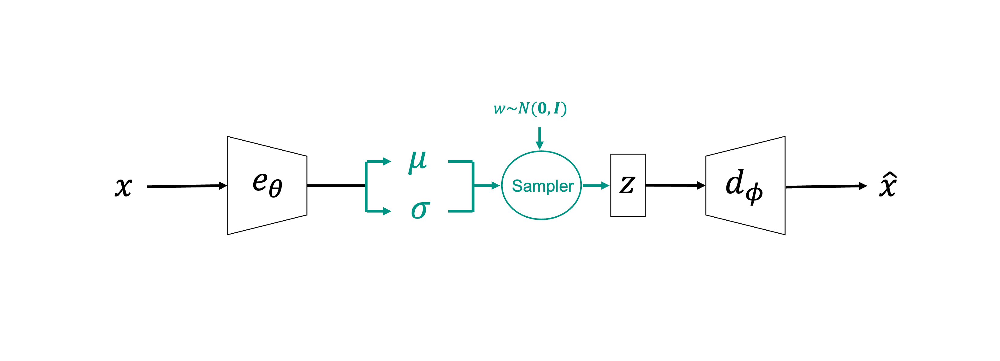
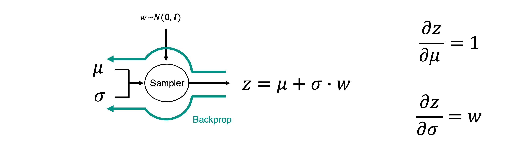
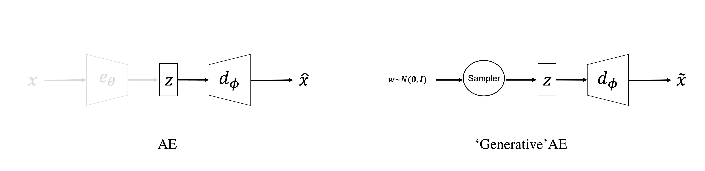
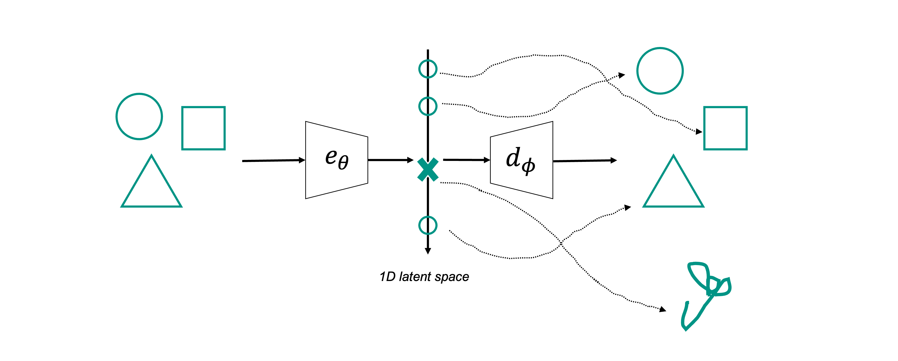
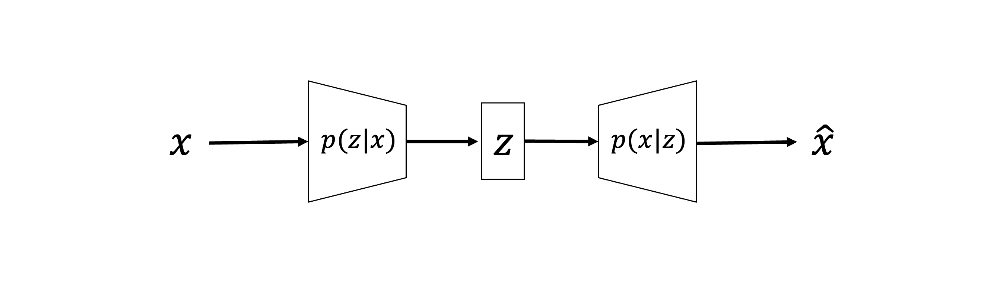
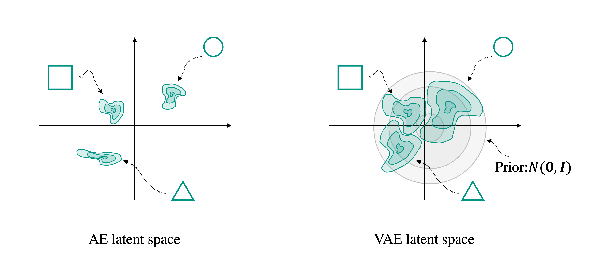

# Generative Modelling and Variational AutoEncoders

Up until now, our attention has been mostly focused on supervised learning tasks where we have access to a certain number
of training samples, in the form of input-target pairs, and we train a model (e.g., a NN) to learn the best possible mapping
between the two. These kind of models are also usually referred to as *discriminative models* as they learn from training samples
their underlying conditional probability distribution $p(\mathbf{y}|\mathbf{x})$.

In the last lecture, we have also seen how the general principles of supervised learning can be adapted to accomplish a
number of different tasks where input-target pairs are not available. Dimensionality reduction is one of such tasks, which are 
usually categorized under the umbrella of unsupervised learning.

Another very exciting area of statistics that has been recently heavily influenced by the deep learning revolution is the
so-called field of *Generative modelling*. Here, instead of having access to input-target pairs, we are able to only gather
a (large) number of samples $\mathbf{X} = \{ \mathbf{x}^{(1)}, \mathbf{x}^{(2)}, ..., \mathbf{x}^{(N_s)} \}$
that we believe come from a given hidden distribution. The task that we wish to accomplished is  therefore:

- Learn the underlying distribution $p(\mathbf{x})$, or 
- Learn to sample from the underlying distribution $\tilde{\mathbf{x}} \sim p(\mathbf{x})$

Obviously, the first task is more general and usually more ambitious. Once you know a distribution, sampling from it is rather an
easy task. In the next two lectures, we will however mostly focused on the second task and discuss two popular algorithms that
have shown impressive capabilities to sample from high-dimensional, complex distributions.

To set the scene, let's take the simplest approach to generative modelling that has nothing to do with neural networks. Let's imagine 
we are provided with $N_s$ multi-dimensional arrays and we are told that they come from a multi-variate gaussian distribution. We can 
set up a generative modelling task as follows:

- Training
     - Compute the sample mean and covariance from the training samples: $\boldsymbol \mu, \boldsymbol \Sigma$
     - Apply the Cholesky decomposition to the covariance matrix: $\boldsymbol \Sigma = \mathbf{L} \mathbf{L}^T$
  
- Inference / Generation
     - Sample a vector from a unitary, zero-mean normal distribution $\mathbf{z} \sim \mathcal{N}(\mathbf{0}, \mathbf{I})$
     - Create a new sample from the true distribution: $\tilde{\mathbf{x}} = \mathbf{L} \mathbf{z} + \boldsymbol \mu$

Unfortunately, multi-dimensional distributions that we usually find in nature are hardly gaussian and this kind of simple
generative modelling procedure falls short. Nevertheless, the approach that we take with some of the more advanced generative modelling
methods that we are going to discuss later on in this lecture does not differ from what we have done so far. A training phase, where the 
free-parameters of the chosen parametric model (e.g., a NN) are learned from the available data, followed by a generation phase that uses
the trained model and some stochastic input (like the $\mathbf{z}$ vector in the example above).

## Variational AutoEncoders (VAEs)

Variational AutoEncoders have been proposed by [Kingma and Welling](https://arxiv.org/abs/1312.6114) in 2013. in As the name implies, these networks take inspiration from the AutoEncoder networks that we have presented in the previous lecture. However, some 
small, yet fundamental changes are implemented to the network architecture as well as the learning process (i.e., loss function) to turn such family
of networks from being able to perform dimensionality reduction to being generative models. 

Let's start by looking at a schematic representation of a VAEs:

Even before we delve into the mathematical details, we can clearly see that one main change has been implemented to the network architecture:
instead of directly producing a vector $\mathbf{z} \in \mathbb{R}^{N_l}$, the encoder's output is composed of two vectors 
$\boldsymbol \mu \in \mathbb{R}^{N_l}$ and $\boldsymbol \sigma \in \mathbb{R}^{N_l}$ that represent the mean and standard deviation of a $N_l$ dimensional
gaussian distribution (with uncorrelated variables, i.e., diagonal covariance matrix). Mathematically, the encoder can be written as 
$\boldsymbol \mu = e_{\theta,\mu}(\mathbf{x}), \; \boldsymbol \sigma = e_{\theta,\sigma}(\mathbf{x})$, where the two networks share all weights apart from
the last layer. The two vectors produced by the encoder are then fed together to a sampler,
who similar to what we did before, produces a sample from the following gaussian distribution: $\mathcal{N}(\boldsymbol \mu, diag\{ \boldsymbol \sigma \})$.
In practice this is however achieved by sampling a vector and then transforming it into the desired distribution, 
$\mathbf{z} = \boldsymbol \sigma \cdot \mathbf{z} + \boldsymbol \mu$ where $\cdot$ refers to an element-wise product. 

### Reparametrization trick

This rather simple trick is referred
to as *Reparametrization trick* and it is strictly needed in neural networks every time we want to introduce a stochastic process within the computational graph.
In fact, by simply having a stochastic process parametrized by a certain mean and standard deviation that may come from a previous part of the computational graph
(as in VAEs) we lose the possibility to perform backpropagation. Instead if we decouple the stochastic component (which we are not interested to update, and 
therefore to backpropagate onto) and the deterministic component(s), we do not lose access to backpropagation:

### Why VAEs?

Before we progress in discussing the loss function and training procedure of VAEs, a rather simple question may arise: 'Why can we not use AEs for
generative modelling?'

In fact, this could be achieved by simply modifying the inference step:

where instead of taking a precomputed $\mathbf{z}$ vector (from a previous stage of compression), we could sample a new $\mathbf{z}$ 
value from a properly crafted distribution (perhaps chosen from statistical analysis of the training latent vectors) at any time we want 
to create a new sample.

Unfortunately, whilst this idea may sound reasonable, we will be soon faced with a problem. In fact, the latent manifold learned by a AE may
not be regular, or in other words it may be hard to ensure that areas of such manifold that have not been properly sampled by the training data will
produce meaningful samples $\tilde{\mathbf{z}}$. Just to give an idea, let's look at the following schematic representation:

as we can see, if a part of the latent 1-d manifold is not rich in training data, the resulting generated sample may be non-representative at all.
Whilst we discussed techniques that can mitigate this form of overfitting (e.g., sparse AEs), VAEs bring the learning process to a whole new level
by choosing a more appropriate regularization term $R(\mathbf{x}^{(i)} ;\theta,\phi)$ to add to the reconstruction loss.

### Regularization in VAEs

In order to better understand the regularization choice in VAEs, let's look once again at a schematic representation of VAEs but this time in a
probabilistic mindset:

where we highlight here the fact that the encoder and decoder can be seen as probability approximators. More specifically:

- $e_\theta(\mathbf{x}) \approx p(\mathbf{z}|\mathbf{x})$: the encoder learns to sample from the latent space distribution conditioned on a specific input
- $d_\phi(\mathbf{z}) \approx p(\mathbf{x}|\mathbf{z})$: the decoder learns to sample from the true distribution conditioned on a specific latent sample

By doing so, we can reinterpret the reconstruction loss as the negative log-likelihood of the decoder. And, provided that we have defined a 
prior for the latent space $\mathbf{z} \sim P(\mathbf{z})$, we can learn the parameters of the decoder by ensuring that the posterior does not deviate
too much from the prior. This can be achieved by choosing:

$$
R(\mathbf{x} ;\theta,\phi) = KL(p(\mathbf{z}|\mathbf{x})||p(\mathbf{z}))
$$

As in any statistical learning process, the overall loss of our VAEs shows a trade-off between the likelihood (i.e., learning from data) and 
prior (i.e., keeping close to the initial guess). 

Before we provide a mathematical derivation supporting these claims, let's briefly try to provide some intuition onto why adding this regularization
makes VAEs more well behaved than AEs in terms of generating representation samples of the input distribution ($p(\mathbf{x})$) whilst sampling directly
in the latent space. Back to the example with geometrical shapes, if we now assume a 2-dimensional latent space for both an AE and a VAEs:

the effect of the regularization term in VAEs is such that the probability density function of the latent space (($p(\mathbf{z}|\mathbf{x})$) is forced
to stay close to the prior, and therefore the "clouds" of different classes do not really separate from each other abruptly. As a consequence, the 
geometrical shapes associated with the transition zones in the latent space are still meaningful. The same cannot be said for the AE as the
"clouds" of different classes tend to move apart leaving unexplored regions between them. Sampling from such region will result in non-representative
geometrical shapes.

More precisely, the regularization term in VAEs ensures the following two properties for the latent space:

- continuity: two closely points in the latent space are similar in the original space;
- completness: any point sampled from the latent distribution is meaningful in the original space;

### Mathematics of VAEs

To conclude our lecture on VAEs, we would like to gain a stronger mathematical understanding about the inner working of this model. In order to do
so, we are required to introduce a technique commonly used in statistics to estimate complex distributions. 
This technique goes under the name of *Variational Inference (VI)*. 

Let's begin from the classical setup of Bayesian inference. We are interested in a certain probability distribution that we want to sample from 
or characterize (e.g., in terms of its mean and standard deviation), for example the following posterior distribution in a general inverse problem setting:

$$
p(\mathbf{x} | \mathbf{y}) = \frac{p(\mathbf{y}|\mathbf{x}) p(\mathbf{x})}{p(\mathbf{y})}
$$

where $\mathbf{x}$ is the model we wish to estimate and $\mathbf{y}$ are the available observations. We assume knowledge of the prior distribution $p(\mathbf{x})$ and the underlying
physical process that links the model to the data, $\mathbf{y}=f(\mathbf{x})$ from which we can compute the likelihood $p(\mathbf{y}|\mathbf{x})$ (assuming a certain statistics for the noise).
The denominator of the Bayes rule ($p(\mathbf{y}) = \int p(\mathbf{y}|\mathbf{x}) p(\mathbf{x}) d\mathbf{x}$) is what prevents us from computing the posterior directly.

Variational Inference approaches the above problem in a special way. A parametric distribution $q_\theta(\mathbf{x})$ is defined, also sometimes referred to as
guide or proposal distribution, and an optimization problem is set up to find the best free-parameters $\theta$ such that this easy-to-evaluate distribution
closely resembles to posterior distribution of interest. As usual when setting up an optimization problem, a measure of distance between such distributions is required to be able to optimize 
for such set of parameters. In this case, since we are dealing with distributions, it comes natural to choose the Kullback-Leibler divergence as metric:

$$
\underset{\theta} {\mathrm{argmin}} \; KL(q_\theta(\mathbf{x})||p(\mathbf{x}|\mathbf{y}))
$$

Let's now expand the expression of the KL divergence and show an equivalent formula for this optimization problem:

$$
\begin{aligned}
&\underset{\theta} {\mathrm{argmin}} \; KL(q_\theta(\mathbf{x})||p(\mathbf{x}|\mathbf{y})) \\
&= \underset{\theta} {\mathrm{argmin}} \; E_{\mathbf{x} \sim q_\theta} \left[ log \left( \frac{q_\theta(\mathbf{x})}{p(\mathbf{x}|\mathbf{y})} \right) \right] \\
&= \underset{\theta} {\mathrm{argmin}} \; E_{\mathbf{x} \sim q_\theta} [ log q_\theta(\mathbf{x}) ] - E_{\mathbf{x} \sim q_\theta} [ log p(\mathbf{x}|\mathbf{y}) ] \\
&= \underset{\theta} {\mathrm{argmin}} \; E_{\mathbf{x} \sim q_\theta} [ log q_\theta(\mathbf{x}) ] - E_{\mathbf{x} \sim q_\theta} \left[ log \left( \frac{p(y|\mathbf{x})p(\mathbf{x})}{p(\mathbf{y})} \right) \right] \\
&= \underset{\theta} {\mathrm{argmin}} \; E_{\mathbf{x} \sim q_\theta} [ log q_\theta(\mathbf{x}) ] - E_{\mathbf{x} \sim q_\theta} [ log p(\mathbf{y}|\mathbf{x}) ] - E_{\mathbf{x} \sim q_\theta} [ log p(\mathbf{x}) ] + \cancel{E_{\mathbf{x} \sim q_\theta} [ log p(\mathbf{y}) ]} \\
&= \underset{\theta} {\mathrm{argmin}} \; KL(q_\theta(\mathbf{x})||p(\mathbf{x})) - E_{\mathbf{x} \sim q_\theta} [ log p(\mathbf{y}|\mathbf{x}) ]
\end{aligned}
$$

where we have eliminated $E_{x \sim q_\theta} [ p(\mathbf{y}) ]$ the in the 5th row since it does not depend on $\theta$. In the last row, we can see the two 
terms that we have previously described:

- $-E_{x \sim q_\theta} [ p(\mathbf{y}|\mathbf{x}) ]$ is the negative log-likelihood of a traditional Maximum likelihood estimation (i.e., data misfit term). In the
  special case of gaussian noise ($\mathbf{y} \sim \mathcal{N}(f(\mathbf{x}), \sigma^2 \mathbf{I})$), this becomes the MSE loss as discussed in one 
  of our previous lectures;
- $KL(q_\theta(\mathbf{x})||p(\mathbf{x}))$ is the regularization term encouraging the proposal distribution to stay close to the prior.

Finally, let's slightly rearrange the expression in the 5th row:

$$
E_{\mathbf{x} \sim q_\theta} [ log p(\mathbf{y}) ] - KL(q_\theta(\mathbf{x})||p(\mathbf{x}|\mathbf{y})) = 
E_{\mathbf{x} \sim q_\theta} [ log p(\mathbf{y}|\mathbf{x}) ] - KL(q_\theta(\mathbf{x})||p(\mathbf{x})) 
$$

The left hand side of this equation is called *Evidence Lower Bound (ELBO)*. The names comes from the fact that the sum of these two terms is
always $\le E_{\mathbf{x} \sim q_\theta} [ log p(\mathbf{y}) ]$ since KL divergence is always positive. Therefore, by maximizing the right hand side (or
equivalently by minimizing the negative of the right hand side), we effectively maximize the lower bound of the probability of the evidence $p(\mathbf{y})$.
Variational inference can be therefore seen also as a maximization problem over the ELBO.

Whilst we now understand the theoretical foundations of VI, to make it practical we need to specify:

- A suitable proposal $q_\theta(\mathbf{x})$, where *suitable* means that we can easily evaluate such probability, its KL divergence with a prior of choice,
  as well as sample from it. The simplest choice that is sometimes made in VI is named *mean-field approximation* where:
    $$
    q_\theta(\mathbf{x}) = \prod_i q_\theta(x_i) \sim \mathcal{N}(\boldsymbol \mu , diag(\boldsymbol \sigma))
    $$
  where $\theta={\boldsymbol \mu, \boldsymbol \sigma}$. This implies that there is no correlation over the different variables of the N-dimensional 
  proposal distribution. Whilst this choice may be too simple in many practical scenarios, it is important to notice that this is not the same as 
  assuming that the variables of the posterior itself are uncorrelated!

- A suitable optimizer. In the case where multiple \mathbf{x} samples are available, $p(\mathbf{y}|\mathbf{x}$, $p(\mathbf{x}$, and 
  $q_\theta(\mathbf{x})$ are differentiable we can simply use a stochastic gradient method. This special case of VI is named ADVI.

Moving back to where we started, the VAE model. Let's now rewrite the problem as a VI estimation (where $\mathbf{z}$ plays here the role of the
model or unseen variable and $\mathbf{x}$ represents the available observations):

$$
\begin{aligned}
&\underset{\theta, \phi} {\mathrm{argmin}} \; KL(q_\theta(\mathbf{z})||p(\mathbf{z}|\mathbf{x})) \\
&= \underset{\theta, \phi} {\mathrm{argmin}} \; KL(q_\theta(\mathbf{z})||p(\mathbf{z})) - E_{\mathbf{z} \sim q_\theta} [ log p_\phi(\mathbf{x}|\mathbf{z}) ]
\end{aligned}
$$

where the first term is responsible for updating the encoder whilst the second term contributes to the update of both the encoder and decoder. 
The proposal distribution is here parametrized as $q_\theta(\mathbf{z}) \sim \mathcal{N}(e_{\theta,\mu}(\mathbf{x}), diag(e_{\theta,\sigma}(\mathbf{x})))$.
and the expectation is taken over the training samples (or a batch of them).

## Additional readings

- The flow of this lecture is heavily inspired by this [blog post](https://towardsdatascience.com/understanding-variational-autoencoders-vaes-f70510919f73)
- A Python library that can help you step up your game with Variational Inference is [Pyro](https://pyro.ai) from Uber.