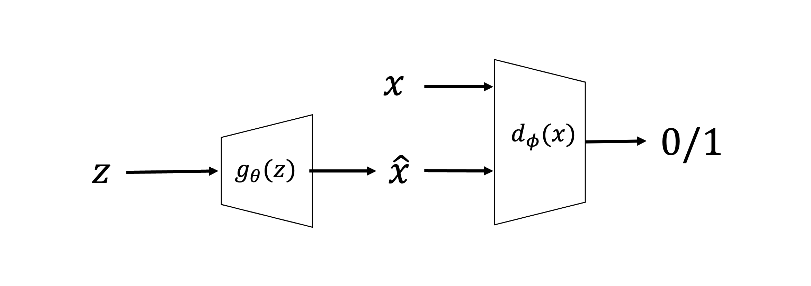
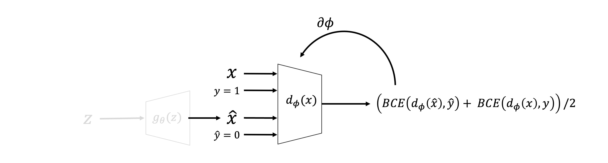
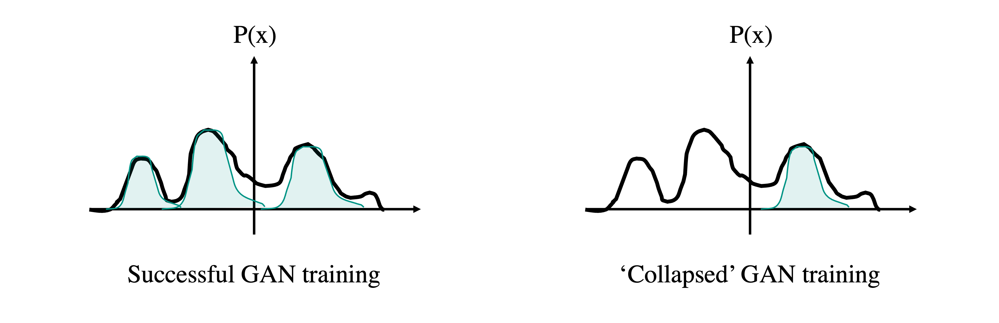
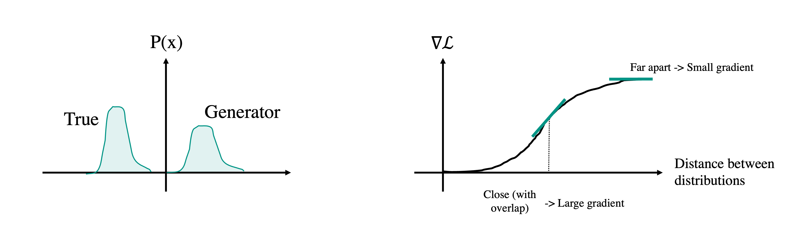
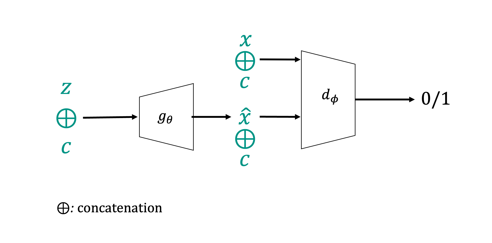
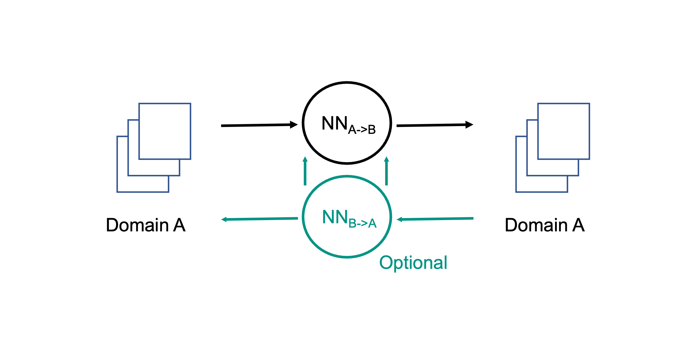
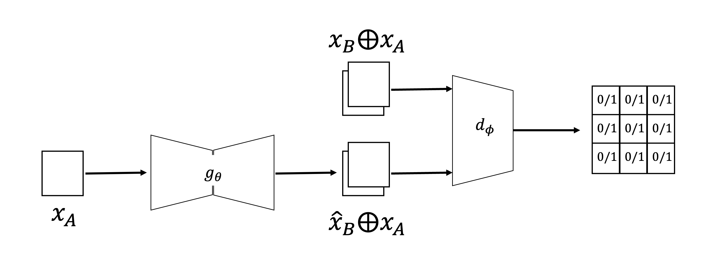
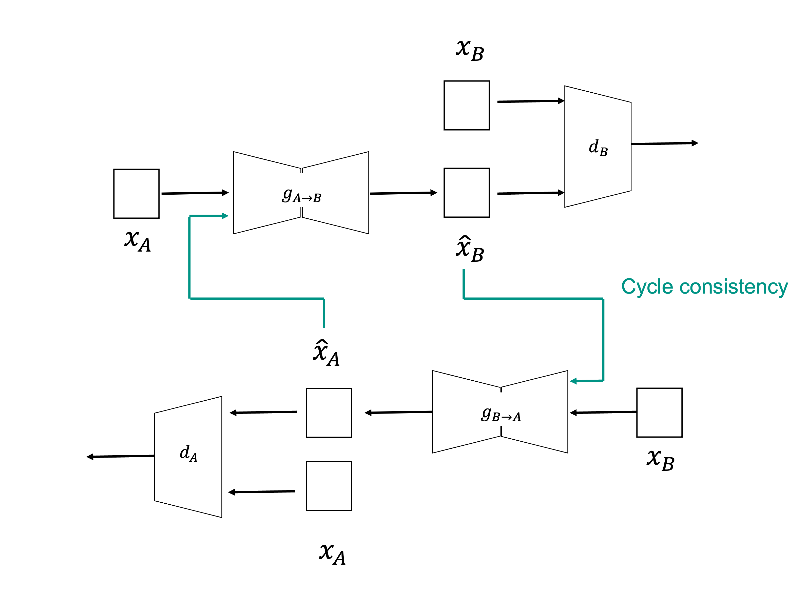

# Generative Adversarial Networks (GANs) 

A fundamentally new way of approaching generative modelling has been proposed by [Goodfellow and co-authors](https://arxiv.org/abs/1406.2661) in 2014.
Similar to VAEs, Generative Adversarial Networks (GANs) can learn a distribution from some training samples, or more precisely thy can learn to sample
from the underlying, unknown distribution. This family of NNs are revolutionary in that they can produce very high quality (i.e., extremely realistic)
samples compared to predecessor models at similar computational cost. 

Whilst the core application of GANs (and pretty much any generative model in deep learning) has been computer vision (i.e., natural images and portraits
of people in particular), their use in geoscience has also recently provided us with new ways of generating "new" samples that can easily outperform state-of-the-art
geostatistical tools. This is very appealing in applications like reservoir modelling as geologists and reservoir engineers are nowadays usually tasked to work with
multiple realizations of the subsurface and provide probabilistic estimates to support the subsequent decision making process. A few examples of early 
applications of GANs in geoscience are:

- [Mosser et al.](https://arxiv.org/abs/1704.03225), Reconstruction of three-dimensional porous media using generative adversarial neural networks
- [Zhang et al.](https://link.springer.com/article/10.1007/s12182-019-0328-4), Generating geologically realistic 3D reservoir facies models using deep learning of sedimentary architecture with generative adversarial networks
- [Wang et al.](https://agupubs.onlinelibrary.wiley.com/doi/10.1029/2020JB020077?af=R), SeismoGen: Seismic Waveform Synthesis Using GAN With Application to Seismic Data Augmentation
- ...

We will begin by discussing the main application of GANs, i.e. pure unconditional generation. Later, we will however see that
recent modifications of GANs have allowed performing conditional generation (e.g., generate facies model conditioned to well information) as well
as domain transformation (e.g., from seismic to reflectivity, from facies to petrophysical parameters). The latter has been shown to outperform traditional 
supervised learning workflows based for example on UNet architectures.

## GANs groundbreaking idea

Let's start by looking at the basic idea of GANs with a schematic drawing of the network architecture (or, as we will soon become familiar with, we should say
the network architectures as we will be dealing with two networks!):

A GAN model is composed of two networks, namely:

- Generator ($g_\theta$): takes an input vector $\mathbf{z} \in \mathbb{R}^{N_l}$ randomly sampled for a given distribution 
  (e.g., $\mathbf{z} \sim \mathcal{N}(\mathbf{0}, \mathbf{I})$) and produces an output vector $\hat{\mathbf{x}} \in \mathbb{R}^{N_f}$
  that should should belong to the underlying probability distribution of the training samples, $p(\mathbf{x})$). 
  To achieve this task, the generator is not allowed direct access to the training samples $\mathbf{x}^{<i>}$. On the other hand, it relies 
  on the discriminator for feedback.
- Discriminator ($d_\phi$): takes both real samples $\mathbf{x}$ and fake samples $\hat{\mathbf{x}}$ (the latter coming from the generator) 
  and tries to classify them. Its goal is to discriminate between true and fake samples, or in other words to identify which samples are coming from
  the generator.

A classical example from the original paper is that the generator is a painting forger, whilst the discriminator is a painting critic. It is obvious here
that these two networks must compete with each other, if one achieves its goal the other would have failed and vice-versa. As we will see later, this is 
what makes GANs successful but also hard to train. Moreover, whilst training is performed in parallel, it is worth noticing that the generator network is what
ultimately we care about (to be able to create realistic samples), whilst the discriminator is an auxiliary network that will be discarded after training.

## Mathematics of GANs

Before we delve into the mathematical framework of GANs, let's take a more detailed look at the two networks and their training process. First, the generator:

and the discriminator:

As previously explained, the generator is updated solely based on the samples it generates. This is not done in a direct form, rather through the feedback 
of the discriminator. As the generator tries to fool the discriminator, the discriminator is provided with true labels during the generator training phase.
On the other hand, the discriminator is fed with both true and fake samples and their correct corresponding label. Its task is therefore to perform a correct classification,
which, if successful, will prevent the generator from producing realistic fake samples. Note that since we want the discriminator to perform a binary classification task the activation
of the last layer must be chosen to be a sigmoid function.

Let's try to put down into equations this training process. Given that we are dealing with a binary classification problem, the obvious choice for the loss function
is the commonly used binary cross entropy (BCE) loss. Starting from the generator:

$$
\mathscr{L}(\hat{\mathbf{x}}, \hat{\mathbf{y}}=1) = BCE(d_\phi(g_\theta(\mathbf{z})), \hat{\mathbf{y}}=1) = -log(d_\phi(g_\theta(\mathbf{z})))
$$

which is minimum for $g_\theta(d_\phi(\mathbf{z}))=1$ (i.e., when the generator has been able to fool the discriminator), and maximum for 
$g_\theta(d_\phi(\mathbf{z}))=0$ (i.e., when the discriminator recognizes the creation of the generator).

For the discriminator we must consider two cases. The first one is associated with the generator:

$$
\mathscr{L}(\hat{\mathbf{x}}, \hat{\mathbf{y}}=0) = BCE(d_\phi(g_\theta(\mathbf{z})), \hat{\mathbf{y}}=0) = -log(1-d_\phi(g_\theta(\mathbf{z})))
$$

which is minimum for $g_\theta(d_\phi(\mathbf{z}))=0$ (i.e., when the discriminator recognizes the creation of the generator), and maximum for 
$g_\theta(d_\phi(\mathbf{z}))=1$ (i.e., when the generator has been able to fool the discriminator). The second one is instead
associated with the true samples:

$$
\mathscr{L}(\mathbf{x}, \mathbf{y}=1) = BCE(d_\phi(\mathbf{x}), \mathbf{y}=1) = -log(d_\phi(\mathbf{x}))
$$

which is minimum for $d_\phi(\mathbf{x})=1$ (i.e., when the discriminator recognizes the true samples), and maximum for 
$d_\phi(\mathbf{x})=0$ (i.e., when the discriminator believes that the true samples are fake).

Whilst for simplicity we have analyzed these three terms separately and focused on how they can be minimized (this is also what we would do when 
implementing GANs in practice), a unique *adversarial loss function* can be also defined that uniquely identifies the goal of GAN training:

$$
\mathscr{L}_{adv} = E_{\mathbf{x} \sim p_x} [log(d_\phi(\mathbf{x}))] + 
E_{\mathbf{z} \sim p_z} [log(1- d_\phi(g_\theta(\mathbf{z})))]
$$

and the overall training problem can be written as:

$$
arg \; \underset{g_\theta} {\mathrm{min}} \; \underset{d_\phi} {\mathrm{max}} \; \mathscr{L}_{adv} 
$$

This is interesting, as we are not simply minimizing a loss function to find the best parameters of a network, rather we are required to play a min-max
game between the generator and discriminator. This is exactly where the Adversarial part of the name GANs comes from.

## Training of GANs
Although there are various strategies to successfully train these two networks together, the most common one is to do one step of 
optimization on one and one on the other in an alternating fashion. By doing so, we allow the two networks to competitively learn together 
their own task whilst trying to make the other network fail on the other task.

In practice, the learning process of GANs can be however very unstable (and sometimes even unpredictable). A common scenario is in fact represented
by the fact that one network learns its task much faster than the other network. Depending on which of the two networks is the fast 
learner, the following scenarios may arise:

- Super-discriminator (i.e., the discriminator outpaces the generator): the generator is made aware of the fact that most (if not all) of his fake samples have been identified by 
  the discriminator. By not knowing which of the generated samples are harder to discriminate and which ones are easier, the network cannot update its parameters
  to generator more of the samples that were mislead for real and less of those that were identified as fake by the discriminator. This is the most common scenario 
  as the discriminator has a much easier task (binary classification) compared to that of the generator (learning a probability density function);
- Super-generator (i.e.,the generator outpaces the discriminator): as the discriminator cannot tell apart the true from the fake samples, the generator is satisfied with what it is 
  producing and continues to do so. Whilst this is the ideal scenario that we wish to experience after some epochs of training, when this arises early (in the first few epochs),
  it is usually a sign that the generator is producing samples that are very similar to each other instead of a representative set of samples of the underlying
  distribution (so-called mode collapse).

Now that we know how to train GANs, and that the training process may be hard, let's discuss in details a number of scenarios that we may encounter during
training. After that, we will discuss a number of strategies that have been devised through out the years to minimize the risk of having unbalanced training and ultimately 
a generator with poor generative capabilities.

### Mode collapse
Let's consider the following multi-modal 1-dimensional distribution:

A successfully trained GAN is able to generate sample from the different modes of this distribution. However, it is common for a GAN to identify a single mode
and stick to it, generating only samples from a small part of the overall distribution. As these samples are realistic, the generator may eventually end up fooling
the discriminator losing any interest in exploring other areas of the distribution. 

More precisely, let's imagine that during the early stages of training the 
discriminator is able to distinguish between fake and real samples for 3 of the 4 modes whilst it struggles for the remaining one. Whilst trying to fool the
discriminator, the generator realizes that and exploits its ability to fool the discriminator when sampling from one of the modes. By doing this, the generator becomes
better and better at producing realistic samples from that mode but forgets about the fact that the probability it is trying to approximate may be multi-modal.
Whilst this is a better scenario than the one depicted above (i.e., the generator is outpaced by the discriminator and cannot produce any representative sample), 
mode collapse is still something we would like to avoid if possible. We will soon discuss a number of modifications to the classical GAN model that can achieve that.

### Vanishing gradients

Another problem commonly experienced whilst training GANs is represented by the arising of vanishing gradients. Let's imagine that at the start of the training process,
the discriminator manages to get the two distribution (true and generator) far apart. In this scenario, the gradient of the BCE loss tends to flatten and training
starts to slow down as depicted in the figure below:

In other words, once the distributions stop overlapping the chances of the generator to keep learning and producing something meaningful  drastically reduce (or at least
the learning process becomes very slow).

## Solutions to unstable training

In the quest of creating stable and reliable GAN models, a number of researchers have suggested that the BCE loss initially used in the 
original GAN paper may be the main cause of some of the above highlighted problems. As GANs ultimate goal is that of estimate a probability distribution, 
a suggestion was made by [Arjovsky](https://arxiv.org/abs/1701.07875) and coauthors in 2017 to replace the BCE loss with the so-called Wasserstein loss.

Simply put, the Wasserstein distance, or Earth's mover distance, is a distance function between two probability distributions that computes the amount of earth (or soil)
that needs to be moved from one probability to match another. Let's take a look at it with an example where for simplicity we discretize two probability distributions
(i.e., we display them as histograms). In this case we can simply observe that the Wasserstein distance between such probabilities is 1 as we need to make just
one move to match them:

More importantly, a clear implication in choosing this loss function over BCE for the training of GANs lies in the fact that its gradient does not saturate very quickly
as two distributions are pulled far apart. This greatly eases the training process of the generator even when the discriminator is superior at the beginning of the training process.

In practice, when using the Wasserstein distance, the loss function of the min-max game becomes:

$$
arg \; \underset{g_\theta} {\mathrm{min}} \; \underset{d_\phi} {\mathrm{max}} \; E_{\mathbf{x} \sim p_x} [d_\phi(\mathbf{x})] -
E_{\mathbf{z} \sim p_z}[d_\phi(g_\theta(\mathbf{z}))]
$$

and the training process remains unchanged. Finally, note in the context of Wasserstein GANs (W-GANs) the discriminator is sometimes also
called critic as its role it is not anymore to perform a classification but simply criticize the fake samples. Moreover, although the 
Wasserstein loss makes training of GANs less unstable, it introduces a problem. The training of the discriminator can be affected by the
exploding gradient behaviour, due to the fact that the discriminator may not be 1-Lipschitz continuous. Various approaches have been introduced to
avoid such a situation, *gradient clipping* and *gradient penalty* are two of the most common solutions.

To conclude this section, it is worth mentioning that a number of other strategies have been proposed in the literature to mitigate training failures of GANs.
Whilst we will not go into the details here, we will briefly mention a couple of them:

- *Spectral normalization*: another approach used to ensure that the discriminator is 1-Lipschitz continuous. As the name implies, spectral normalization
  is a normalization procedure applied to each layer of the network to ensure that the spectral norm of the layer is smaller or equal to 1. It requires estimating
  the largest eigenvalue of each layer and renormalizing its weight whenever they are updated. For more details, see this [blog post](https://jonathan-hui.medium.com/gan-spectral-normalization-893b6a4e8f53) for more details.
- *Polyak averaging of the generator*: as discussed in this [lecture](08_gradopt1.md), it is possible to mitigate the importance of the stopping criterion
  when training GANs by averaging the parameters of the generator for a number of iterations $N_{it}$ (or even epochs).
- Pro-GAN (Progressive growing GANs): Instead of training a GAN network directly on the high-resolution output of interest, a good strategy proposed by
  [Karras and coauthors](https://arxiv.org/abs/1710.10196) is to start with a smaller, lower resolution version and train a small GAN. This is repeated for a number
  of times by freezing the trained layers, adding more layers, and increasing the resolution of the sought output.

## Conditional GANs

The original formulation of GANs aims at learning an unconditional probability distribution and sampling from it. However, in many real life scenarios we may
expect the probability distribution of our data to be somehow clustered (i.e., display a multi-modal behaviour). Let's for example imagine that we are
provided with a number of geological models from all over the world and our goal is to teach a GAN to create new 'fake' models that are as realistic as possible. 
Whilst all the geological models share some high-level features, it is logical to expect that some of them have more things in common then others. Let's also assume 
we are provided with such information in the form of labels, so that for each sample we also know the class it belongs to. If we were able to sample from a 2-dimensional 
latent space and reproduce exactly our training samples, this is what we may observe:

It may be appealing to train a GAN that at inference time could produce samples conditionally to us choosing a specific class (or cluster) of interest. Of course,
the most straightforward approach could be to separate the training samples into $N_c$ buckets and train $N_c$ independent GANs. This is however very costly. A smarter approach
is to turn our generative network from unconditional to conditional, something we call conditional GAN (or c-GAN). 

Conditional GANs present a number of distinctive features when compared to traditional GANs, which we are going to summarize here:

- Alongside a random vector $\mathbf{z} \in \mathbb{R}^{N_l}$, the generator is now also fed with a label that represents the class we wish to sample from. These two are
  concatenated to each other to form a new vector $\tilde{\mathbf{z}} = [\mathbf{z}, c] \in \mathbb{R}^{N_l+1}$. Alternatively, the label can be one-hot encoded into a 
  vector $\mathbf{c}$ and the generator is fed with $\tilde{\mathbf{z}} = [\mathbf{z}, \mathbf{c}] \in \mathbb{R}^{N_l+N_c}$. By doing so at training time, we inform the generator
  that we are not just interested in producing a random sample from the distribution of the training data, rather we want a sample from a specific class. Once the network is trained,
  at inference time we will have the ability to sample conditionally;
- The discriminator is also made aware of the fact that the training data is divided into classes. And of course, this goes also for the generated samples. Similar to the generator input,
  the input of the discriminator is now modified to include also the label of the true sample (or the label provided to the generator for the fake sample). Once again the vector
  $\mathbf{x} is simply concatenated with either the label $c$ or its one-hot encoded version $\mathbf{c}$ to create a new input to the discriminator $\tilde{\mathbf{x}}$. 

Finally, what if the input of the discriminator (and/or generator) is N-dimensional. This is usually the case when working with natural images or multi-dimensional 
geoscientific data (e.g., seismic data, satellite images). A simple modification of the process described above can be introduced. Instead of concatenating the label
$c$ to the 1-dimensional $\mathbf{z}$ (or $\mathbf{x}$) vector, an additional channel is added to the N-dimensional $\mathbf{z}$ (or $\mathbf{x}$) tensor that contains the value of the label.
Similarly, when working with the one-hot encoded version of the label, $N_c$ channels are added instead with one of them containing 1s (the one corresponding to the label) and all
others containing 0s.

## Domain translation with GANs

To conclude this lecture, we will discuss a slightly different application of GANs. Whilst so far we have presented GANs as statistical modelling tools for generative tasks, 
it turns out they are also useful for image-to-image translation (or more broadly, for any form of *domain translation*). 

We previously mentioned this application in the context of convolutional networks and more specifically the UNet architecture. The idea is to map data from a given input domain to
a given output domain. A number of interesting applications in geoscience may benefit from this set up. For example, any geophysical processing step can be seen as a domain translation task
where we transform the input data into a new version of it. Also, we could think of using domain translation as a way to create realistic geological models from sketches or to populate them
with petrophysical properties whist starting from a pure facies skeleton.

In general, two scenarios may arise:

- Paired training: the training data provides us with paired combinations of samples from the two domains, e.g., $\mathbf{x}_A^{<i>} \leftrightarrow \mathbf{x}_B^{<i>} \; \forall i$
- Unpaired training: the training data comes in the form of two set of training samples, the first from domain A and the second from domain B. However, we do not know how each sample
  of one domain is related to a sample of the other domain, i.e. $X_A = (\mathbf{x}_A^{<1>}, \mathbf{x}_A^{<2>}, ..., \mathbf{x}_A^{<N_A>})$ and 
  $X_B = (\mathbf{x}_B^{<1>}, \mathbf{x}_B^{<2>}, ..., \mathbf{x}_B^{<N_B>})$.

### Paired training
In 2017 [Isola and coauthors](https://arxiv.org/abs/1611.07004) suggested that c-GANs could be used for paired domain translation and proposed the so called Pix2Pix network.
Mathematically speaking, whilst a traditional c-GAN aims to learn:

$$
p(\mathbf{x} | \mathbf{z}, c)
$$

a c-GAN for domain translation will be tasked to learn:

$$
p(\mathbf{x}_B | \mathbf{z}, \mathbf{x}_A)
$$

where the noise vector $\mathbf{z}$ can be used to sample multiple realizations conditioned on the given input $\mathbf{x}_A$. In practice, it turns out that this problem is
too constrained to allow 'rich sampling', so the original authors suggest to remove $\mathbf{z}$ from the inputs and use alternative approaches such as dropout if interested 
to produce multi outputs.

The overall network architecture of Pix2Pix can be summarized as follows:

- Generator: as the inputs and outputs of the generator share the same dimensions, the network architecture here does not need to be that of a
  `decoder` like in classical GANs. More powerful architectures with skip connections, like UNet, can be used instead. Note that, as mentioned above, there
  the random vector $\mathbf{z}$ is not required to be the input of the generator.
- Discriminator: similar to c-GAN, both the true samples from the target domain, $\mathbf{x}_B$, as well as the predicted ones, $\hat{\mathbf{x}}_B$ are fed to the 
  discriminator concatenated with their corresponding sample in the original domain, $\mathbf{x}_A$. A second modification to the usual GAN discriminator is also applied
  here. Instead of using a classical discriminator that reduces the dimensionality of the output to a scalar, Pix2Pix use a special type of discriminator called *Patch GAN*.
  More specifically, the discriminator produces an 2-dimensional output of size $N_d \times N_d$ (where $N_d$ is much smaller than
  the size of the input samples, $N \times N$). This matrix contains values that are fed independently to the adversarial loss used in classical GANs. By doing 
  the PatchGAN discriminator tries to classify if each $N/N_d \times N/N_d$ patch in an image is real or fake, providing therefore a much richer feedback to the generator.

Apart from the network changes, Pix2Pix introduces also a modification to the original loss function of GANs:

$$
\mathscr{L} = \mathscr{L}_{adv} + \lambda \mathscr{L}_{pix}
$$

where the first term, $\mathscr{L}_{adv}$, is the adversarial loss of choice, whilst the second term computes the error between the predicted sample in the new domain and the
corresponding true one, e.g. $MSE(\hat{\mathbf{x}}_B^{<i>}, \mathbf{x}_B^{<i>})$. As this can be interpreted as the classical loss term of a supervised learning task, Pix2Pix
does indeed trade-off between performing a classical reconstruction with pixel-wise loss and producing samples that can fool the discriminator.

### Unpaired training
As we previously mentioned, it is not always possible to have access to paired samples from the two domains. Provided access to a variety of samples from domains A and B, *CycleGAN*
was introduced by [Zhu and colleagues](https://arxiv.org/abs/1703.10593) as a way to perform domain translation in this more general setup. The idea of CycleGAN is to train 2
GANs in parallel, one performing a domain translation task from A to B and the other performing a domain translation task from B to A:

Each GAN is composed of a generator with UNet architecture and a discriminator (it could be normal one or a PatchGAN); samples from domain A are fed to the $GAN_{A \rightarrow B}$ 
whilst samples from domain B are fed to the $GAN_{B \rightarrow A}$. An adversarial loss is used as commonly done in GANs training, but in this case neither BCE nor Wasserstein is 
chosen. Instead, the authors suggest to use an MSE loss:

$$
\begin{aligned}
\mathscr{L}_{adv, g_{A \rightarrow B}} &= E_{\mathbf{x}_A \sim p_{x,A}} [(d_B(g_{A \rightarrow B}(\mathbf{x}_A) - 1)^2], \\
\mathscr{L}_{adv, g_{B \rightarrow A}} &= E_{\mathbf{x}_B \sim p_{x,B}} [(d_A(g_{B \rightarrow A}(\mathbf{x}_B) - 1)^2], \\
\mathscr{L}_{adv, d_A} &= E_{\mathbf{x}_A \sim p_{x,A}} [(d_A(\mathbf{x}_A) - 1)^2] + E_{\mathbf{x}_B \sim p_{x,B}} [d_B(g_{B \rightarrow A}(\mathbf{x}_B))^2], \\
\mathscr{L}_{adv, d_B} &= E_{\mathbf{x}_B \sim p_{x,B}} [(d_B(\mathbf{x}_B) - 1)^2] + E_{\mathbf{x}_A \sim p_{x,A}} [d_B(g_{A \rightarrow B}(\mathbf{x}_A))^2], \\
\end{aligned}
$$

and we finally define $\mathscr{L}_{adv, A \rightarrow B}=\mathscr{L}_{adv, g_{A \rightarrow B}} + \mathscr{L}_{adv, d_B}$ and 
$\mathscr{L}_{adv, B \rightarrow A}=\mathscr{L}_{adv, g_{B \rightarrow A}} + \mathscr{L}_{adv, d_A}$.

Moreover, since we do not know how to pair the samples from the different domains the PixelLoss of Pix2Pix 
cannot be used here. Up until now the networks are also not aware of each other and could well be trained separately. A feedback loop is therefore introduced 
such that the two networks are aware of each other and trained together to learn both mappings consistently. This is referred to as *Cycle consistency* and it works as follows:

- A sample from domain A is fed to the $GAN_{A \rightarrow B}$ and subsequently to $GAN_{B \rightarrow A}$ and the reconstruction loss is computed: 
  $\mathscr{L}_{cycle, A \rightarrow B} = MSE(\mathbf{x}_A, g_{B \rightarrow A}(g_{A \rightarrow B}(\mathbf{x}_A))$

- A sample from domain B is fed to the $GAN_{B \rightarrow A}$ and subsequently to $GAN_{A \rightarrow B}$ and the reconstruction loss is computed: 
  $\mathscr{L}_{cycle, B \rightarrow A} = MSE(\mathbf{x}_B, g_{A \rightarrow B}(g_{B \rightarrow A}(\mathbf{x}_B))$

Finally, an Identity loss is also optionally introduced where a sample from one domain is passed through the generator of the other domain and the MSE loss is computed against 
the sample itself. The idea of such loss is that a generator should not modify a sample that already belongs to the target distribution:

$$
\begin{aligned}
\mathscr{L}_{identity, A} &= MSE(g_{B \rightarrow A}(\mathbf{x}_A), \mathbf{x}_A)\\
\mathscr{L}_{identity, B} &= MSE(g_{A \rightarrow B}(\mathbf{x}_B), \mathbf{x}_B)\\
\end{aligned}
$$

To summarize, the overall loss function of CycleGAN becomes:

$$
\mathscr{L} = \sum_{i \in (A \rightarrow B, B \rightarrow A)} \left( \mathscr{L}_{adv, i} + \lambda_C (\mathscr{L}_{cycle, i}) \right) + 
\lambda_I (\mathscr{L}_{identity, A} +\mathscr{L}_{identity, B})
$$

## Additional readings

- A good discussion on the limitations of the BCE loss for GANs training can be found [here](https://jonathan-hui.medium.com/gan-what-is-wrong-with-the-gan-cost-function-6f594162ce01)
- A number of valuable resources for stable training of GANs are: [1](https://machinelearningmastery.com/how-to-train-stable-generative-adversarial-networks/),
  [2](https://towardsdatascience.com/gan-ways-to-improve-gan-performance-acf37f9f59b)
- If you want to get started with GANs in PyTorch, here is a good starting point: 
  [A Zoo of PyTorch implementations of GANs](https://github.com/eriklindernoren/PyTorch-GAN)
