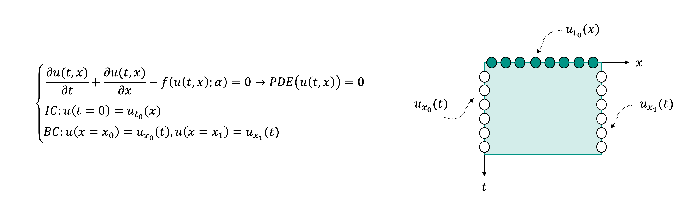
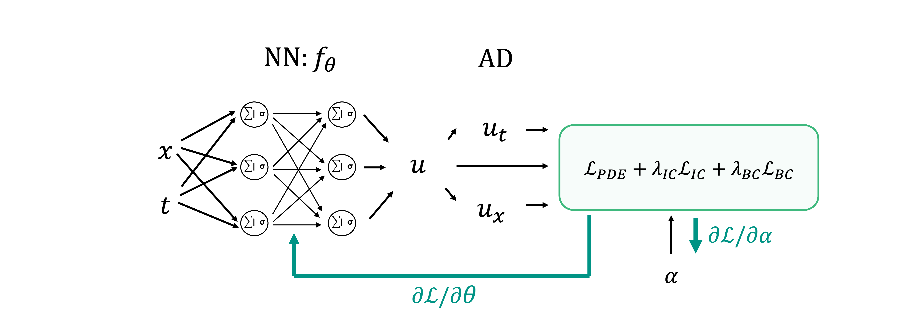
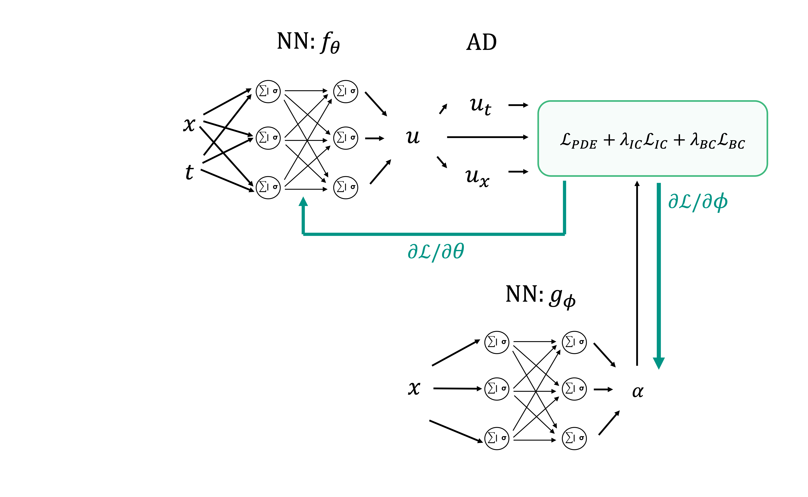

# Scientific Machine Learning and Physics-informed Neural Networks

In the last two lectures of our course, we will focus our attention on a flourishing area of scientific computing that 
aims to develop algorithms that can bridge the gap between purely data-driven methods and model-driven ones. Sometimes 
this new field of research is referred to as *Scientific Machine Learning* and you can find a great deal of information
on the web (e.g., [1](https://sciml.ai), [2](https://sites.brown.edu/bergen-lab/research/what-is-sciml/), 
[3](https://www.science.org/doi/10.1126/science.aau0323)). However, it is not always easy to understand what Scientific ML 
really is and how it differs from the mere application of the ML (and DL) tooling that we have discussed during this course.

To be able to understand what is the best way to marry the latest advances in deep learning with our toolbox of model-driven
algorithms, let's first briefly review what these two disciplines are good at alone and where they usually struggle.

**Deep Learning** is usually great at:

- Computer Vision tasks;
- Language modelling tasks;
- Discovery of hidden patterns in large amount of structured data.

These three topics have something in common: very little is known a priori about the `physics` that underlie the process that
we want to learn from. For example, although a great deal of research has been performed in the fields of neuroscience, our current
understanding of how a child learns to recognize a dog from a cat or how we learn a new language is still very limited. Whilst 
for long time researchers have tried to decode the rules of a language and create computer programs that could translate, 
answer questions or more broadly communicate with humans, it is nowadays clear to us that a better route is to provide machines
with a large amount of training data and let them identify the best possible way to accomplish a task.

**Physics** is usually great at:

- Modelling natural phenomena by means of (more or less) simple equations, e.g. how waves propagate.
- Providing a link between some observations that we are able to take in the nature and the unobserved parameters of the underlying
  physical system. For example, we can link the traveltime of sound waves with the actual velocity of the medium they travel in, or link
  precipitation levels with the pressure and temperature of the atmosphere. This is usually encoded by equations of the form:
    
    $$
    d = g(m)
    $$
  where $d$ are the observations, $m$ are the model parameters, and $g$ is the (usually nonlinear) physical model. This could be
  an ordinary differential equation (ODE), or a partial differential equation (PDE), or any other equation that has an analytical or
  numerical solution.

On the other hand, unlike deep learning, a purely physics-driven approach may not be able to learn useful information from data nor
automatically identify patterns in the solution space that we would like to enhance or suppress. This is where a hybrid approach could
come in handy: we can leverage some of the deep learning methods discussed in this course to identify patterns in both the observations and
the sought after model and use it as an informed prior whilst still relying on the well-established physical process to link the two.

In the following we will focus on the following three directions of research that build their foundations on this paradigm:

- *Physics-Informed Neural Networks (PINNs)*: this family of NNs try to learn to model a physical process in an unsupervised manner. This is accomplished
  by including the ODE or PDE that describe the physical process of interest as part of
  the loss function used to train the network. Ultimately, a trained PINN can quickly evaluate the solution of the chosen ODE or PDE at any point in the domain of interest
  (or perform inverse modelling with respect to the free-parameters, initial conditions or boundary conditions of such an equation);
- *Data-driven regularization of inverse problems*: in classical inverse problem theory, regularization is a heavily used tool to allow the solution
  of ill-posed inverse problem. We will discuss how hand-crafted regularizers (and/or preconditioners) are nowadays replaced by properly pre-trained
  Neural networks.
- *Learned iterative solvers*: large-scale inverse problems are usually solved by means of iterative solvers. A new line of research has shown great promise
  in learning the best direction to apply at each step of an iterative solver, this being the output of a neural network fed with the current solution, gradient
  and possibly other inputs. Whilst this approach requires supervision, we will discuss its great potential to replace classical iterative solvers to improve both
  the speed and quality of the solution.

## Physics-Informed Neural Networks (PINNs)

Physics-Informed Neural Networks are a new family of deep learning models specifically aimed at solving differential equations. 

To begin with, let's recall how a physical model can be explained by means of differential equations:

- Ordinary Differential Equations (ODEs): differential equations with a single independent variable, here denoted with $t$. For example:
  $$
  \frac{d u(t)}{dt} = f(u(t; \alpha))
  $$
  where $u(t)$ is the dependent variable we are interested in, and $f$ is a generic linear or nonlinear function of $u(t)$. 

- Partial Differential Equation (PDEs): differential equations with two or more independent variable, here denoted with $t,x$. For example:
  $$
  \frac{\partial u(t,x)}{\partial t} + \frac{\partial u(t,x)}{\partial x} = f(u(t,x; \alpha))
  $$
  where $u(t)$ is the dependent variable we are interested in, and $f$ is a generic linear or nonlinear function of $u(t)$.

In both cases the free-parameters of the equation are denoted with $\alpha$.

Three family of methods exist to solve such equations:

- *Analytical solution*: some special types of ODEs and PDEs (e.g., with constant free-parameters $\alpha$) can be solved analytically.
  Whilst this approach is very appealing in terms of computational cost and accuracy of the solution it has limited practical use;
- *Numerical methods*: a more general approach to any form of ODE or PDE is to discretize the differential equation itself (or its equivalent
  integral relation) and solve it by means of numerical methods such as Finite-Difference (FD), Finite-Element (FE), Spectral-Element (SE), etc.
  Whilst these methods are routinely employed in almost any scientific field, they present some outstanding limitations, the most important of which
  are the extremely large computational cost and the need for a predefined (regular or irregular) mesh. Moreover, numerical methods like FD or FE
  solve a specific instance of a ODE or PDE (given fixed initial and boundary conditions and free-parameters) and cannot take advantage of the solution
  of one instance of the equation when solving a different instance. A classical problem in geophysics, for example, is to solve the wave equation
  for a given number of different sources (i.e., forcing terms): each instance is solved separately as no one instance can benefit from another one even
  when sources are just a few meters apart.
- *Learned models*: in the spirit of supervised learning, a number of solutions have been proposed to directly learn a ODE or PDE (or the entire operator)
  by training a deep learning model (usually a CNN) to map initial conditions and free-parameters into the solution, or a portion of the solution 
  (e.g., u(t) for $0\ge t <T/N$) and free-parameters into the rest of the solution (e.g., u(t) for $T/N\ge t<T$). Whilst such an approach can work under special
  circumstances, one clear limitation is that the knowledge of the ODE/PDE is only embedded in the training data. Moreover a classical numerical solver
  is still required to create the training data.

PINNs, on the other hand, take a very different approach to learning differential equations. First of all, the exploit the general idea of the
Universal Approximation Theorem which states that any function can be learned with a large enough (1 layer) Neural Network. Second, they do so
by leveraging the underlying ODE/PDE that we wish to solve as part of the loss function used to train such a network. To explain how PINNs work,
let's take a generic PDE and write it formally as:

where we have specified here both the differential equation itself, as well as its initial conditions (IC) and boundary conditions (BC). 

Given the definition of a ODE/PDE, a Physics-Informed Neural Network is composed of the following:

- A simple feedforward network $f_\theta$ with number of inputs equal to the number of independent variables of the differential equation and number of
  outputs equal to the number of dependent variables of the differential equation. In the simple case above, the network will have 2 inputs and one
  outputs. The internal structure of the network is totally arbitrary. Depending on the complexity of the solution this may require more or less layers
  as well as more or less units per layer. Similarly, the choice of the internal activation functions is arbitrary. Experience has shown than tanh works
  well in simple scenarios (e.g., when the solution $u$ is smooth), whilst other activations such as LeakyRelu, Swish or even Sin may be preferable for
  complex solutions (e.g., oscillating or with abrupt discontinuities).
- Automatic differentiation (AD) is used not only to compute the gradient of the loss function, but also to compute the derivatives of the output(s) of the 
  network (dependent variables) over the inputs (independent variables)
- A loss function is defined in such a way that the ODE/PDE is fitted alongside initial and/or boundary conditions.

Before we delve into the details of each of these three new ingredients, let's visually consider the PINN for the sample PDE equation above:

Starting from the left, as usually done when training NNs, a number of $(x^{<i>},t^{<i>}) \; i=1,2,...,N_c$ pairs (also sometimes referred in the literature as co-location points) is selected
and feed to the network. The corresponding outputs $u(x^{<i>},t^{<i>})$ are then fed to AD to compute the required derivatives over the inputs (here $\partial u / \partial x$ and
$\partial u / \partial t$). Finally, both the output and its derivatives are used to evaluate the PDE. Alongside these $N_c$ co-locations points, a number of additional points
are fed to the network. In case of initial conditions, these points are $(x^{<i>},t_0) \; i=1,2,...,N_{IC}$. Similarly, in case of boundary conditions,
these points are $(x_j,t^{<i>}) \; i=1,2,...,N_{BC}; \; j=0,1$. The ratio between $N_c$, $N_{IC}$, $N_{BC}$ is arbitrary. Moreover, the choice of the co-location 
points can be performed in various alternative ways:

- Uniform in the grid;
- Randomly sampled in the grid (once at the start of training);
- Randomly sampled in the grid (at every step)
- Adaptively: this can be based for example on the PDE loss, where during the training process more points are selected in areas where the PDE match is poorer.
- 
Which one is best is still under debate, and it is likely to be also problem dependent. Moreover, whilst a full batch approach is the most common for training PINNs,
researcher have also started to successfully use mini-batch approaches during training.

Moving onto the computation of the derivatives ($\partial u / \partial x$ and $\partial u / \partial t$), since $x$ and $t$ represents the entry leaves of the 
computational graph, as long as we make our computational framework aware of the fact that we want to compute derivatives over such variables,
we can do so at any time (and even multiple times if required by the PDE, e.g., $\partial^2 u / \partial x^2$).

Last but not least, the loss function of PINNs can be written as follows:

$$
\begin{aligned}
\mathscr{L}_{pinn} &= \frac{1}{N_c} \sum_{i=1}^{N_c} PDE(x^{<i>},t^{<i>}) \\
&+ \frac{\lambda_IC}{N_{IC}} \sum_{i=1}^{N_{IC}} IC(x^{<i>},t_0) \\
&+ \frac{\lambda_{BC}}{N_{BC}} \sum_{i=1}^{N_{BC}} BC(x_{j^{<i>}},t^{<i>}) \\
\end{aligned}
$$

As an example, for the problem above, the loss function becomes:

$$
\begin{aligned}
\mathscr{L}_{pinn} &= \frac{1}{N_c} \sum_{i=1}^{N_c} (\partial u(x^{<i>},t^{<i>}) / \partial t 
+ \partial u(x^{<i>},t^{<i>}) / \partial x - f(u(x^{<i>},t^{<i>}; \alpha)||_2^2 \\
&+ \frac{\lambda_IC}{N_{IC}} \sum_{i=1}^{N_{IC}} ||u(x^{<i>},t_0)-u_{t0}(x^{<i>})||_2^2 \\
&+ \frac{\lambda_{BC}}{N_{BC}} \sum_{i=1}^{N_{BC}} ||u(x_{j^{<i>}},t^{<i>})-u_{x_{j^{<i>}}}(t^{<i>})||_2^2
\end{aligned}
$$

where the L2 norm has been used for all the three losses.

Given the loss, the training process follows similar pattern to that of any Neural Network described in this course. An optimizer of 
choice (e.g., Adam) is used to minimize the loss:

$$
\underset{\theta} {\mathrm{argmin}} \; \mathscr{L}_{pinn}
$$

Finally, once the network is trained, the solution can be evaluated anywhere in the domain by simply passing a pair of coordinates $(x,t)$ of choice.
One of the key features of PINNs is that they are mesh independent. Theoretically speaking we could sample our solution at any spatial and temporal sampling of choice,
and even more so we could have different ones for different areas of the domain. Similarly, since we can evaluate any area of the domain, this method can be also very fast
compared to for example FD which requires starting from earlier times to get to later ones.

To conclude, whilst up until now we have discussed PINNs in the context of forward modelling, they can be also used for inverse modelling. In other words,
an optimization problem can be setup for the free-parameters of the ODE/PDE $\alpha$ as follows:

where the optimization process is now performed not only over the network parameters $\theta$ whose aim is to produce a continuos field $u$ that
satisfies the ODE/PDE of interest but also over the free-parameters $\alpha$:

$$
\underset{\theta, \alpha} {\mathrm{argmin}} \; \mathscr{L}_{pinn}
$$

Note, however, that whilst from a computational point of view this can be easily done, In practice the underlying inverse problem may be highly ill-posed 
and finding a satisfactory pair of ($\alpha, \theta$ may not always be easy. Finally, when $\alpha$ is also function of one or more of the independent
variables of the differential equation (e.g., $\alpha(x)$), this approach can be taken one step further by parametrizing also $\alpha$ with a 
feedforward neural network and optimizing the the weights of the two networks instead of $\alpha$ directly:

$$
\underset{\theta, \phi} {\mathrm{argmin}} \; \mathscr{L}_{pinn}
$$

An example of such a scenario can be represented by a classical problem in geophysics: traveltime tomography. Here the PDE is the eikonal
equation, the independent variables are spatial coordinates $(x,z)$ and possibly the coordinates of the sources $(x_S,z_S)$, and the dependent 
variable is the traveltime $T$. For inverse modelling, the free-parameter $\alpha(x,z)$ is the velocity of the medium which can be also parametrized
via a network as shown above. To reduce the amount of plausible solutions that can fit the PDE, a BC must be added to the loss function in the form of
the observed traveltime at receivers (either on the surface ($z=0$) or anywhere available within the domain). 

Of course, the eikonal equation and traveltime tomography is just one problem in geophysics where PINNs may represent an appealing solution.
Other applications that have recently emerged within the field of geoscience are:

- time and frequency domain wave equation;
- Navier-Stokes equations;
- ...