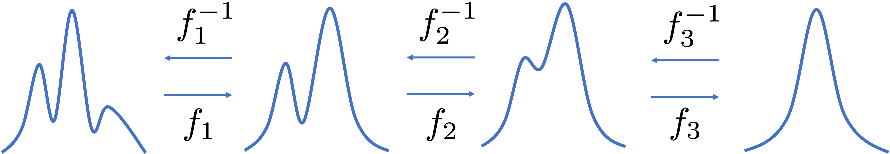
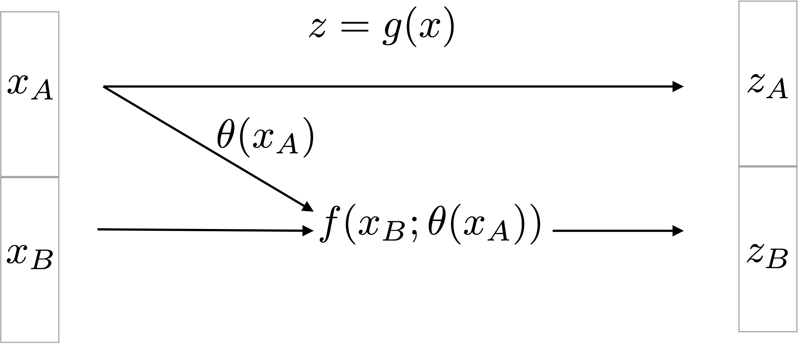
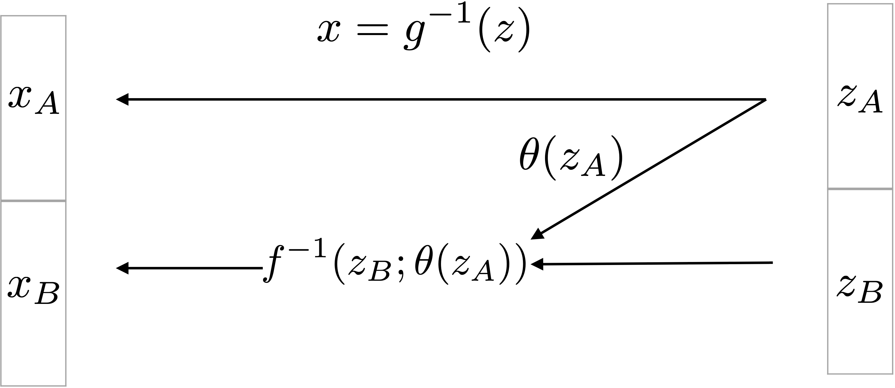
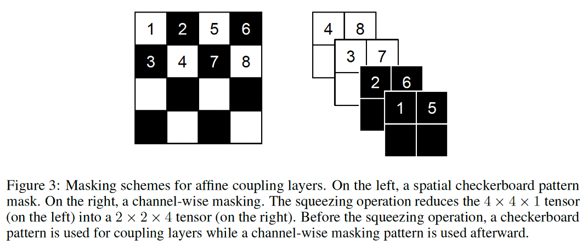
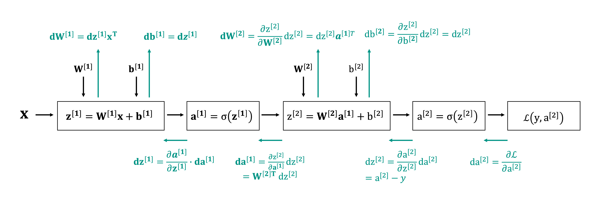
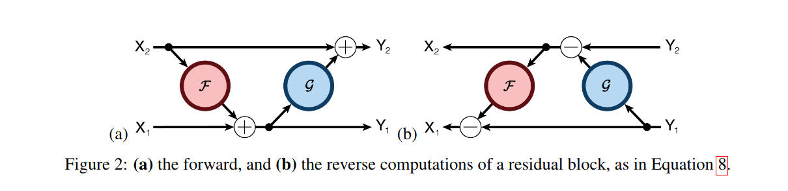
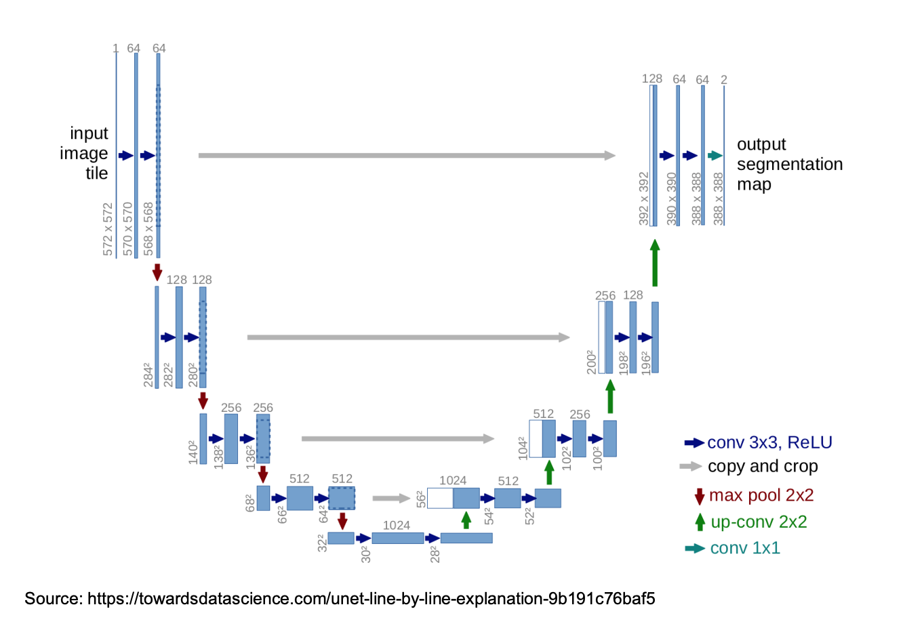
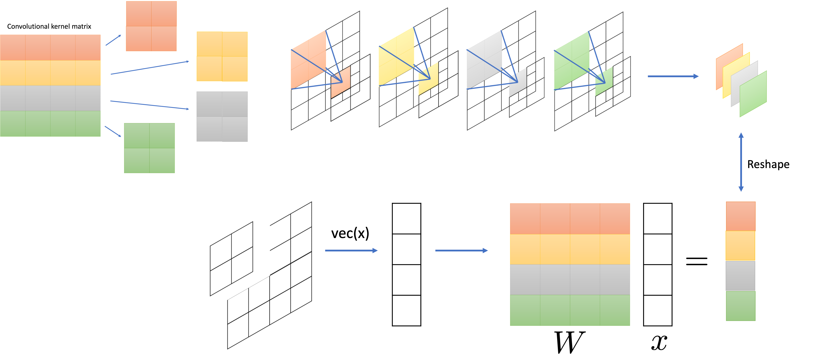
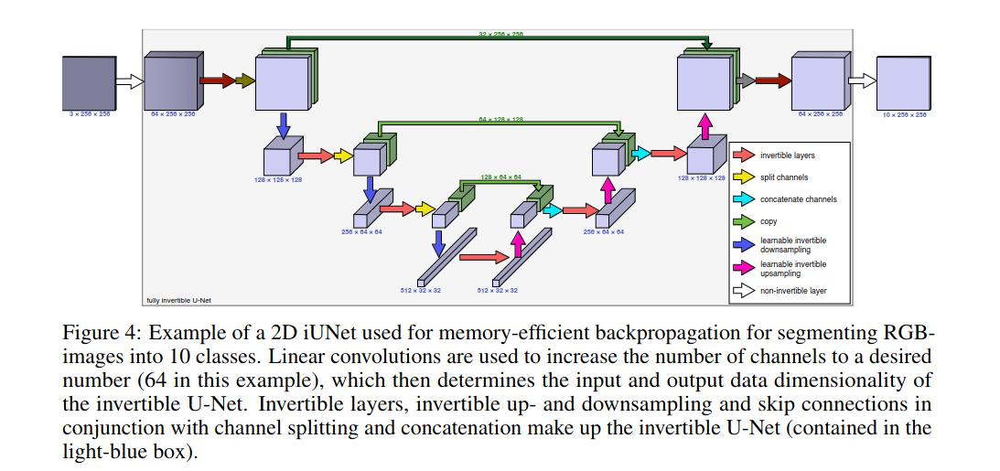

# Invertible Neural Networks
Invertible Neural Networks (INNs) are a class of neural networks where the input of the network can be reconstructed exactly from the output. Popular neural network 
architectures such as (V)AE, UNet and ResNet are not invertible for a number of reasons. Firstly, these networks have layers that map to different dimensions by either 
expanding or shrinking (mostly shrinking) the dimension of the current hidden layer to project the input into the so-called latent space. It was long believed that this 
projection into a lower dimensional space is what made neural networks so powerful; invertible neural networks break with this notion. Additionally, the layers mostly carry
out convolutions, which, even if they map to a space of the same dimension, are generally rank deficient and therefore non-invertible. Moreover, popular architectures 
generally incorporate operations like batch normalization or average or max pooling that are non-invertible. On top of that, some popular activation functions, like ReLU, suffer the same issue
of non-invertibility. Given that non-invertible operations like pooling, batch normalization and non-invertible activation functions are typically chosen because
they greatly improve performance, discarding them just to ensure invertibility is undesirable. Therefore, constructing an INN that performs on par with modern architectures is not 
straightforward.

In this lecture we will cover how to construct INNs that perform on par with state-of-the-art neural network architectures and show some of their applications. INNs have two main applications 
that we will cover in this lecture:

1. INNs are used as generative models, mostly known under the name of *normalizing flows (NFs)*. The idea is that a complicated distribution can be transformed into a 
Gaussian distribution through a sequence of invertible and differentiable transformations, also called *flow*, hence the name *normalizing flow*.
2. INNs are used to overcome the memory requirements of neural networks due to storing all activations that are needed for backpropagation. In INNs, since the input can be computed from 
the output, these values need not be stored and the memory requirements are constant as the size of the network increases.

## Normalizing flows
Normalizing flows are used for generative modeling by transforming a sample distribution into the target distribution through a series of invertible transformations, called
*flow*. This principle is illustrated in the figure below

Any sample $x$ from the target distribution can be transformed to a sample from the base distribution $z$ via the relation $f(x) = z$ and if $f$ is invertible then we can equivalently obtain
$x = f^{-1}(z)$. When the flow consists of multiple transformations like in the figure above, then $f = f_1 \circ f_2 \circ f_3$ and $f^{-1} = f_3^{-1} \circ f_2^{-1} \circ f_1^{-1}$.
Ideally, the sample distribution is a simple one whose parameters are known and is one that is easy to sample from. When one probability density function is related to 
another via a flow the relationship between the two is given by

$$ 
    p_X(x) = p_Z(f(x))\vert \det Df(x)\vert
$$

Ideally, when looking for a probability distribution that best fits the data one is interested in minimizing the negative log-likelihood. In the case of INNs this is straightforward,
since the log-likelihood of $p_X$ is related to the log-likelihood of $p_Z$ via

$$
    -\log p_X(x) = - \log p_Z(f(x)) - \log(\vert \det Df(x)\vert).
$$

This shows one benefit of INNs as compared to other generative models such as GANs and VAEs, that are not able to minimize the log-likelihood. GANs do not act on the log-likelihood and 
VAEs only minimize an upper bound, see the lecture on VAEs. Moreover, by design both sampling from the distribution and inference are easy. This makes INNs well-suited for Variational Inference (VI),
as discussed in the lecture on VAEs. 

Clearly, in order to efficiently evaluate the sought after distribution $p_X$, we need to be able to evaluate $\det Df(x)$ efficiently. For a general matrix evaluating the
determinant is costly; roughly equal to the cost of inverting the matrix. As an example, assume that we have a neural network that maps $\mathbb{R}^n \to \mathbb{R}^n$. Choosing
a sigmoid activation function yields the following expression for one forward pass from one layer to the next

$$
    \sigma(x) = \frac{1}{1 + e^{- Wx - b}},
$$

where the exponential is evaluated pointwise. The gradient is given by

$$
    D\sigma(x) = \begin{bmatrix} \frac{e^{-Wx - b}}{(1 + e^{-Wx - b})^2}\odot w_1, \ldots, \frac{e^{-Wx - b}}{(1 + e^{-Wx - b})^2}\odot w_n \end{bmatrix}.
$$

Clearly, evaluating the determinant of this matrix is not feasible for large-scale problems, even though the network itself has an invertible structure.
When the matrix has special structure, e.g. diagonal or triangular, or if the matrix is unitary, computing the determinant is cheap. However, guaranteeing a certain structure
or property of the weight matrix is either not possible, computationally expensive, or severely limits the expressive capabilities of the network. [Dinh et al., 2014](https://arxiv.org/abs/1410.8516)
proposed the *coupling flow* that is both invertible and has a determinant that is cheap to evaluate.

## Coupling flows
A coupling flow is a flow that splits the input into two parts, say $x_A$ and $x_B$, after which $x_A$ is mapped directly to the output via the identity function and $x_B$ undergoes an invertible
transformation, which is conditioned on $x_A$. The principle is outlined in the figure below.

Here, $f$ denotes the *coupling function* that ensures the dependency of the output $z_B$ on the input $x_A$. $\theta$ can be any function and need not even be invertible,
since it only parametrizes the coupling function $f$, and it can be computed from the output using the equality $z_A = x_A$. For example, in [Dinh et al., 2014](https://arxiv.org/abs/1410.8516) the authors 
use a simple ReLU MLP, [Dinh et al., 2016](https://arxiv.org/pdf/1605.08803.pdf) use a convolutional residual neural network, and in [Kingma et al., 2018](https://arxiv.org/pdf/1807.03039.pdf) a three-layer
CNN with ReLU activations. As illustrated in the figure below, the coupling flow is invertible.

By splitting the input the Jacobian will consist of four components. Denoting the function mapping the input $x$ to the output $z$ by $g$ we have

$$
    Dg(x) = \begin{bmatrix} \frac{\partial z_A}{\partial x_A} & \frac{\partial z_A}{\partial x_A} \\ \frac{\partial z_B}{\partial x_A} & \frac{\partial z_B}{\partial x_B}\end{bmatrix} = 
            \begin{bmatrix} I & 0 \\ \frac{\partial}{\partial x_A} f(x_B;\theta(x_A)) & Df(x_B;\theta(x_A)) \end{bmatrix}.
$$

The Jacobian is a triangular matrix and therefore the determinant is easy to evaluate since it is simply the product of the diagonal elements.

### The coupling function
The coupling flow was introduced in [Dinh et al., 2014](https://arxiv.org/abs/1410.8516), where the additive coupling function has the following structure
$$
    \begin{aligned}
        z_A = x_A \\
        z_B = x_B + \theta(x_A)
    \end{aligned} 
$$
In subsequent work [Dinh et al., 2016](https://arxiv.org/pdf/1605.08803.pdf) used the affine coupling function
$$
    \begin{aligned}
        z_A = x_A \\
        z_B = x_B \odot e^{s(x_A)} + t(x_A),
    \end{aligned} 
$$
where $s$ denotes a scaling function and $t$ a translation function.

### The split function
Splitting the input can be done a number of ways. [Dinh et al., 2016](https://arxiv.org/pdf/1605.08803.pdf) split the input along the spatial dimension using a checkerboard pattern,
after which a squeezing operation is applied that reduces the spatial dimension and accordingly increases the number of channels. Subsequently, the channel dimension is masked in a 
manner that doesn't interfere with the masking in the spatial dimension. This principle is illustrated in the figure below that is directly taken from the paper.

In this figure, the white squares are fed directly to the output whereas the black squares are fed through an invertible function conditioned on the white squares.
By splitting the input the same way every time certain parts of the input are never used but only propagated directly to the output. To make sure all components are leveraged, the 
intermediate outputs have to be shuffled. [Dinh et al., 2016](https://arxiv.org/pdf/1605.08803.pdf) propose alternating shuffling where the components that are unaltered
are fed through the invertible function in the next iteration and vice versa. Alternatively, [Kingma et al., 2018](https://arxiv.org/pdf/1807.03039.pdf) propose the use of invertible
learned 1-x-1 convolutions, and show that this improves performance compared to alternating shuffling of [Dinh et al., 2016](https://arxiv.org/pdf/1605.08803.pdf) or random shuffling.

### Multi-scale architecture
Along with the spatial splitting of the input [Dinh et al., 2016](https://arxiv.org/pdf/1605.08803.pdf) propose a multi-scale architecture where the spatial dimension is downsampled followed
by a corresponding increase in the number of channels. Their overal architecture combines 3 coupling layers with spatial checkerboard masking followed by a squeezing operation with channel-wise
masking. Because the layers of an INN preserve dimension, propagating the input through the network is costly both in terms of computational cost and memory cost. Therefore, half of the dimension
are fed through the network directly without undergoing any more coupling functions.

## Reversible network architectures
Due to the reversible nature of the network INNs have low memory cost. To understand this, let's recall the algorithm that is used to perform gradient descent for neural networks: backpropagation.
Backpropagation essentially computes the gradient by repeated application of the chain rule. Recall the following figure from lecture 6:

To compute the derivative we need access to result of the activation functions. If the network is fully invertible these values can be computed from the output. However, if the network is not invertible 
either the values have to be recomputed, which is extremely expensive for large networks, or the output of the activations has to be stored. This is essentially what happens in backpropagation. The drawback
is that all the intermediate outputs have to be stored, putting a huge burden on the memory. Since GPUs generally have limited memory this becomes a bottleneck for deep neural networks. When the network is 
reversible, the inputs can be computed from the outputs which lifts the burden from the memory in exchange computation. This is generally a favorable trade for GPUs. A number of popular architectures
now have reversible or invertible counterparts, for example UNet and ResNet. Note that, in order to lift the memory burden from backpropagation, the network need not be invertible: injectivity suffices. We now
show two popular network architectures that can be made invertible: UNet and ResNet.

### RevNet: reversible ResNet
The ResNet architecture is characterized by skip connections and consists of residual blocks of the form

$$
    y = x + \mathcal{F}(x),
$$

where $\mathcal{F}(x)$ denotes the residual block. The RevNet uses a coupling flow that is slightly different from the previous coupling as shown in the figure below from the RevNet paper [Gomez et al., 2017](https://arxiv.org/pdf/1707.04585.pdf).

Here, both $F$ and $G$ denote the residual blocks that are typical for the standard ResNet. The coupling flow is given by

$$
    \begin{aligned}
        z_A & = x_A + F(x_B) \\
        z_B & = x_B + G(z_A)
    \end{aligned}
$$

with inverse

$$
    \begin{aligned}
        x_B & = z_B - G(z_A) \\
        x_A & = z_A - F(x_B)
    \end{aligned}
$$

### i-UNet: invertible UNet
The UNet architecture calculates features on multiple scales by downsampling the input a number of times: this is the depth of the UNet. Every downsampling layers is followed by a number of convolutional layers that extract the 
features at the current scale. When the maximum downsampling is reached, the input is upsampled at the same rate until an output with the same dimension as the input is reached. To combine the extracted features from different scales
the UNet passes the downsampled images directly from the downsampling layers to the upsampling layers where they are concatenated. This is illustrated in the figure below.

The convolutional layers in the UNet can be replaced by the invertible coupling layers to make them invertible. The downsampling layers can be made invertible by increasing the number of channels. If we denote the size of the current image
by $h \times w \times c$, where *h* denotes the height, *w* denotes the width and *c* denotes the number of channels, then a map from $\mathbb{R}^{h \times w \times c} \to \mathbb{R}^{h/n_h \times w/n_w \times n_h\cdot n_w\cdot c}$ can be made
invertible. In principle one could use the downsampling operation according to the checkerboard pattern as introduced by [Dinh et al., 2016](https://arxiv.org/pdf/1605.08803.pdf). However, the corresponding upsampling operation introduces checkerboard
artifacts. [Etmann et al., 2020](https://arxiv.org/pdf/2005.05220.pdf) proposed the use of learned orthogonal downsampling and upsampling operations. The key idea is that the downsampling operation can be expressed as a convolution where the kernel
size equals the stride. This way, convolution can be seen as matrix-vector multiplication with a convolutional kernel matrix that has the dimension of the number of channels. This principle is illustrated in the figure below.

Note that it is convenient but not strictly necessary for the kernel matrix to be orthogonal. Orthogonality makes the subsequent upsampling operator easy to evaluate, as it's just the adjoint of the kernel matrix. The invertible UNet, i-UNet, is now constructed
by combining the invertible downsampling operator with the coupling functions we have seen before, replacing the standard downsampling and convolutional layers respectively. The i-UNet architecture is shown in the figure below from the paper 
by [Etmann et al., 2020](https://arxiv.org/pdf/2005.05220.pdf).

## Further reading
These notes were heavily inspired by the following tutorials:

- [Brubacker and Kothe](https://www.youtube.com/watch?v=8XufsgG066A)
- [Paul Hand](https://www.youtube.com/watch?v=IpbeIwSr7r0)

Below are the references for the RealNVP, GLOW, i-UNet and RevNet papers:

- [RealNVP](https://arxiv.org/abs/1605.08803)
- [GLOW](https://arxiv.org/abs/1807.03039)
- [i-UNet](https://arxiv.org/pdf/2005.05220.pdf)
- [RevNet](https://arxiv.org/pdf/1707.04585.pdf)

Library for building INNs:

- [MemCNN](https://github.com/silvandeleemput/memcnn)

